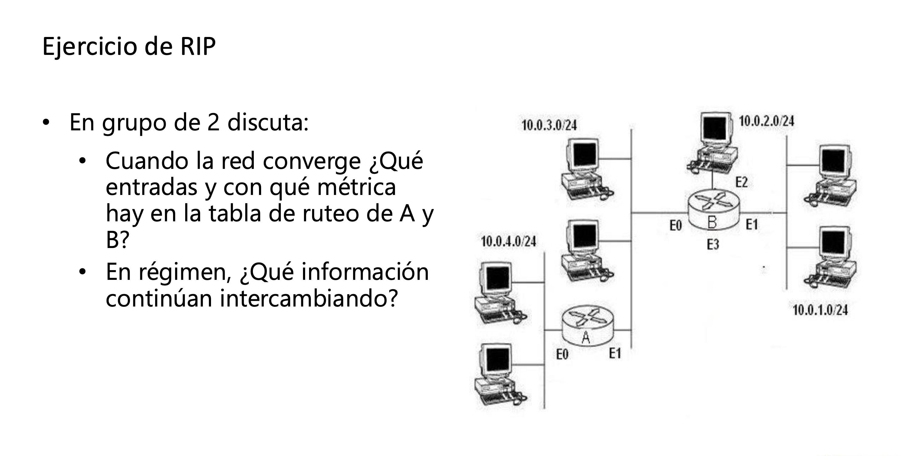
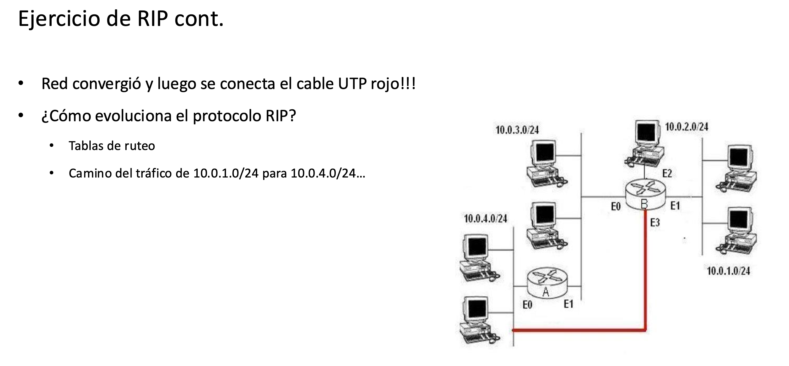

# 10-08-2026 — Protocolo de Ruteo RIP

## 1. El problema que resuelve el ruteo

Todo esto vive en la **capa de red**, porque es esa capa la que tiene que responder una pregunta muy simple: *¿cómo llego hasta tal otro lado?* Para responderla hay que **calcular rutas**.

Pensalo como un GPS: cada router no conoce el mapa completo del mundo, pero sabe "para llegar para allá, andá por esa calle" y le pasa el paquete al siguiente. Cada router toma su decisión **de forma independiente**, mirando solamente su propia tabla, y confía en que el siguiente router va a hacer lo mismo con el suyo. Nadie tiene el mapa completo, pero entre todos arman el camino.

Para que esto funcione, los routers **conversan entre sí**: se intercambian información sobre qué redes conocen y, con esa información, cada uno hace sus cuentas para construir (y mantener actualizada) su **tabla de enrutamiento**. A ese proceso de conversación e intercambio es a lo que llamamos **protocolo de enrutamiento** (o *routing protocol*).

## 2. Cómo viaja un paquete IP de un punto A a un punto B

1. El host en el punto A necesita tener configurado un **gateway** (a mano o, más común, por DHCP, que además le da su propia IP).
2. El paquete IP con destino B llega al router.
3. Ese router necesita conocer la **subred de destino** donde vive B — no la IP puntual, la red.
4. Para que el paquete pueda llegar, **cada router en el camino** necesita tener, de alguna forma, una entrada que lo acerque a la red de B. Dicho de otra forma: el camino de ida se arma porque, en el sentido contrario, cada router fue "marcando" por dónde se llega hasta ahí — se construye un **camino inverso**.

Las tablas de enrutamiento, entonces, contienen entradas del tipo: *"para llegar a esta red, el siguiente salto es esta otra IP"*.

Un mismo destino puede tener **más de una entrada** — por ejemplo, si tengo dos salidas distintas hacia la misma red, con next-hops diferentes. Y si solo tengo una única conexión de salida, en vez de tener que listar todas las redes del mundo puedo usar un **default gateway**: "si no sé a dónde mandarlo, mandalo por acá".

### ¿Y cómo se hace esto escalable?

Configurar todo esto a mano, router por router, es un lío que no escala (literal: en la maqueta del curso hay que configurar cada router individualmente para que ande). La solución es prender, en cada router, un **protocolo de ruteo**: un componente de software que hace hablar a los routers entre sí, se intercambian la información que tienen y la propagan al resto. Con eso, las tablas se arman y se actualizan solas.

¿Cuál es "la mejor ruta"? En general, la que tiene **menor cantidad de saltos** o **menor costo** — y cómo se calcula eso depende pura y exclusivamente del algoritmo que usa el protocolo (Dijkstra, vector distancia, etc.).

## 3. Cómo reenvía un paquete el router (la mecánica interna)

Cuando un paquete entra al router:

1. El router mira la **tabla de enrutamiento** buscando qué entrada matchea con la IP destino.
2. ¿Cómo se hace ese matching? Haciendo un **AND** bit a bit entre la IP destino del paquete y la **máscara** de cada entrada de la tabla, y comparando el resultado contra la red de esa entrada. Si coincide, esa entrada es candidata (y si hay varias que matchean, gana la más específica, es decir la de máscara más larga).
3. Una vez que sabe la entrada correcta, sabe por qué **interfaz** tiene que salir y cuál es la IP del próximo salto.
4. Pero para poner el paquete en el cable, necesita la dirección **MAC** de ese próximo salto — ahí es donde entra **ARP**: le pregunta "¿quién tiene esta IP?" y arma la **trama Ethernet** con esa MAC de destino.

La idea clave: para entregarle el paquete al siguiente salto, siempre tengo que compartir un **medio físico** con él (estar en el mismo segmento/LAN), porque a nivel de enlace la entrega es por MAC, no por IP.

## 4. Características generales de los protocolos de enrutamiento

- **Reaccionan a cambios topológicos**: si algo cambia (un link cae, aparece una red nueva), el router actualiza su propia tabla y avisa a sus vecinos.
- Son **procesos que corren en cada router**, todo el tiempo, en paralelo con el reenvío de paquetes.
- A medida que **crece la cantidad de routers**, crece también el *overhead*: hay más información para calcular, más para guardar en memoria y más para comunicar por la red. Esto es justo lo que va a diferenciar a los protocolos entre sí (algunos escalan mejor que otros).

## 5. Sistemas autónomos: IGP vs. EGP

Cuando una red crece mucho, aparece un concepto administrativo: el **Sistema Autónomo (AS)**. Un AS es, ni más ni menos, un conjunto de routers que están bajo **la misma administración** y **las mismas políticas de enrutamiento**.

Todo operador de red (un ISP, una empresa grande, una universidad) maneja su propio AS, y es **su responsabilidad** diseñar y administrar las políticas de enrutamiento ahí adentro.

Pensalo así: si tengo una organización grande con regiones bien separadas, cada región va a manejar sus propias políticas dentro de su AS, y esos ASes se van a conectar entre sí. Puertas adentro, decido libremente qué protocolo interno usar (RIP, OSPF...). Puertas afuera, hacia otros ASes, uso políticas: por ejemplo, "para llegar a la regional norte, prefiero salir por la regional este porque tiene más capacidad, y si eso falla, uso otra ruta". O si tengo varios proveedores de Internet, puedo decidir por cuál proveedor sale el tráfico hacia Estados Unidos, cuál hacia Europa, cuál hacia Asia — porque **yo controlo las políticas** de mi propio AS.

De ahí salen las dos grandes categorías de protocolos:

| | **IGP** (Interior Gateway Protocol) | **EGP** (Exterior Gateway Protocol) |
|---|---|---|
| Dónde corre | Dentro de un mismo AS | Entre ASes distintos |
| Cómo decide | Por **métrica**: la mejor ruta según un número que calcula el propio protocolo | Por **política**: yo decido qué ruta acepto y por qué, no es solo un número |
| Ejemplos | RIP (saltos), OSPF (por defecto, ancho de banda de las interfaces) | BGP |
| Control que tengo | Poco: la decisión la toma la métrica que define el protocolo | Mucho: puedo mirar la métrica, la ruta, y decidir en base a mi propia política qué hacer con eso |
| Escalabilidad | Peor: reacciona a cualquier cambio, hasta menor (un equipo que se desconecta ya genera recálculo) | Mucho mejor: no le importan los cambios chicos, así que escala y performa mejor |

RIP es un IGP. Vamos a eso.

## 6. RIP: la idea de fondo

RIP usa un algoritmo de **vector distancia**. La idea central: **ningún nodo conoce la topología completa de la red**. Lo único que sabe es "para llegar a tal red destino, mi vecino tal me sirve, y me cuesta tantos saltos". Lo único que importa es esa métrica (la cantidad de saltos).

Una tabla de ruteo RIP, en su forma más simple, tiene esta pinta:

| Red | Cantidad de saltos | Próximo salto |
|---|---|---|
| 10.0.1.0/24 | 0 (directamente conectada) | — |
| 10.0.5.0/24 | 2 | 10.0.1.2 |
| 10.0.9.0/24 | 5 | 10.0.1.2 |

Es decir: "sé que la red 10.0.5.0/24 está alcanzable a distancia 2, pasando por 10.0.1.2". Nada más — no sé cómo es el camino entero, solo el primer paso y cuánto falta.

### ¿Y si tengo dos protocolos de ruteo compitiendo por la misma red?

Un mismo router puede tener corriendo **más de un protocolo de enrutamiento a la vez** (por ejemplo, RIP y OSPF juntos). Si los dos te dicen cómo llegar a la misma red, ¿cuál entra en la tabla?

- Primero se compara la **distancia (o métrica) administrativa**: es un valor de "confianza" que se le asigna a cada protocolo o fuente de información — no tiene nada que ver con la métrica interna del protocolo (saltos, ancho de banda, etc.), es un número aparte que sirve solo para elegir entre protocolos distintos. Cuanto **más bajo**, más se prefiere. Por ejemplo (valores típicos, pueden variar según el fabricante): ruta directamente conectada = 0, ruta estática = 1, OSPF = 110, RIP = 120. Si OSPF y RIP anuncian la misma red, gana OSPF, aunque su métrica en "saltos equivalentes" sea peor, porque tiene menor distancia administrativa.
- Si la ruta llega por **el mismo protocolo** dos veces (dos vecinos RIP anunciando la misma red), ahí sí se compara la métrica propia del protocolo — en RIP, el que tenga menos saltos.

### El algoritmo de RIP, paso a paso

1. **Cada 30 segundos**, el router toma *todas* las entradas de su tabla y las manda por *todas* sus interfaces. No pregunta si hay alguien escuchando del otro lado — simplemente las manda igual.
2. En paralelo, escucha lo que le mandan sus vecinos. Por cada red que recibe, compara: si lo que le llegó es **mejor** (menos saltos) que lo que ya tenía, actualiza su tabla con esa nueva ruta.
3. ¿Y si lo que llega es **peor**, o es la misma fuente que antes pero ahora con más saltos? Significa que el camino que venía usando "se alejó" — el router acepta ese empeoramiento y **aumenta** la cantidad de saltos de esa entrada.
4. Detalle importantísimo para no olvidar: cuando un router le informa a un vecino sobre una red, **le suma 1 salto antes de mandarlo**. Si yo tengo una red a distancia 3, se la anuncio a mi vecino como distancia 4 — porque, a través de mí, a él le queda un salto más lejos.

### El mensaje RIP

RIP viaja **encapsulado sobre IP** (usa UDP, puerto 520) — esto es relevante porque significa que, para que el protocolo de ruteo funcione, **IP ya tiene que estar funcionando** (el router necesita tener sus interfaces con IP configuradas y operativas antes de poder intercambiar rutas).

Se manda como **IP multicast** a la dirección **224.0.0.9** (en RIPv1 era broadcast, a 255.255.255.255).

Cada mensaje puede llevar hasta **25 entradas de red**. Si el router tiene más de 25 redes para anunciar, simplemente manda varios mensajes seguidos.

Formato simplificado de un mensaje RIPv2:

```
┌─────────────┬─────────────┬───────────────────┐
│ Comando (1B)│ Versión (1B)│  No usado (2B)     │   ← cabecera
├─────────────┴─────────────┴───────────────────┤
│  Familia de direcciones (2B) │ Route Tag (2B)  │
├─────────────────────────────────────────────────┤
│           Dirección IP de la red (4B)            │
├─────────────────────────────────────────────────┤
│           Máscara de subred (4B)                 │
├─────────────────────────────────────────────────┤
│           Próximo salto (4B)                     │
├─────────────────────────────────────────────────┤
│           Métrica: cantidad de saltos (4B)       │
└─────────────────────────────────────────────────┘
        ↑ esta entrada se repite hasta 25 veces por mensaje
```

- **Comando**: si es un *request* (pido rutas) o un *response* (te mando mis rutas).
- Junto con cada red viaja también su **máscara** — esto es lo que hace a RIPv2 *classless* (en RIPv1 no se mandaba máscara, ver más abajo).
- La **métrica** es fija: cantidad de saltos de router. El máximo son **15 saltos**; **16 se interpreta como "infinito", o sea red inalcanzable**.
- Todo esto está especificado en la **RFC 2453** (RIPv2): tools.ietf.org/html/rfc2453

Los mensajes se mandan **cada 30 segundos** (update periódico) o también como respuesta a un *request* explícito de algún vecino.

### Temporizadores

RIP no vive solo del envío cada 30 s — tiene varios timers para saber cuándo una ruta dejó de ser válida:

- **Update timer (~30 s)**: cada cuánto se manda la tabla completa por todas las interfaces.
- **Invalid / timeout timer (~180 s)**: si no llega ningún update refrescando una red en 180 segundos, se la marca como **inalcanzable** (métrica 16). Ojo con esto: no es instantáneo, si la red ya no existe hay que esperar bastante tiempo hasta que el router se dé cuenta.
- **Flush / garbage-collection timer (~240 s)**: pasado este tiempo desde que se marcó inalcanzable, la entrada se **borra por completo** de la tabla.

### Split horizon

Es una regla anti-loop muy simple: **no le reanuncio a un vecino una ruta que aprendí de él mismo, por esa misma interfaz**. Suena obvio, pero evita un problema real: si A le dijera de vuelta a B "yo sé llegar a esa red" (cuando en realidad la aprendió de B), B podría terminar creyendo que tiene un camino alternativo por A, cuando en realidad ese camino pasa por B mismo — un loop de ida y vuelta.

Hay una variante más fuerte llamada **split horizon with poison reverse**: en vez de simplemente no anunciar esa ruta de vuelta, se la anuncia igual pero con métrica **infinita (16)**, dejando explícito "por acá no se puede, no me la ofrezcas".

### Triggered updates

Además de esperar los 30 segundos del ciclo normal, cuando hay un **cambio de topología** (una red aparece, desaparece o cambia de métrica), el router dispara un **update inmediato**, sin esperar al próximo ciclo. Esto acelera la convergencia — la red se entera del cambio mucho más rápido que si tuviera que esperar el próximo update periódico.

### Ventajas y desventajas de RIP

**Ventajas:**
- Muy simple de entender y de configurar.
- Bajo consumo de recursos (CPU/memoria) en redes chicas.
- Amplísima compatibilidad — está soportado prácticamente en cualquier equipo, incluso viejo.

**Desventajas:**
- El límite de **15 saltos** lo hace inservible para redes grandes.
- **Convergencia lenta** comparado con protocolos modernos (aunque split horizon y triggered updates ayudan, en topologías más complejas todavía puede sufrir el clásico problema de "contar hasta el infinito").
- La métrica es **solo cantidad de saltos** — no tiene en cuenta ancho de banda ni latencia, así que puede elegir un camino de 3 saltos por enlaces lentos en vez de uno de 4 saltos por fibra.
- Manda la **tabla completa** cada 30 segundos, por diseño — en redes grandes esto es mucho tráfico de control desperdiciado, incluso cuando nada cambió.
- No escala tan bien como OSPF o EIGRP para redes medianas/grandes.

### RIPv1 vs. RIPv2 vs. RIPng

- **RIPv1**: *classful* (no manda máscara de subred, asume la máscara por defecto de la clase de la IP), usa **broadcast** (255.255.255.255), sin autenticación.
- **RIPv2**: *classless* (soporta VLSM/CIDR, manda la máscara en cada entrada), usa **multicast** (224.0.0.9), autenticación opcional, agrega campo de *next-hop* y *route tags*.
- **RIPng**: la versión para **IPv6**, usa multicast IPv6, mantiene el mismo concepto de vector distancia y el mismo límite de 15 saltos.

---

## 7. Ejercicios

### Ejercicio 1



**1. Redes conectadas directamente**

Router A:
- E0 → 10.0.4.0/24 (métrica 0)
- E1 → 10.0.3.0/24 (métrica 0) — este es el segmento que comparte con B

Router B:
- E0 → 10.0.3.0/24 (métrica 0) — mismo segmento que A-E1
- E1 → 10.0.1.0/24 (métrica 0)
- E2 → 10.0.2.0/24 (métrica 0)
- E3 → sin red conectada en este ejercicio

Convención usada: métrica RIP = cantidad de routers a atravesar; una red directamente conectada tiene métrica 0. (Si tu profesor cuenta distinto, el método es el mismo, solo cambia el número base.)

**2. Intercambio de updates (vector distancia)**

En t=0, cada router solo conoce lo directamente conectado.

Primer update periódico (RIP los manda cada ~30 s):
- **A → B** (por E1): anuncia (10.0.4.0/24, 0) y (10.0.3.0/24, 0).
- B recibe por E0 y suma 1 al costo del enlace: 10.0.4.0/24 le queda con métrica 1 (no la tenía → la agrega, next-hop A). 10.0.3.0/24 le quedaría métrica 1, pero ya la tiene directa con 0 → descarta.

- **B → A** (por E0): anuncia (10.0.3.0/24, 0), (10.0.1.0/24, 0), (10.0.2.0/24, 0).
- A recibe por E1 y suma 1: 10.0.3.0/24 métrica 1 → descarta (ya tiene 0 directa). 10.0.1.0/24 y 10.0.2.0/24 métrica 1 → las agrega, next-hop B.

Como acá solo hay dos routers (nada a 2 saltos), con este único intercambio la red ya converge.

**3. Tablas convergidas**

Router A:

| Red | Métrica | Próximo salto | Interfaz |
|---|---|---|---|
| 10.0.4.0/24 | 0 | directa | E0 |
| 10.0.3.0/24 | 0 | directa | E1 |
| 10.0.1.0/24 | 1 | B | E1 |
| 10.0.2.0/24 | 1 | B | E1 |

Router B:

| Red | Métrica | Próximo salto | Interfaz |
|---|---|---|---|
| 10.0.3.0/24 | 0 | directa | E0 |
| 10.0.1.0/24 | 0 | directa | E1 |
| 10.0.2.0/24 | 0 | directa | E2 |
| 10.0.4.0/24 | 1 | A | E0 |

**4. En régimen, ¿qué siguen intercambiando?**

- Updates **periódicos completos** cada 30 s (timer de update), aunque no haya cambios — RIP no es "solo ante cambios".
- **Horizonte dividido (split horizon)**: A no vuelve a anunciarle a B por E1 las redes que aprendió de B por esa misma interfaz (10.0.1.0/24, 10.0.2.0/24). Solo reenvía 10.0.4.0/24 y 10.0.3.0/24. Simétricamente, B no le reanuncia a A por E0 la red 10.0.4.0/24 (la aprendió por ahí); reenvía 10.0.3.0/24, 10.0.1.0/24, 10.0.2.0/24.
- Corren además el **invalid timer** (~180 s sin recibir la ruta → se marca métrica 16/inalcanzable) y el **flush timer** (~240 s → se borra de la tabla).
- Si hay un cambio de topología, se dispara un **triggered update** inmediato, sin esperar los 30 s.

Con este esquema podés resolver cualquier variante que te den en la práctica: cada router suma 1 al recibir un anuncio, compara contra lo que ya tenía, y actualiza solo si es mejor — iterás hasta que nadie cambia nada más, eso es la convergencia.

### Ejercicio 2



**1. Qué cambia en las tablas al conectar el cable**

B agrega una red directamente conectada nueva:
- E3 → 10.0.4.0/24, métrica **0**

Como B ya tenía esa red en su tabla, pero aprendida vía A con métrica 1, la nueva ruta (métrica 0) es mejor → la reemplaza inmediatamente. Esto dispara un **triggered update** (no espera los 30 s, porque es una mejora, no hay riesgo de loop).

Ese update se propaga y además pasa algo extra: como el segmento 10.0.4.0/24 ahora es compartido por A (E0) y B (E3), **A empieza a escuchar directamente los anuncios de B por esa misma LAN**, además de los que ya escuchaba por E1 (vía el segmento 10.0.3.0/24). O sea, quedan dos caminos router-a-router entre A y B.

**2. Tablas convergidas**

Router A:

| Red | Métrica | Próximo salto | Interfaz |
|---|---|---|---|
| 10.0.4.0/24 | 0 | directa | E0 |
| 10.0.3.0/24 | 0 | directa | E1 |
| 10.0.1.0/24 | 1 | B | E1 **o** E0 (equal-cost) |
| 10.0.2.0/24 | 1 | B | E1 **o** E0 (equal-cost) |

Router B:

| Red | Métrica | Próximo salto | Interfaz |
|---|---|---|---|
| 10.0.3.0/24 | 0 | directa | E0 |
| 10.0.1.0/24 | 0 | directa | E1 |
| 10.0.2.0/24 | 0 | directa | E2 |
| 10.0.4.0/24 | 0 | directa | E3 ← reemplazó a "vía A, métrica 1" |

A ahora tiene dos rutas de igual costo (métrica 1) hacia 10.0.1.0/24 y 10.0.2.0/24: una por E1 y otra por E0, porque B es alcanzable directamente por ambos segmentos. Muchas implementaciones de RIP instalan y balancean entre rutas de igual costo (hasta 4 típicamente); otras se quedan con la primera que instalaron.

**3. Camino del tráfico de 10.0.1.0/24 → 10.0.4.0/24**

*Antes del cable rojo:*
host en 10.0.1.0/24 → entra a B por E1 → sale por E0 → cruza 10.0.3.0/24 → entra a A por E1 → sale por E0 → llega a 10.0.4.0/24.
→ **2 saltos de router** (B y A).

*Después del cable rojo:*
host en 10.0.1.0/24 → entra a B por E1 → sale directo por E3 → llega a 10.0.4.0/24.
→ **1 solo salto de router** (solo B). A queda completamente afuera del camino para ese tráfico, aunque sigue siendo una ruta válida "de respaldo" en teoría.

Esto es justo el efecto que se busca mostrar con el cable: agregar el link no solo crea redundancia, cambia el camino óptimo real del tráfico.

**4. ¿Cómo evoluciona RIP?**

Ver la sección "RIPv1 vs. RIPv2 vs. RIPng" más arriba.
