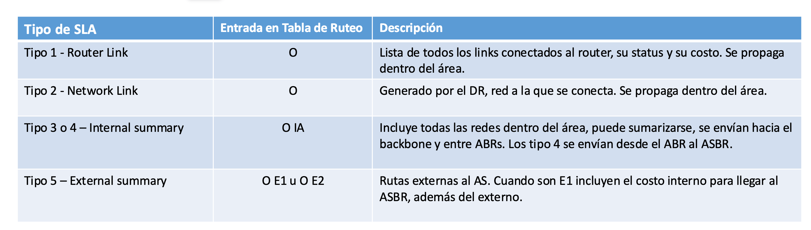
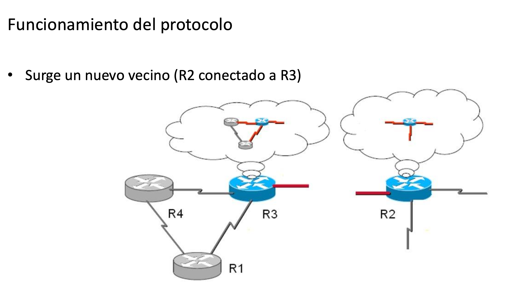
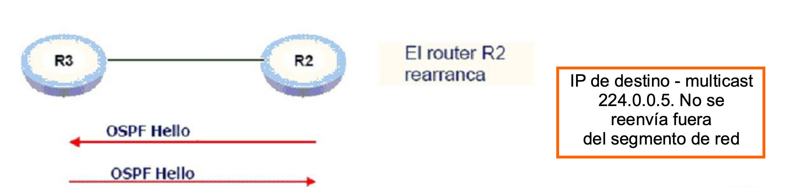
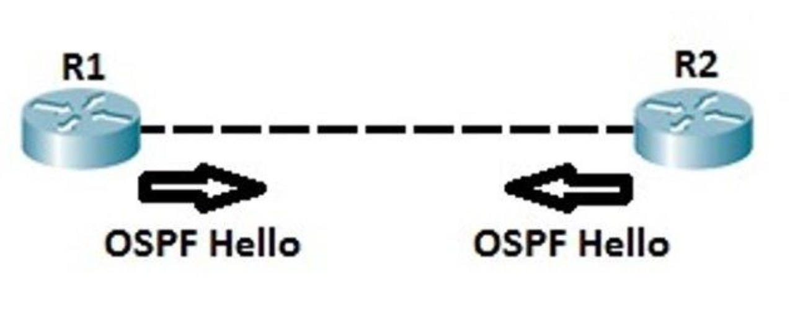
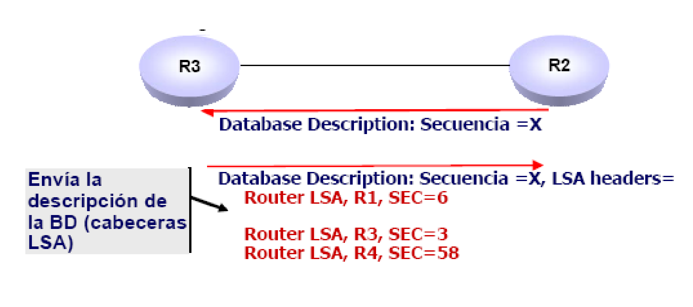
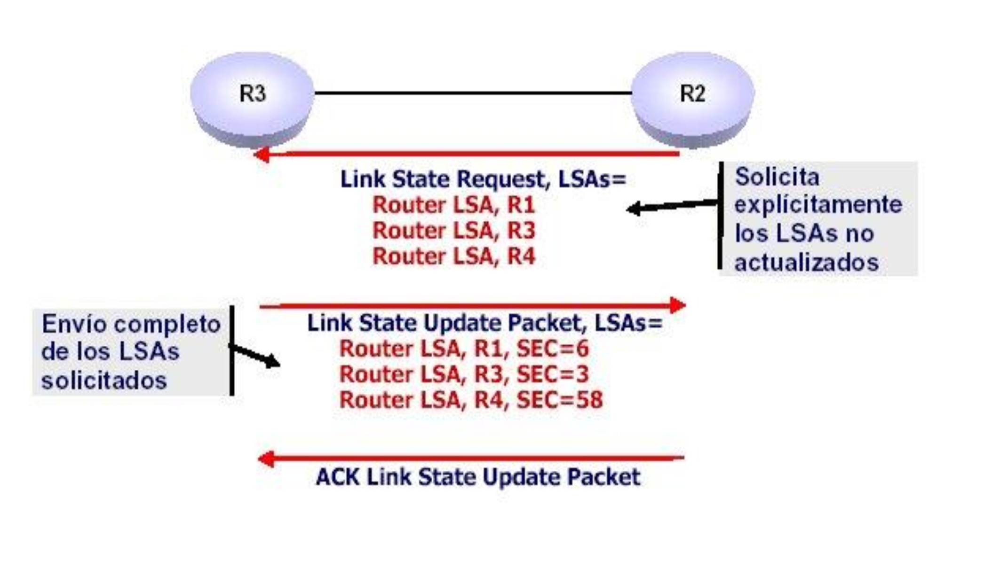
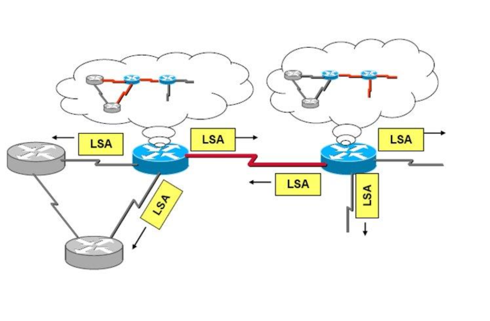
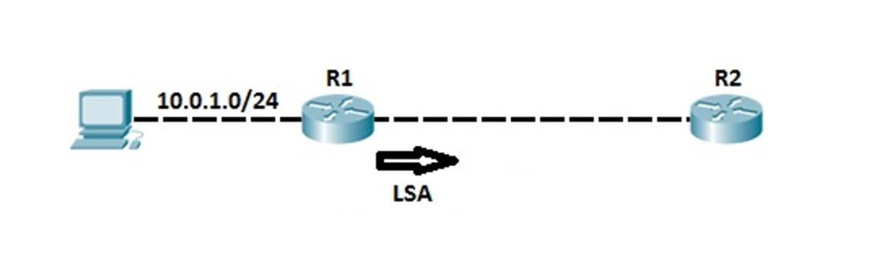
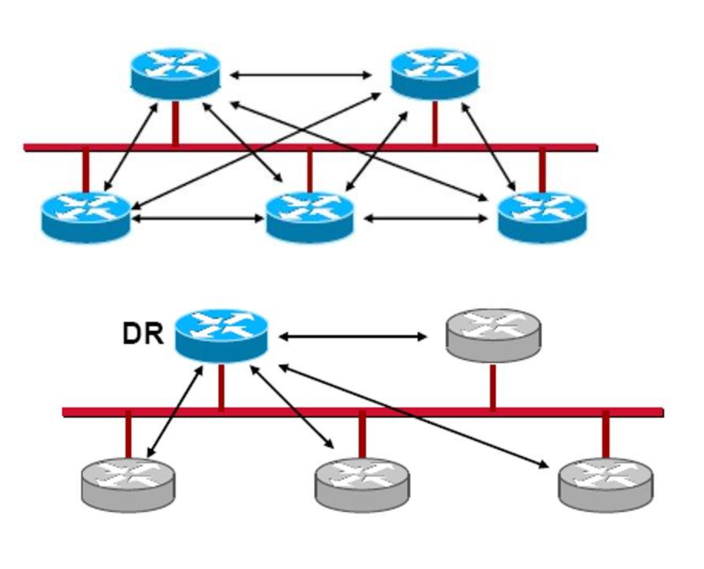
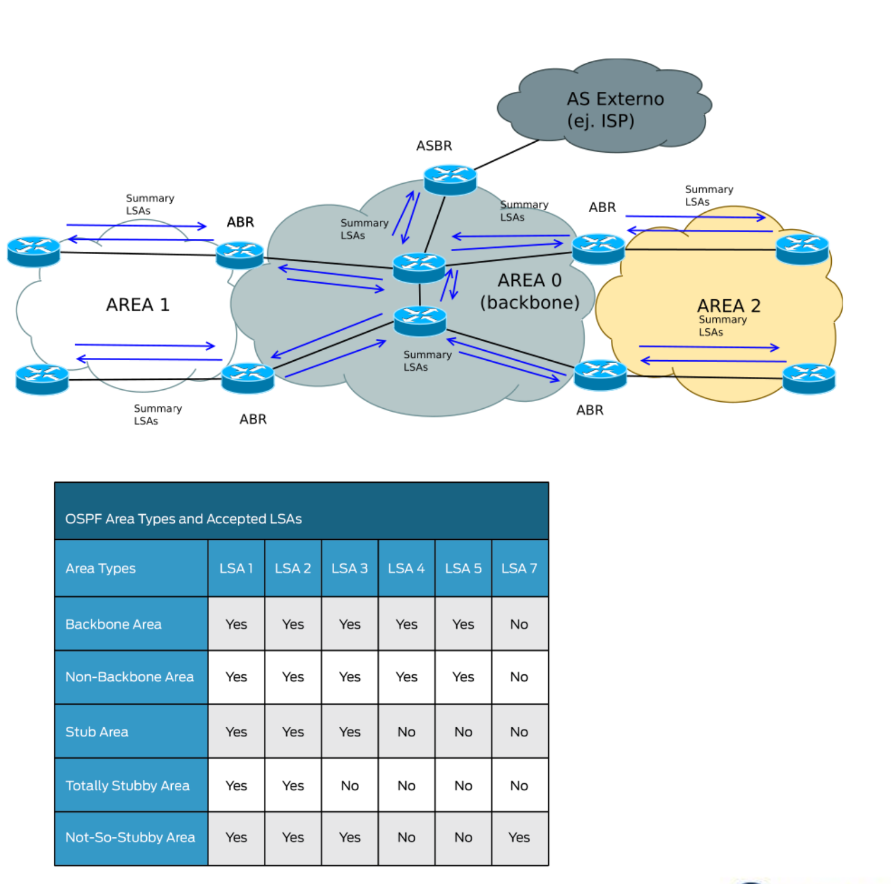

# 17-08-2026 — Protocolo de Ruteo OSPF

## Índice

- [1. OSPF en una frase](#1-ospf-en-una-frase)
- [2. ¿Qué arma OSPF con toda esa información?](#2-qué-arma-ospf-con-toda-esa-información)
- [3. Cómo baja la carga de la red](#3-cómo-baja-la-carga-de-la-red)
- [4. Escalabilidad](#4-escalabilidad)
- [5. El algoritmo: Dijkstra (SPF)](#5-el-algoritmo-dijkstra-spf)
- [6. La métrica: el costo](#6-la-métrica-el-costo)
- [7. La base de datos de estado de enlace (LSDB)](#7-la-base-de-datos-de-estado-de-enlace-lsdb)
- [8. Definiciones básicas](#8-definiciones-básicas)
- [9. LSAs (Link State Advertisement)](#9-lsas-link-state-advertisement)
- [10. Áreas OSPF](#10-áreas-ospf)
- [11. El paquete OSPF: encabezado común](#11-el-paquete-ospf-encabezado-común)
- [12. Funcionamiento del protocolo, paso a paso](#12-funcionamiento-del-protocolo-paso-a-paso)
  - [12.1 El paquete Hello](#121-el-paquete-hello)
  - [12.2 Intercambio de información: Database Description](#122-intercambio-de-información-database-description)
  - [12.3 Intercambio de información: Link State Request, Update y Acknowledgment](#123-intercambio-de-información-link-state-request-update-y-acknowledgment)
  - [12.4 Cálculo de Dijkstra](#124-cálculo-de-dijkstra)
  - [12.5 Flooding de los LSAs nuevos](#125-flooding-de-los-lsas-nuevos)
- [13. Funcionamiento en régimen](#13-funcionamiento-en-régimen)
- [14. Funcionamiento en redes multiacceso: DR y BDR](#14-funcionamiento-en-redes-multiacceso-dr-y-bdr)
- [15. Funcionamiento en múltiples áreas](#15-funcionamiento-en-múltiples-áreas)

---

## 1. OSPF en una frase

OSPF también es un **IGP** (corre dentro de un mismo sistema autónomo, [igual que RIP](2026-08-10%20Protocolo%20de%20Ruteo%20RIP.md)), pero cambia completamente el enfoque: en vez de **vector distancia** (donde cada router solo sabe "a qué distancia" está un destino, según le contó un vecino), OSPF es **estado de enlace (link-state)**: cada router informa **el estado de sus propios links directamente conectados** a *todos* los demás routers del área, y con toda esa información cada uno arma, por su cuenta, el mapa completo de la red.

Es la diferencia entre "che, para llegar ahí tenés que ir 3 saltos" (RIP) y "yo estoy conectado a estos routers, por estos links, con estas condiciones — armate vos el mapa" (OSPF).

## 2. ¿Qué arma OSPF con toda esa información?

La idea central de OSPF es que cada router se termine haciendo **una idea del grafo completo de la red**: qué routers existen y cómo se conectan entre sí. Para eso necesita conocer, de cada conexión, una **métrica asociada al ancho de banda** de ese link (lo vemos en detalle en la sección de [costo](#6-la-métrica-el-costo)).

Con ese grafo armado, lo que en definitiva le interesa a cada router es una sola cosa muy concreta: **encontrar el mejor next hop** para cada red de destino que conoce. Todo lo demás (LSAs, áreas, DR, paquetes) es la maquinaria que existe para que ese grafo se arme de forma consistente y eficiente en todos los routers del dominio.

## 3. Cómo baja la carga de la red

- Los updates son **incrementales**: no se manda la base completa cada vez, solo lo que cambió.
- Se envían a una dirección **multicast 224.0.0.5** (el grupo *AllSPFRouters*), y son **triggered** (ante un cambio, no hay que esperar un timer para avisar).
- Cada tanto igual hay un **full update**, que sirve para resincronizar todo por las dudas algo se haya perdido o desincronizado.

Esto es justo lo contrario de RIP, que manda la tabla completa entera cada 30 segundos exista o no un cambio — por eso OSPF escala mucho mejor.

## 4. Escalabilidad

OSPF soporta redes bastante más grandes que RIP. Como referencia (valores recomendados por Cisco, no un límite duro del protocolo):

- Hasta ~50 routers por área.
- Hasta ~60 vecinos por router.

## 5. El algoritmo: Dijkstra (SPF)

OSPF usa el algoritmo **Shortest Path First (SPF)**, que es el algoritmo de **Dijkstra** aplicado a la topología de red. Con la base de datos de estado de enlace, cada router calcula **su propio árbol de caminos más cortos** hacia todos los destinos, garantizando una topología **libre de loops**. Vemos el detalle de este cálculo en la sección [12.4 Cálculo de Dijkstra](#124-cálculo-de-dijkstra).

## 6. La métrica: el costo

La métrica de OSPF es el **costo**, y se calcula así:

$$\text{costo} = \frac{10^8}{\text{ancho de banda del enlace (bps)}}$$

Donde el ancho de banda es el que está **configurado en la interfaz del router** (no necesariamente el real). Por ejemplo, si la interfaz es de 10 Mbps, el costo queda en 10 (10^8 / 10^7 = 10).

Ese ancho de banda "configurado" no es un número que OSPF mide solo: en un router Cisco se define con el comando de interfaz `bandwidth <kbps>` — un valor puramente informativo que usan varios protocolos (entre ellos OSPF) para sus cálculos, y que no cambia la velocidad real del enlace. Si en cambio querés fijar el costo directamente, sin pasar por la fórmula, existe `ip ospf cost <valor>`.

### ¿Qué pasa con interfaces de más de 100 Mbps?

Acá está el problema con la fórmula: $10^8$ = 100.000.000, que corresponde a 100 Mbps. Si tengo una interfaz de 1 Gbps o 10 Gbps, el resultado da menor a 1, y OSPF **redondea el costo mínimo a 1** — con lo cual una interfaz de 100 Mbps, una de 1 Gbps y una de 10 Gbps terminan teniendo **el mismo costo (1)**, y el protocolo pierde la capacidad de diferenciarlas.

La solución es cambiar el **ancho de banda de referencia** (*reference bandwidth*) que usa la fórmula — en vez de $10^8$, se configura un valor más alto (por ejemplo $10^{10}$ para poder diferenciar hasta 10 Gbps). Es una configuración manual que hay que aplicar **de forma consistente en todos los routers del dominio OSPF**, porque si cada uno usa una referencia distinta, los costos dejan de ser comparables entre sí y el cálculo de mejor camino se rompe.

### Entonces, ¿gana el camino con más ancho de banda?

No necesariamente el que tiene un solo enlace más rápido, sino el de **menor costo acumulado** a lo largo de todo el camino (SPF suma los costos de cada link en el camino). Por eso puede pasar algo un poco contra-intuitivo: un camino **más largo** (más saltos) pero compuesto por enlaces de mayor ancho de banda puede terminar teniendo **menor costo total** que un camino más corto con enlaces lentos, y en ese caso OSPF va a preferir el camino largo-pero-rápido. La fórmula está pensada justamente para **priorizar el ancho de banda por sobre la cantidad de saltos**, al revés de lo que hace RIP.

## 7. La base de datos de estado de enlace (LSDB)

Cada router mantiene una **base de datos (LSDB - Link State Database)** con la topología completa de la red: describe todos los routers y todos los links del área. Todos los routers de una misma área tienen, en teoría, **exactamente la misma base de datos** — es a partir de ahí que cada uno corre Dijkstra de forma local para armar su propia tabla de ruteo.

## 8. Definiciones básicas

- **Router ID**: identifica al router dentro del dominio OSPF (es un número de 32 bits, con formato de dirección IP, pero no tiene por qué corresponder a una interfaz real). Se puede definir de tres formas, en orden de prioridad:
  1. Manualmente, con el comando `router-id <ip>` dentro de la configuración de OSPF — es la forma recomendada, porque queda fija.
  2. Si no se configuró a mano, se usa la IP más alta entre las **interfaces loopback** configuradas en el router.
  3. Si tampoco hay loopbacks, se usa la IP más alta entre las interfaces físicas activas.
  - ¿Por qué se prefiere una loopback? Porque una interfaz loopback es **virtual**: nunca se "cae" por un problema físico de cable o de enlace (solo si un administrador la apaga a mano). Eso hace que el Router ID sea **estable** en el tiempo, en vez de depender de qué interfaz física esté arriba en ese momento. Se configura como cualquier interfaz: `interface loopback0` + `ip address x.x.x.x 255.255.255.255`.
- **Link**: una conexión entre dos routers, con ciertos atributos asociados (costo, tipo, etc.).
- **Router vecino (neighbor)**: un router que tiene una interfaz en el **mismo segmento de red** que el propio router. Los vecinos se descubren enviando **multicast**, y a partir de ahí se establece una relación de vecindad (ver el detalle del descubrimiento en [12.1 El paquete Hello](#121-el-paquete-hello)). En una LAN puede haber varios routers que son todos vecinos entre sí, simplemente porque comparten el mismo segmento.
- **Área OSPF**: un conjunto de routers de la red que corren la misma instancia del protocolo OSPF. Sirve para **segmentar la red** y, sobre todo, para **limitar el flooding** de información (cada área tiene su propia LSDB, no hace falta que toda la red conozca el detalle de todas las demás áreas). Se configura asociando cada interfaz a un área dentro del proceso OSPF, por ejemplo con `network <red> <wildcard> area <area-id>`. Ver el detalle de los tipos de área en la sección [10. Áreas OSPF](#10-áreas-ospf).
  - Aclaración importante: **broadcast** y **flooding** no son lo mismo. Broadcast es un mensaje que mando una vez para que lo reciban todos en el segmento. Flooding es un mensaje que cada router que lo recibe **lo retransmite** a sus otros vecinos, para que se propague por toda el área.
- **Router interno**: un router donde **todas** sus interfaces pertenecen a una misma área.
- **ABR (Area Border Router)**: un router que pertenece a **más de un área** — hace de frontera entre áreas. Es una figura clave porque es quien decide qué información resumida ("summary") de una área se propaga hacia las demás (ver [15. Funcionamiento en múltiples áreas](#15-funcionamiento-en-múltiples-áreas)).
- **ASBR (AS Boundary Router)**: un router que intercambia información de ruteo con **otro sistema autónomo** (por ejemplo, redistribuyendo rutas de RIP o de BGP hacia OSPF). Es la puerta de entrada de rutas "externas" al dominio OSPF.
- **DR (Designated Router) y BDR (Backup Designated Router)**: en un segmento donde hay más de dos routers (una LAN, por ejemplo), se elige un router designado para simplificar la sincronización entre todos. Se explica en detalle, con el problema que resuelve, en [14. Funcionamiento en redes multiacceso: DR y BDR](#14-funcionamiento-en-redes-multiacceso-dr-y-bdr).

## 9. LSAs (Link State Advertisement)

Un **LSA** es una porción de la base de datos de estado de enlace: representa la información de un link puntual. Cuando hay un cambio de topología, los routers se intercambian LSAs referidos a ese link específico — eso es lo que decíamos antes, el **update incremental**.

Cada LSA no se manda "a ciegas": lleva un **número de secuencia** que se incrementa cada vez que ese LSA cambia. Gracias a ese número, cualquier router puede comparar el LSA que tiene guardado contra el que le llega y saber cuál es más nuevo — así se evita reprocesar información vieja o repetida. El detalle de cómo se actualizan y se van renovando estos números lo vemos en [13. Funcionamiento en régimen](#13-funcionamiento-en-régimen).

Hay varios tipos de LSA, cada uno con un rol distinto:

| Tipo | Nombre | Quién lo genera | Qué describe |
|---|---|---|---|
| 1 | Router | Cada router, uno por router | Sus propios links directamente conectados |
| 2 | Network | El **DR** (router designado) de una red multiacceso | Todos los routers vecinos conectados a esa red donde él es el designado |
| 3 | Network Summary | Los **ABR** | Sumariza las redes IP de un área hacia otra área |
| 4 | ASBR Summary | Los **ABR** | Informa cómo llegar hasta el ASBR (se envía del ABR hacia donde está el ASBR) |
| 5 | AS External | Los **ASBR** | Redes que están en **otro sistema autónomo** |
| 7 | NSSA External | Los **ASBR** dentro de un área NSSA | Rutas externas, pero solo dentro de esa área (ver [10. Áreas OSPF](#10-áreas-ospf)) |

Otro dato útil de cada LSA es cómo queda reflejado en la tabla de ruteo una vez procesado, y qué información puntual trae:

| Tipo de LSA | Entrada en tabla de ruteo | Descripción |
|---|---|---|
| Tipo 1 — Router Link | `O` | Lista de todos los links conectados al router, su estado y su costo. Se propaga dentro del área. |
| Tipo 2 — Network Link | `O` | Generado por el DR: la red a la que se conecta. Se propaga dentro del área. |
| Tipo 3 / 4 — Internal Summary | `O IA` | Incluye las redes dentro de un área, puede sumarizarse; se envían hacia el backbone y entre ABRs. Los tipo 4 se envían del ABR al ASBR. |
| Tipo 5 — External Summary | `O E1` u `O E2` | Rutas externas al sistema autónomo. Si son E1, incluyen el costo interno hasta el ASBR sumado al costo externo. |



Cada LSA además lleva un **encabezado** con la información necesaria para identificarlo dentro de la LSDB:

- **LS Age**: tiempo, en segundos, desde que se originó el LSA.
- **LS Type**: el tipo de LSA (1 a 5, según la tabla de arriba).
- **Link State ID**: cambia de significado según el tipo de LSA:

| LS Type | Qué es el Link State ID |
|---|---|
| 1 | El Router ID del router que originó el LSA |
| 2 | La IP de la interfaz del DR de esa red |
| 3 | La IP de la red de destino |
| 4 | El Router ID del ASBR que se describe |
| 5 | La IP de la red de destino |

## 10. Áreas OSPF

OSPF puede usarse en una configuración de **una sola área** o **multi-área**.

- Si uso una única área, se la llama **área de backbone o área 0**.
- Si agrego más áreas, **todas tienen que conectarse al backbone** (directa o indirectamente) — el área 0 es el punto de tránsito obligado entre áreas.

Tipos de área:

- **Área estándar**: todos los routers conocen las redes del área y comparten la misma base topológica (LSDB) completa.
- **Área stub**: los routers conocen las redes del área y las de otras áreas del sistema autónomo, pero **no aceptan LSAs de tipo 5** (rutas externas al AS). Como no tienen esa información detallada, para salir hacia otros sistemas autónomos usan una **ruta por defecto**.
- **Totally stubby area**: un paso más restrictivo — tampoco aceptan LSAs de **tipo 3**. O sea que para salir del área, ya sea hacia otras áreas internas o hacia otros sistemas autónomos, usan una **ruta por defecto** en ambos casos.
- **NSSA (Not-So-Stubby Area)**: se puede pensar como una variante de área stub. Las rutas externas **no se propagan** hacia adentro ni hacia afuera del área (LSAs tipo 4 y tipo 5 no están permitidos), **pero sí** se pueden distribuir, dentro del área, redes aprendidas por otros protocolos — por ejemplo, un router que también habla RIP, o que tiene una relación BGP con otro sistema autónomo. Para eso existe el **LSA tipo 7**: propaga esas rutas *dentro* del área NSSA, pero no hacia otras áreas. Si esa información necesita propagarse a otras áreas, el **ABR** de esa área NSSA la convierte de tipo 7 a **tipo 5** antes de mandarla para afuera.
- **Área 0 / backbone**: se conecta contra todas las demás áreas y propaga todos los tipos de LSA, **excepto el tipo 7**, que justamente se traduce a tipo 5 antes de entrar al backbone (por eso el tipo 7 nunca "cruza" hacia el área 0 tal cual).

La siguiente tabla resume qué LSAs acepta cada tipo de área:

| Area Types | LSA 1 | LSA 2 | LSA 3 | LSA 4 | LSA 5 | LSA 7 |
|---|---|---|---|---|---|---|
| Backbone Area | Sí | Sí | Sí | Sí | Sí | No |
| Non-Backbone Area | Sí | Sí | Sí | Sí | Sí | No |
| Stub Area | Sí | Sí | Sí | No | No | No |
| Totally Stubby Area | Sí | Sí | No | No | No | No |
| Not-So-Stubby Area | Sí | Sí | Sí | No | No | Sí |

## 11. El paquete OSPF: encabezado común

Todos los paquetes OSPF (sea cual sea su tipo) comparten un encabezado común de 24 bytes:

```
┌──────────────┬──────────────┬────────────────────────┐
│ Version (1B) │  Type (1B)   │   Packet Length (2B)    │
├──────────────┴──────────────┴────────────────────────┤
│                    Router ID (4B)                      │
├─────────────────────────────────────────────────────────┤
│                     Area ID (4B)                        │
├──────────────┬──────────────┬────────────────────────┤
│ Checksum (2B)│ AuType (2B)  │                          │
├─────────────────────────────────────────────────────────┤
│              Authentication (8B, según AuType)           │
└─────────────────────────────────────────────────────────┘
```

- **Version**: versión de OSPF (2 = OSPFv2, para IPv4).
- **Type**: qué tipo de paquete es — 1: Hello, 2: Database Description, 3: Link State Request, 4: Link State Update, 5: Link State Acknowledgment.
- **Packet Length**: longitud total del paquete OSPF, en bytes.
- **Router ID**: el ID del router que originó el paquete.
- **Area ID**: el área a la que pertenece la interfaz por la que se envía.
- **Checksum**: para detectar errores en el paquete.
- **AuType**: tipo de autenticación (0 = ninguna, 1 = password simple, 2 = criptográfica).
- **Authentication**: los datos de autenticación en sí, según lo que indique AuType.

Los cinco tipos de paquete (Hello, DBD, LSR, LSU, LSAck) son justamente los que aparecen en el paso a paso de la siguiente sección — cada uno cumple un rol puntual dentro del proceso de armar y mantener sincronizada la LSDB.

## 12. Funcionamiento del protocolo, paso a paso

Cuando conecto un router nuevo a una topología, lo que aparece del otro lado es, ni más ni menos, un **vecino nuevo**. Por ejemplo: R2 se conecta a R3, que ya forma parte de una topología con R1 y R4.



La secuencia completa, a partir de ahí, es:

1. **Descubrimiento del vecino**: se manda un paquete **Hello** para encontrar routers vecinos en el segmento.
2. **Intercambio de información / sincronización**: una vez reconocidos como vecinos, se sincronizan las bases de datos de estado de enlace.
3. **Cálculo del nuevo grafo**: con la LSDB actualizada, corre Dijkstra (SPF) de nuevo.
4. **Actualización de la tabla de ruteo**, en base a las mejores rutas que salieron del cálculo.
5. **Flooding de los LSAs nuevos** hacia el resto de los vecinos, para que todos terminen sincronizados.

Vamos paso por paso.

### 12.1 El paquete Hello

Para descubrir vecinos, cada router manda periódicamente unos paquetes pequeños llamados **Hello**. Además de servir para el descubrimiento inicial, estos paquetes se siguen mandando después para **mantener viva la relación de vecindad** (si dejo de recibir Hellos de un vecino, eventualmente asumo que se cayó — ver [13. Funcionamiento en régimen](#13-funcionamiento-en-régimen)).

- El **Hello timer** es configurable, aunque los equipos vienen con un valor por defecto (típicamente 10 segundos en redes broadcast y punto a punto, en equipos Cisco).
- El paquete Hello **no se reenvía fuera del segmento de red** — es estrictamente local, a diferencia de los LSAs que sí se floodean. Se envía por multicast a **224.0.0.5**.
- Con los Hellos recibidos se arma una **tabla de vecinos** (dinámica): a medida que se establecen adyacencias, cada router agrega el Router ID del vecino a esa tabla. Si se dejan de recibir Hellos de un vecino por un cierto tiempo, se lo borra de la tabla.



Estructura del paquete Hello, más allá del encabezado común de OSPF:

| Campo | Qué indica |
|---|---|
| Network Mask | Máscara de red de la interfaz por la que se manda |
| HelloInterval | Cada cuánto se mandan los Hello (tiene que coincidir entre vecinos) |
| Options | Capacidades que soporta el router (por ejemplo, si maneja áreas stub) |
| Router Priority | Usado para la elección de DR/BDR en redes multiacceso |
| RouterDeadInterval | Tiempo sin recibir Hello de un vecino antes de darlo por caído (normalmente 4x el HelloInterval) |
| Designated Router | IP del DR conocido en ese segmento |
| Backup Designated Router | IP del BDR conocido en ese segmento |
| Lista de vecinos | Router IDs de los vecinos de los que recibió Hello recientemente |

Un ejemplo simple, entre dos routers punto a punto, es el siguiente: ambos se mandan Hello por igual, cada uno en su dirección, hasta reconocerse como vecinos.



### 12.2 Intercambio de información: Database Description

Una vez que dos routers se reconocen como vecinos, necesitan sincronizar lo que cada uno sabe de la red. El primer paso de esa sincronización es el paquete **Database Description (DBD)**: cada router le cuenta al otro, de forma resumida, qué LSAs tiene en su base de datos (no manda los LSAs completos todavía, solo sus **encabezados**, con su número de secuencia).



Como puede ser mucha información para mandar en un solo paquete, el DBD se divide en una secuencia de varios paquetes. Los campos que identifican esa secuencia son:

- **I-bit (Init)**: en 1 indica que este paquete es el **primero** de la secuencia de DBD.
- **M-bit (More)**: en 1 indica que **todavía vienen más** paquetes DBD después de este.
- **MS-bit (Master/Slave)**: en 1 indica que el router es el **master** durante el proceso de intercambio (Database Exchange); si está en 0, es el **slave**. Entre los dos vecinos, uno actúa de master y el otro de slave para coordinar el orden del intercambio.
- **DD sequence number**: numera la secuencia de paquetes DBD. El valor inicial (marcado por el I-bit) debe ser único, y se va incrementando hasta terminar de mandar toda la descripción de la base de datos.

### 12.3 Intercambio de información: Link State Request, Update y Acknowledgment

Con los encabezados que recibió en el DBD, cada router compara: para los LSAs donde la información del vecino es **más nueva** que la propia (por número de secuencia), pide la versión completa.

- **Link State Request (LSR)**: pide explícitamente la instancia más nueva de los LSAs que le faltan o que tiene desactualizados.
- **Link State Update (LSU)**: el vecino contesta con los LSAs completos que se le pidieron (por unicast).
- **Link State Acknowledgment (LSAck)**: se reconocen los LSAs recibidos en el update, para asegurar que la entrega fue exitosa.



Cada LSA dentro de un LSU trae:

- El **Router ID** del router que originó el LSA.
- El **número de secuencia** del LSA.
- El **tipo** de LSA.
- Y, según el tipo:
  - Si es **Router-LSA** (tipo 1): la cantidad de links a los que está conectado y, para cada uno, la IP del router en esa interfaz, la IP del vecino (si es un enlace punto a punto) y la métrica (costo).
  - Si es **Network-LSA** (tipo 2): la lista de Router IDs de los routers adyacentes en esa red, y la máscara de la red.

### 12.4 Cálculo de Dijkstra

Con toda la información sincronizada, cada router:

1. Arma el grafo completo de la red a partir de los LSAs de su LSDB.
2. Aplica el algoritmo de **Dijkstra**, poniéndose a sí mismo como **raíz** del árbol.
3. Calcula el mejor camino hacia cada subred, en base al **costo acumulado** a lo largo del camino.
4. Solo los **mejores destinos** (redes IP) pasan a la tabla de ruteo, junto con su costo y la IP del próximo salto (next hop).

### 12.5 Flooding de los LSAs nuevos

Como consecuencia de la nueva adyacencia, los routers involucrados (en nuestro ejemplo, R3 y R2) tienen información nueva en sus bases de datos. Ahora tienen que avisarle a **todos** los demás routers del área — para eso hacen flooding de los LSAs nuevos por todas sus interfaces, y cada router que los recibe los retransmite a su vez a sus propios vecinos.



## 13. Funcionamiento en régimen

Una vez que la red ya está estable (todos los routers sincronizados, con sus adyacencias formadas), OSPF sigue trabajando en segundo plano para tres cosas: mantener las vecindades vivas, reaccionar a cambios, y evitar que la información se desactualice con el tiempo.

### Mantenimiento de vecindades

Periódicamente se siguen enviando **Hellos** (multicast) para mantener la relación de vecindad. Si se dejan de recibir Hellos de un vecino durante el **RouterDeadInterval** (4x el HelloInterval, por defecto), se declara no disponible esa vecindad y se lo saca de la tabla de vecinos.

### Cambios topológicos

Ante un cambio en la red (por ejemplo, se agrega una red nueva conectada a un router), el propio router que detecta el cambio:

1. Recalcula la topología y actualiza su tabla de ruteo.
2. Incrementa el **número de secuencia** del LSA afectado.
3. Hace **flooding** del LSA que cambió hacia todos sus routers adyacentes — estos lo procesan y a su vez también hacen flooding, hasta que se propaga por toda el área.



### Procesamiento de LSAs

Cuando le llega un LSA a un router, la lógica que sigue es:

- ¿Ya está ese LSA en mi base de datos?
  - **Sí, y el que llegó es más nuevo** → lo reconozco (ACK) al vecino, recalculo la topología, y hago flooding por todas mis interfaces.
  - **Sí, pero es más viejo que el que ya tengo** → lo reconozco y lo descarto, y le mando al vecino mi versión (más actualizada) del LSA.
  - **No lo tenía** → lo reconozco, recalculo la topología, y hago flooding por todas mis interfaces.

### Manejo de inconsistencias: LSRefreshTime y MaxAge

Para que las bases de datos no se desincronicen con el tiempo, cada LSA tiene un ciclo de vida:

- **LSRefreshTime**: si un LSA supera este tiempo, el router que lo originó debe generar y enviar una nueva instancia a la red — **incluso si el contenido no cambió**. Esto mantiene sincronizadas las bases de datos aunque no haya novedades reales. Su valor es de **30 minutos**.
- **MaxAge**: si un LSA alcanza esta edad sin haber sido refrescado, se elimina de la base de datos. Su valor es de **1 hora**.

## 14. Funcionamiento en redes multiacceso: DR y BDR

En una red de tipo LAN Ethernet, donde varios routers comparten el mismo segmento, si cada uno formara adyacencia con todos los demás se generaría un **full-mesh** de adyacencias. Eso sería muy ineficiente: todos los routers terminarían haciendo flooding de los mismos LSAs una y otra vez entre sí.



La solución es elegir un **Designated Router (DR)** y un **Backup Designated Router (BDR)** para ese segmento:

- Los demás routers del segmento establecen adyacencia **únicamente con el DR** (y con el BDR, como respaldo) — no entre sí.
- El DR es quien centraliza la sincronización: recibe los LSAs de todos y los redistribuye, en vez de que cada router hable con cada otro.
- Por eso el DR es quien genera el **Network-LSA (tipo 2)** de esa red, ya que es el único que tiene visibilidad de todos los vecinos conectados a ella.
- La elección del DR y BDR se hace durante el establecimiento de las adyacencias, a través de los paquetes Hello: se usa el campo **Router Priority** (a mayor prioridad, gana), y en caso de empate se desempata por **Router ID** (el más alto).
- Para la comunicación puntual con el DR/BDR se usa un segundo grupo multicast, **224.0.0.6** (*AllDRouters*), además del 224.0.0.5 general que usan todos los routers OSPF.

## 15. Funcionamiento en múltiples áreas

Cuando la red tiene más de un área, entra en juego el rol del **ABR**: es quien conecta cada área con el backbone (área 0) y con las demás áreas, generando **summary LSAs** e inyectándolos donde corresponde.



El flujo de información entre áreas funciona así:

- Los LSAs tipo 1 (Router) y tipo 2 (Network) de un área, al cruzar hacia otra área a través de un ABR, se **traducen a tipo 3** (Network Summary).
- Esos LSAs tipo 3 y tipo 4 (ASBR Summary) son tomados por otros ABRs e **inyectados en sus propias áreas** — con la excepción de las áreas totally stubby, que no los aceptan.
- Los tipo 4 recibidos desde el backbone se reenvían (forward) dentro del área; lo mismo pasa con los tipo 5 (externos), salvo en áreas stub o totally stubby, que no los admiten.
- Una regla importante para evitar loops de sumarización: si un summary se recibe **dentro de un área** (viniendo de otra área no-backbone), no se vuelve a reenviar. Si se recibe **desde el backbone**, ya no puede volver a sumarizarse.

### Orden de procesamiento y métrica

Cuando un router arma su tabla de ruteo con información de varias áreas, procesa los LSAs en este orden:

1. Primero los LSAs **internos**, tipo 1 y tipo 2 (la topología detallada de su propia área).
2. Después los LSAs tipo 3 y tipo 4 del propio sistema autónomo — si estos LSA describen una ruta que ya es interna al área, **no se toma en cuenta** el camino externo equivalente (siempre gana la ruta interna).
3. Por último, los LSAs tipo 5 (rutas externas al sistema autónomo).

Este orden asegura que OSPF siempre prefiera, en este orden: rutas dentro de la propia área, después rutas hacia otras áreas del mismo AS, y recién al final rutas hacia otros sistemas autónomos.


# Comandos Útiles CISCO IOS

1) ENTRAR A CONFIG GLOBAL
Router> enable
Router# configure terminal

2) (OPCIONAL) LOOPBACK PARA ROUTER-ID ESTABLE
Router(config)# interface loopback0
Router(config-if)# ip address <ip> 255.255.255.255
Router(config-if)# exit

3) ARRANCAR PROCESO OSPF
<id-proceso> es un numero arbitrario que vos elegis (1-65535). Es local al router, NO hace falta que coincida entre routers. Por convencion se suele usar el mismo en todo el lab para simplificar.
Router(config)# router ospf 1

4) ROUTER ID MANUAL (dentro de router ospf)
Router(config-router)# router-id <ip>
ej: Router(config-router)# router-id 1.1.1.1

5) ANUNCIAR REDES (dentro de router ospf)
network <red> <wildcard> area <area-id>

<red>: la direccion de red de la interfaz (fijate la IP con show ip interface brief y calculala segun su mascara)
<wildcard>: la mascara invertida (255 - cada octeto)
  255.255.255.0   -> 0.0.0.255
  255.255.255.252 -> 0.0.0.3
  255.255.0.0     -> 0.0.255.255
<area-id>: la definis vos/el profe. Si es area unica, se usa area 0. Si es multi-area, hay que fijarse que interfaz va en que area.

Ejemplo, interfaz 192.168.1.1 /24, area unica:
Router(config-router)# network 192.168.1.0 0.0.0.255 area 0

Ejemplo, link punto a punto 10.0.0.1 /30:
Router(config-router)# network 10.0.0.0 0.0.0.3 area 0

Si el router tiene varias interfaces, se repite una linea por cada una:
Router(config-router)# network 192.168.1.0 0.0.0.255 area 0
Router(config-router)# network 192.168.2.0 0.0.0.255 area 0
Router(config-router)# network 10.0.0.0 0.0.0.3 area 0

6) SALIR
Router(config-router)# exit

7) COSTO EN UNA INTERFAZ (modo interfaz)
Router(config-if)# bandwidth <kbps>
Router(config-if)# ip ospf cost <valor>
ej: Router(config-if)# ip ospf cost 20

8) REFERENCE BANDWIDTH (dentro de router ospf, mismo valor en TODOS los routers)
Router(config-router)# auto-cost reference-bandwidth <valor-en-Mbps>
ej: Router(config-router)# auto-cost reference-bandwidth 10000

9) PRIORIDAD DR/BDR (modo interfaz)
Router(config-if)# ip ospf priority <valor>
ej: Router(config-if)# ip ospf priority 100
(prioridad 0 = nunca puede ser DR/BDR)

10) INTERFAZ PASIVA (dentro de router ospf, no manda Hellos por esa interfaz)
Router(config-router)# passive-interface <interfaz>
ej: Router(config-router)# passive-interface GigabitEthernet0/1

11) AUTENTICACION (modo interfaz)
Router(config-if)# ip ospf authentication
Router(config-if)# ip ospf authentication-key <clave>
ej: Router(config-if)# ip ospf authentication-key cisco123

VERIFICACION (modo EXEC privilegiado, sin configure terminal)
Router# show ip ospf neighbor
Router# show ip ospf interface
Router# show ip ospf interface brief
Router# show ip ospf database
Router# show ip protocols
Router# show ip ospf
Router# show ip route
Router# show ip route ospf

GUARDAR CONFIG
Router# copy running-config startup-config
(o: Router# write memory)

---
TIPS RAPIDOS:
- wildcard = mascara invertida (255.255.255.0 -> 0.0.0.0.255)
- id-proceso en "router ospf X" es local, no coincide entre routers
- area-id si es una sola area, casi siempre 0; si es multi-area, todas deben tocar el area 0
- HelloInterval debe coincidir entre vecinos para formar adyacencia
- multicast OSPF: 224.0.0.5 (todos), 224.0.0.6 (DR/BDR)
- rutas OSPF en la tabla de ruteo aparecen marcadas con O