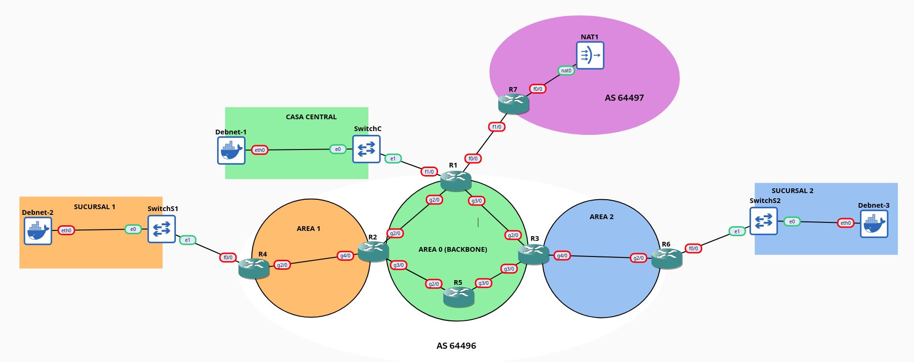
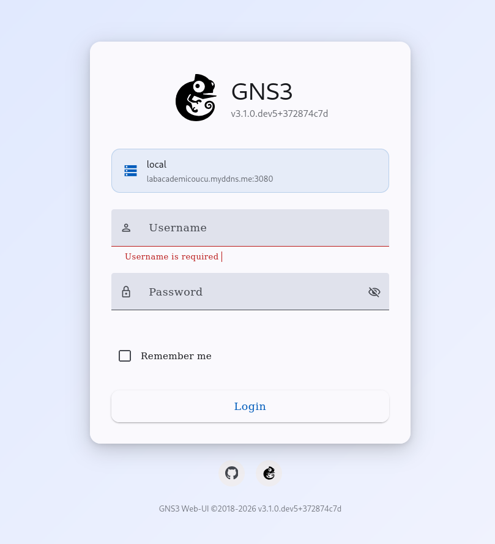
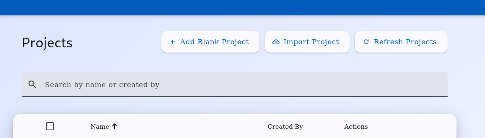
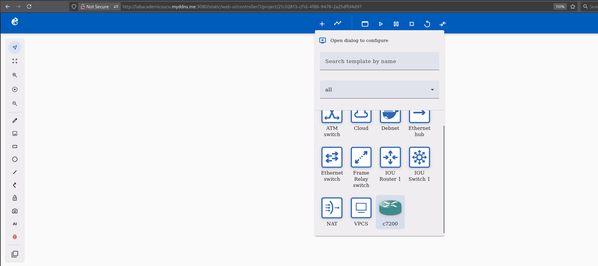

**Curso de Administración de Redes**

**Laboratorio 1 – Armado de una red de capa 3**

\_\_\_\_\_\_\_\_\_\_\_\_\_\_\_\_\_\_\_\_\_\_\_\_\_\_\_\_\_\_\_\_\_\_\_\_\_\_\_\_\_\_\_\_\_\_\_\_\_\_\_\_\_\_\_\_\_\_\_\_\_\_\_\_\_\_\_\_

## Estudio preparatorio del tema y de este LAB

1.  Diapositivas de clase: 01-Protocolos de Enrutamiento – OSPF.pdf

2.  Kurose: Computer.Networking. A.Top-Down Approach 6th Edition

    1.  4.5.1 The Link-State (LS) Routing Algorithm, pág. 366.

    2.  4.6.2 Intra-AS Routing in the Internet: OSPF, pág. 388.

3.  Material de consulta de clase disponible en <https://webasignatura.ucu.edu.uy/pluginfile.php/1144081/mod_folder/content/0/Material_de_consulta/Unidad_1_-_Protocolos_de_ruteo_y_QoS/ospf.pdf>

|  |  |
|:--:|:--:|
| **Nombre de los integrantes del grupo** | **Participó del laboratorio (SI / NO)** |
|  |  |
|  |  |
|  |  |
|  |  |
|  |  |
|  |  |

\_\_\_\_\_\_\_\_\_\_\_\_\_\_\_\_\_\_\_\_\_\_\_\_\_\_\_\_\_\_\_\_\_\_\_\_\_\_\_\_\_\_\_\_\_\_\_\_\_\_\_\_\_\_\_\_\_\_\_\_\_\_\_\_\_\_\_\_

**Objetivo**

El laboratorio tiene por objetivo resolver el diseño e implementación de las políticas de ruteo en una empresa que tiene un sitio central, conexiones a varias sucursales y acceso a Internet.

Los estudiantes durante el laboratorio deberán:

- Configurar el direccionamiento IP de la red.

- Configurar enrutamiento dinámico, protocolo OSPF.

- Configurar una ruta por defecto a Internet.

- Verificar el funcionamiento del protocolo OSPF.

**Requerimientos**

Los participantes se deben dividir en **grupos**.

Cada grupo se deberá́ presentar al laboratorio con:

- Laptops personales por grupo

- La presente letra con el desarrollo del laboratorio.

Al finalizar el laboratorio se deberá́ entregar este documento con:

- Nombre de los integrantes del grupo.

- Las tablas planteadas con los datos completados.

- Capturas de pantalla cuando corresponda.

**Importante**

- El laboratorio puede ser realizado en paralelo en más de un laptop para apoyar al grupo en su ejecución, pero es importante que la documentación para la entrega (respuestas a las distintas preguntas) se realice desde un solo equipo para ser consistentes.

- Mantengan la concentración en el laboratorio para poder finalizar dentro del plazo de clase.

**Maqueta del laboratorio**

Para el laboratorio se armará una maqueta que simulará una Red Privada de una empresa con acceso a Internet y tres áreas de OSPF. Para ello se interconectan routers de forma de implementar la topología de la figura. Los mismos simulan estar ubicados en el sitio central y en las sucursales. En la LAN del sitio central, además, se conecta el router central con el router del proveedor de servicios de Internet.

En la siguiente figura se muestra la red que se desea simular.

La misma consta de:

- Routers C7200 que poseen interfaces FastEthernet y GigaEthernet.

- Ethernet Switches para implementar las redes de sucursales y casa central.

- Tres Dispositivos tipo Docker, que generarán y recibirán tráfico y es desde donde se realizarán los tests de conectividad.

- Cables Ethernet de interconexión.

- Nodo de tipo NAT para conectar la maqueta a Internet.

El direccionamiento IP de la maqueta se muestra en la siguiente tabla:

<table style="width:93%;">
<colgroup>
<col style="width: 25%" />
<col style="width: 18%" />
<col style="width: 29%" />
<col style="width: 19%" />
</colgroup>
<tbody>
<tr>
<td style="text-align: center;"><strong>Subred</strong></td>
<td style="text-align: center;"><strong>a.b.c.d/m</strong></td>
<td style="text-align: center;"><strong>Interfaz – Equipo</strong></td>
<td style="text-align: center;"><strong>Dirección IP</strong></td>
</tr>
<tr>
<td style="text-align: center;"><strong>R7-Internet (NAT)</strong></td>
<td style="text-align: center;">DHCP</td>
<td style="text-align: center;">R7-f0/0</td>
<td style="text-align: center;"><mark>(ingresar ip asignada)</mark></td>
</tr>
<tr>
<td rowspan="2" style="text-align: center;"><strong>LAN-R1 (SwitchC)</strong></td>
<td rowspan="2" style="text-align: center;">172.16.0.0/24</td>
<td style="text-align: center;">R1-f1/0</td>
<td style="text-align: center;">172.16.0.1</td>
</tr>
<tr>
<td style="text-align: center;">Debnet-1-eth0</td>
<td style="text-align: center;">172.16.0.2</td>
</tr>
<tr>
<td rowspan="2" style="text-align: center;"><strong>R1-R7</strong></td>
<td rowspan="2" style="text-align: center;">192.0.2.0/24</td>
<td style="text-align: center;">R1-f0/0</td>
<td style="text-align: center;">192.0.2.1</td>
</tr>
<tr>
<td style="text-align: center;">R7-f1/0</td>
<td style="text-align: center;">192.0.2.2</td>
</tr>
<tr>
<td rowspan="2" style="text-align: center;"><strong>R1-R2</strong></td>
<td rowspan="2" style="text-align: center;">10.0.0.0/30</td>
<td style="text-align: center;">R1-g2/0</td>
<td style="text-align: center;">10.0.0.1</td>
</tr>
<tr>
<td style="text-align: center;">R2-g2/0</td>
<td style="text-align: center;">10.0.0.2</td>
</tr>
<tr>
<td rowspan="2" style="text-align: center;"><strong>R1-R3</strong></td>
<td rowspan="2" style="text-align: center;">10.0.0.4/30</td>
<td style="text-align: center;">R1-g3/0</td>
<td style="text-align: center;">10.0.0.5</td>
</tr>
<tr>
<td style="text-align: center;">R3-g2/0</td>
<td style="text-align: center;">10.0.0.6</td>
</tr>
<tr>
<td rowspan="2" style="text-align: center;"><strong>R2-R5</strong></td>
<td rowspan="2" style="text-align: center;">10.0.0.8/30</td>
<td style="text-align: center;">R2-g3/0</td>
<td style="text-align: center;">10.0.0.9</td>
</tr>
<tr>
<td style="text-align: center;">R5-g2/0</td>
<td style="text-align: center;">10.0.0.10</td>
</tr>
<tr>
<td rowspan="2" style="text-align: center;"><strong>R3-R5</strong></td>
<td rowspan="2" style="text-align: center;">10.0.0.12/30</td>
<td style="text-align: center;">R3-g3/0</td>
<td style="text-align: center;">10.0.0.13</td>
</tr>
<tr>
<td style="text-align: center;">R5-g3/0</td>
<td style="text-align: center;">10.0.0.14</td>
</tr>
<tr>
<td rowspan="2" style="text-align: center;"><strong>R2-R4</strong></td>
<td rowspan="2" style="text-align: center;">10.0.10.0/30</td>
<td style="text-align: center;">R2-g4/0</td>
<td style="text-align: center;">10.0.10.1</td>
</tr>
<tr>
<td style="text-align: center;">R4-g2/0</td>
<td style="text-align: center;">10.0.10.2</td>
</tr>
<tr>
<td rowspan="2" style="text-align: center;"><strong>LAN-R4 (SwitchS1)</strong></td>
<td rowspan="2" style="text-align: center;">172.17.0.0/24</td>
<td style="text-align: center;">R4-f0/0</td>
<td style="text-align: center;">172.17.0.1</td>
</tr>
<tr>
<td style="text-align: center;">Debnet-2-eth0</td>
<td style="text-align: center;">172.17.0.2</td>
</tr>
<tr>
<td rowspan="2" style="text-align: center;"><strong>R3-R6</strong></td>
<td rowspan="2" style="text-align: center;">10.0.20.0/30</td>
<td style="text-align: center;">R3-g4/0</td>
<td style="text-align: center;">10.0.20.1</td>
</tr>
<tr>
<td style="text-align: center;">R6-g2/0</td>
<td style="text-align: center;">10.0.20.2</td>
</tr>
<tr>
<td rowspan="2" style="text-align: center;"><strong>LAN-R6 (SwitchS2)</strong></td>
<td rowspan="2" style="text-align: center;">172.18.0.0/24</td>
<td style="text-align: center;">R6-f0/0</td>
<td style="text-align: center;">172.18.0.1</td>
</tr>
<tr>
<td style="text-align: center;">Debnet-3-eth0</td>
<td style="text-align: center;">172.18.0.2</td>
</tr>
</tbody>
</table>

## 

## 

## 

## 

## Desarrollo del laboratorio

El laboratorio consta de varios pasos las cuales se describen a continuación:

### Paso 1 – Armado de la maqueta en GNS3

Este punto será también explicado por los docentes al comienzo del laboratorio.

1.1 Conexión a servidor remoto.

Nos conectamos al servidor de GNS3 disponible en: <http://labacademicoucu.myddns.me:3080> y nos autenticamos con las credenciales: grupox/Grupoxucu

1.2 Creación de nuevo proyecto para el Laboratorio1

Haciendo click en “Add Blank Project” creamos un proyecto el cual nombraremos como Lab1.Grupox.2026

1.3 Armado de topología en editor del proyecto.

Utilizamos los símbolos de la herramienta para crear la topología, el símbolo de + nos permite agregar dispositivos (arrastrandolo a la pantalla) y el símbolo del cable (al lado del de +) para interconectarlos.

1.4 Inicio de simulación.

Los símbolos Play, Pause, Stop nos permiten manejar la simulación.

Con el botón derecho sobre un dispositivo desplegar un menú que entre otras cosas nos permitirá lanzar la consola de configuración (Web Console – Inline).

Si seleccionamos un link también con el botón derecho podremos acceder a un menú que usaremos para lanzar las capturas y la aplicación Wireshark (inline) para el análisis de tráfico.

### Paso 2 – Configuración inicial, routers, pcs, acceso a Internet. 

Una vez conectados los routers se deben configurar en cada uno el direccionamiento IP en la WAN y en la LAN. Para ello comenzamos haciendo doble click en el router a configurar y a continuación ejecutamos la siguiente secuencia de comandos:

1.  Acceso al modo privilegiado (super-user/root) si no está habilitado.

    - R7\>enable

    - R7#

2.  Acceso a modo configuración

    - R7#configure terminal

3.  Acceso a la interfaz, comenzaremos con la que conecta contra Internet.

- R7(config)#interface FastEthernet 0/0

4.  Se debe configurar las direcciones IP y máscara de la interfaz cuando corresponda y en este caso el modo dhcp porque es la interfaz que conecta contra el acceso a Internet.

- R7(config-if)#

5.  Se debe habilitar la interfaz y configurar el modo dhcp para el direccionamiento, anotando en la tabla de direccionamiento IP de la maqueta la IP obtenida por la interfaz R1-FastEthernet0/0.

- R7(config-if)#no shutdown

- R7(config-if)#ip address dhcp

> \*Mar 17 00:02:35.495: %DHCP-6-ADDRESS_ASSIGN: Interface FastEthernet0/0 assigned DHCP address 192.168.122.111, mask 255.255.255.0, hostname R7

6.  Configuración de DNS.

Si queremos configurar en un router la resolución de DNS podemos hacerlo agregando las siguientes líneas.

- R7(config)#ip name-server 200.40.30.245

- R7(config)#ip domain lookup

- R7(config)#exit

Podemos ahora probar el acceso a Internet y la resolución de nombres desde el router.

- R7#ping www.google.com

Translating "www.google.com"...domain server (192.168.122.1) \[OK\]

Type escape sequence to abort.

> Sending 5, 100-byte ICMP Echos to 142.251.155.119, timeout is 2 seconds:

!!!!!

7.  Se debe regresar al nivel anterior de la secuencia de configuración, para luego repetir el proceso con otra interfaz de este router. También es posible escribir todo el comando desde el nivel (config-if) indicando la otra interfaz, pero no es posible utilizar la función de autocompletado (tecla Tab) pero si permite acceder a la historia (tecla **↑** ).

- R7(config-if)#exit

- R7(config)#

<!-- -->

- R7(config)#interface FastEthernet 1/0

- R7(config-if)#no shutdown

- R7(config-if)#ip address 192.0.2.2 255.255.255.252

8.  Ahora repetimos este procedimiento con el resto de los routers completando la configuración IP.

Posteriormente, se debe verificar el estado de las interfaces de red, para ello se debe ejecutar el siguiente comando:

- R7(config-if)#do show ip interface brief

El comando **do** es necesario solo cuando estoy en el modo **(config)**.

> **OBSERVACIÓN:** Se debe verificar que el direccionamiento IP está correctamente configurado, de acuerdo con la tabla presentada anteriormente, y que las interfaces de red están operativas, **“up”.**

Al finalizar la configuración ejecutar el comando **write** de manera de salvar la configuración del router (debo salir del modo configuración para ejecutar el comando).

9.  Ahora repetimos este procedimiento con los dispositivos Devnet-x configurando el direccionamiento IP mediante la edición del archivo /etc/network/interfaces. Usaremos en la consola la herramienta **vi** o **nano** quitando los comentarios y modificando las IPs de la interfaz eth0 para ajustarla a los datos suministrados.

- root@Debnet-1:/# vi /etc/network/interfaces

> \#Static config for eth0
>
> auto eth0
>
> iface eth0 inet static
>
> address 172.16.0.2
>
> netmask 255.255.255.0
>
> gateway 172.16.0.1
>
> Si queremos configurar el DNS tenemos que editar el archivo /etc/resolv.conf y agregar la siguiente línea:

nameserver 200.40.30.245

10. Ahora habilitamos la interfaz con la nueva configuración y realizamos un ping al gateway

Ej. En Debnet-1:

- root@Debnet-1:/# ifup eth0

- root@Debnet-1:/# ping 172.16.0.1

> PING 172.16.0.1 (172.16.0.1) 56(84) bytes of data.
>
> 64 bytes from 172.16.0.1: icmp_seq=1 ttl=255 time=63.7 ms
>
> 64 bytes from 172.16.0.1: icmp_seq=2 ttl=255 time=19.7 ms

### Paso 3 – Tablas de enrutamiento

###  

1.  Desplegar e interpretar el contenido de la tabla de ruteo en algunos de los routers:

- R1# show ip route

Complete las siguientes tablas, que representa a la tabla de ruteo de los routers R1 y R7, en función de la información desplegada, no ingrese las entradas de tipo “Local” (L).

**R1**

|                 |         |     |         |               |          |
|:---------------:|:-------:|:---:|:-------:|:-------------:|:--------:|
| Tipo de entrada | Métrica | Red | Máscara | Próximo salto | Interfaz |
|                 |         |     |         |               |          |
|                 |         |     |         |               |          |
|                 |         |     |         |               |          |
|                 |         |     |         |               |          |

**R7**

|                 |         |     |         |               |          |
|:---------------:|:-------:|:---:|:-------:|:-------------:|:--------:|
| Tipo de entrada | Métrica | Red | Máscara | Próximo salto | Interfaz |
|                 |         |     |         |               |          |
|                 |         |     |         |               |          |
|                 |         |     |         |               |          |
|                 |         |     |         |               |          |

### Paso 4 – Prueba de conectividad

Ahora, desde el PC de la Sucursal 1 realice un ping al PC de la Casa Central y complete la siguiente tabla.

|  |  |  |  |
|:--:|:--:|:--:|:--:|
| IP Debnet-2 | IP Debnet-1 | Resultado del Ping | Explique por qué se obtuvo ese resultado |
|  |  |  |  |

### ¿Está llegando a destino?:

###  Justifique la respuesta

### 

### Paso 5 – Configuración deL enrutamiento dinámico en la red, OSPF. 

Este paso se debe configurar el enrutamiento de la red en forma dinámica. Para ello se debe configurar el protocolo de ruteo OSPF, instanciando el protocolo y luego seleccionando las subredes que se van a publicar. Para evitar que el protocolo OSPF envíe información hacia las redes LANes de Casa Central y Sucursales se pasiva en dichas interfaces:

1.  Acceda al modo de configuración del router

- Router# enable

- Router# configure terminal

2.  Acceda al sub-nivel de configuración del protocolo OSPF donde indicamos el número de proceso OSPF (número entre 1-65535) y luego agregamos las interfaces que pertenecen a el área indicando el número de red y la wildcard\*.

- R1(config)#router ospf 1

<!-- -->

- R1(config-router)#network 10.0.0.0 0.0.0.3 area 0

<!-- -->

- R1(config-router)#network 10.0.0.4 0.0.0.3 area 0

> \* Se invierten los bits de la máscara.
>
> Otra forma de hacer esto mismo es parándose en la configuración de la interfaz e indicando el proceso y área OSPF a la que queremos que pertenezca. Para el ejemplo anterior:

- R1(config)#interface GigabitEthernet 2/0

- R1(config-if)#ip ospf 1 area 0

- R1(config)#interface GigabitEthernet 3/0

- R1(config-if)#ip ospf 1 area 0

3.  Para las interfaces de tipo LAN, agregamos la red pero anulamos los anuncios de OSPF en la misma.

- R1(config-router)#network 172.16.0.0 0.0.0.255 area 0

- R1(config-router)#passive-interface FastEthernet 1/0

4.  Terminar la configuración para el resto de los equipos de la red, tener en cuenta las áreas ospf, incluyendo las redes LAN en la misma área que pertenece su gateway.

**Paso 6 – Verificación de vecindades y actualización de tablas de enrutamiento.**

1.  Verificar las vecindades OSPF en al menos dos routers, identificando el Router ID utilizado. Indicar a qué interfaz del equipo corresponde la IP y cuál es la razón.

- R1#show ip ospf neighbor.

Router:

| Neighbor ID | State | Dead Time | Address | Interface | Router |
|-------------|-------|-----------|---------|-----------|--------|
|             |       |           |         |           |        |
|             |       |           |         |           |        |
|             |       |           |         |           |        |

Router:

| Neighbor ID | State | Dead Time | Address | Interface | Router |
|-------------|-------|-----------|---------|-----------|--------|
|             |       |           |         |           |        |
|             |       |           |         |           |        |
|             |       |           |         |           |        |

2.  Capture tráfico en una interfaz en el link R1-R4 y analice el contenido de un paquete Hello. ¿Qué datos relevantes identifica en el mensaje?

3.  Ingrese a un Neighbor de la tabla y verifique cuál de las interfaces está usando para anunciar su Router ID.

4.  Para una de estas vecindades configure una IP de loopback del rango 192.168.1.0/24, usando como último octeto el número de router.

- R2(config)#interface loopback 0

- R2(config-if)#ip address 192.168.1.2 255.255.255.255

5.  Reinicie todos los procesos OSPF y verifique si se producen cambios en los IDs, justifique.\*

- R2#clear ip ospf process

- Reset ALL OSPF processes? \[no\]: yes

\*Si al verificar no hay cambios en la IP de la vecindad guarde la configuración (en este caso de R2) con un wr y luego apague y vuelva a encender el router en el simulador.

6.  Repita la configuración de la interfaz loopback 0 en el resto de los routers (192.168.1.x con x el número de router) para una mejor identificación de estos guardando la configuración en cada uno al finalizar. Apague y encienda nuevamente la simulación.

**Paso 7 – Actualización de tablas de enrutamiento.**

1.  **Una vez que la red esté estable (pocos segundos)**, verifique el contenido de la tabla de ruteo

- R1# show ip route

Posteriormente, complete tabla de ruteo del router R1 y de otro router, en función de la **<u>NUEVA</u>** información **<u>RELEVANTE</u>** desplegada:

Router R1

|                 |         |     |         |                      |
|:---------------:|:-------:|:---:|:-------:|:--------------------:|
| Tipo de entrada | Métrica | Red | Máscara | IP del próximo salto |
|                 |         |     |         |                      |
|                 |         |     |         |                      |
|                 |         |     |         |                      |
|                 |         |     |         |                      |
|                 |         |     |         |                      |
|                 |         |     |         |                      |
|                 |         |     |         |                      |
|                 |         |     |         |                      |

Router R2

|                 |         |     |         |                      |
|:---------------:|:-------:|:---:|:-------:|:--------------------:|
| Tipo de entrada | Métrica | Red | Máscara | IP del próximo salto |
|                 |         |     |         |                      |
|                 |         |     |         |                      |
|                 |         |     |         |                      |
|                 |         |     |         |                      |
|                 |         |     |         |                      |
|                 |         |     |         |                      |
|                 |         |     |         |                      |
|                 |         |     |         |                      |

**Paso 7 – Prueba de conectividad**

Ahora, desde un dispositivo tipo PC de la Sucursal 1 realice un ping a un PC de la Casa Central y complete la siguiente tabla.

|  |  |  |  |
|:--:|:--:|:--:|:--:|
| IP PC Sucursal 1 | IP PC Casa Central | Resultado del Ping | Explique por qué se obtuvo ese resultado |
|  |  |  |  |

### Paso 8 – Configuración del protocolo BGP

Realizaremos la configuración básica del protocolo BGP para inspeccionar los LSA de tipo 5.

Comenzamos con el router R1 que es el ASBR del Sistema Autónomo 64496 y establecerá una sesión BGP con el AS 65597.

- R1# conf t

- R1(config)#router bgp 64496

- R1(config-router)#neighbor 192.0.2.2 remote-as 64497

- R1(config-router)#neighbor 192.0.2.2 activate

Hacemos lo mismo con el router de borde R7 del AS 64497. Al activar el neighbor vemos que levanta la vecindad.

- R7# conf t

- R7(config)#router bgp 64497

- R7(config-router)#neighbor 192.0.2.1 remote-as 64496

- R7(config-router)#neighbor 192.0.2.1 activate

> \*Mar 17 21:35:16.638: %BGP-5-ADJCHANGE: neighbor 192.0.2.1 Up

Copiamos y pegamos el resto de la configuración que será explicada en clase.

**Router R1**

- R1# conf t

! --- Definir prefijos de salida ---

ip prefix-list PL-LAN-OUT seq 5 permit 172.16.0.0/24

ip prefix-list PL-LAN-OUT seq 10 permit 172.17.0.0/24

ip prefix-list PL-LAN-OUT seq 15 permit 172.18.0.0/24

! --- Route-map para salida ---

route-map RM-ISP-OUT permit 10

match ip address prefix-list PL-LAN-OUT

! --- Route-map para entrada (Aceptar solo la default y la red wan entre R7 y NAT) ---

ip prefix-list PL-DEFAULT-IN seq 5 permit 0.0.0.0/0

ip prefix-list PL-TEST-IN seq 10 permit 192.168.122.0/24

route-map RM-ISP-IN permit 10

match ip address prefix-list PL-DEFAULT-IN

! Permitimos también la red de prueba para visualizar un prefijo externo no solo la ruta por defecto (¡en Internet serían más de un millón!).

route-map RM-ISP-IN permit 20

match ip address prefix-list PL-TEST-IN

! --- Configuración BGP ---

router bgp 64496

neighbor 192.0.2.2 remote-as 64497

address-family ipv4

neighbor 192.0.2.2 route-map RM-ISP-IN in

neighbor 192.0.2.2 route-map RM-ISP-OUT out

! Publicamos las redes (deben estar en la tabla de ruteo por OSPF)

network 172.16.0.0 mask 255.255.255.0

network 172.17.0.0 mask 255.255.255.0

network 172.18.0.0 mask 255.255.255.0

exit-address-family

! --- Propagar Default Route en OSPF ---

router ospf 1

default-information originate

! 1. Creamos un Prefix-list para identificar la red del ISP

ip prefix-list PL-OSPF-REDIST seq 5 permit 192.168.122.0/24

! 2. Creamos el Route-map que permite esa red

route-map RM-BGP-TO-OSPF permit 10

match ip address prefix-list PL-OSPF-REDIST

! 3. Entramos a OSPF y realizamos la redistribución

router ospf 1

redistribute bgp 64496 subnets route-map RM-BGP-TO-OSPF

**Router R7**

- R7# conf t

! --- Definir prefijos de entrada y salida---

ip prefix-list PL-CLIENTE-IN seq 5 permit 172.16.0.0/24

ip prefix-list PL-CLIENTE-IN seq 10 permit 172.17.0.0/24

ip prefix-list PL-CLIENTE-IN seq 15 permit 172.18.0.0/24

ip prefix-list PL-TEST-OUT seq 5 permit 192.168.122.0/24

ip prefix-list PL-DEFAULT-OUT seq 10 permit 0.0.0.0/0

! --- Route-maps para salida ---

route-map RM-CLIENTE-OUT permit 10

match ip address prefix-list PL-TEST-OUT

route-map RM-CLIENTE-OUT permit 20

match ip address prefix-list PL-DEFAULT-OUT

! --- Route-map para entrada---

route-map RM-CLIENTE-IN permit 10

match ip address prefix-list PL-CLIENTE-IN

! --- Configuración BGP ---

router bgp 64497

neighbor 192.0.2.1 remote-as 64496

neighbor 192.0.2.1 description PEERING_HACIA_R1_AS64496

address-family ipv4

neighbor 192.0.2.1 route-map RM-CLIENTE-IN in

neighbor 192.0.2.1 route-map RM-CLIENTE-OUT out

! Generamos y anunciamos la default route

neighbor 192.0.2.1 default-originate

! Anunciamos la red de prueba

network 192.168.122.0 mask 255.255.255.0

exit-address-family

### Paso 9 – Configuración del NAT

Realizar un traceroute desde un PC de alguna de las LANes de sucursales hacia la IP 8.8.8.8.

Resultado:

1)¿Está llegando al destino?.

2\) ¿Hasta qué IP llega?

3)¿Qué le parece que está pasando?

3\) Aplique esta configuración en el router R7

- R7# conf t

> !---ACL que permite todas las IP (matchea cualquier tráfico IP) ---

- R7(config)#access-list 100 permit ip any any

- R7(config)#ip nat inside source list 100 interface FastEthernet 0/0 overload

- R7(config)#interface FastEthernet 0/0

- R7(config-if)#ip nat outside

- R7(config)#interface FastEthernet 1/0

- R7(config-if)#ip nat inside

4)Vuelva a probar el traceroute a la IP 8.8.8.8

Resultado:

5\) ¿Qué puede concluir de lo realizado?

### 

### 

### Paso 10 – Actualización de tabla de enrutamiento

1)  Verifique la nueva configuración de la tabla de enrutamiento en R1 y en R4 y complete las siguientes tablas con la información nueva encontrada.

R1

|                 |         |     |         |                      |
|:---------------:|:-------:|:---:|:-------:|:--------------------:|
| Tipo de entrada | Métrica | Red | Máscara | IP del próximo salto |
|                 |         |     |         |                      |
|                 |         |     |         |                      |

R4

|                 |         |     |         |                      |
|:---------------:|:-------:|:---:|:-------:|:--------------------:|
| Tipo de entrada | Métrica | Red | Máscara | IP del próximo salto |
|                 |         |     |         |                      |
|                 |         |     |         |                      |

2)  ¿Por qué aparecen estas entradas? (analizar el tipo)

### Paso 11 – Verificación de LSAs.

Comience una captura de tráfico entre R4 y R2 filtrando por “ospf” en Wireshark.

En la consola de R1 ejecute el siguiente comando para hacer un reset del proceso OSPF.

- R1#clear ip ospf process

> Reset ALL OSPF processes? \[no\]: yes

1.  Identifique en Wireshark los mensajes de LS de tipo 3, 4 y 5, analícelos y presente los resultados.

2.  Verifique en uno de los dos routers los mensajes recibidos utilizando el siguiente comando.

- R2#show ip ospf database

**Paso 12 – Metricas estandares y modificación de las mismas.**

3.  Parado en R4 encuentre la métrica para llegar a la red 172.18.0.0 utilizando dos comandos.

- R5#show ip ospf database xxxx 172.18.0.0

- R5#show ip route

4.  Modifique la métrica del enlace entre R2 y R1 (interfaces Gig2/0 en cada router).

- R2(config)#interface GigabitEthernet 2/0

- R2(config-interface)#ip ospf cost 10 \[\*\]

\*también puedo hacerlo a nivel global en la caja configurando el bw de referencia (default 100).

- R2(config)#router ospf 1

- R2(config-router)#auto-cost reference-bandwidth 1000

5.  Vuelva a analizar la métrica desde R4 y justifique el resultado.

### Paso 13 – Análisis de la respuesta del protocolo ante fallas.

1.  Realice desde el contenedor Debnet-1 un traceroute hacia la IP 8.8.8.8.

Resultado:

Capture ahora tráfico en el link entre R2 y R5, lance el Wireshark web en una ventana y filtre por el protocolo OSPF.

2.  En el router R2 ingrese al modo configuración y baje administrativamente la interfaz.

- R2(config)#interface gigabitEthernet 2/0

- R2(config-if)#shut

- R2(config-if)#shutdown

3.  Analice la captura de consola y el LS Update en la captura.

4.  Vuelva a realizar el traceroute:

5.  Analice qué está pasando y justifique utilizando la tabla de enrutamiento.

6.  Vuelva a encender la interfaz (no shut) y analice el nuevo LSA que genera el R2.

==================================================================

RESUMEN DEL LABORATORIO

1.  Comenzamos armando una maqueta en la herramienta de simulación GNS3, maqueta que usaremos en otros laboratorios del curso.

2.  Configuramos el direccionamiento IP de los routers de la red y de los contenedores.

3.  Analizamos la tabla de enrutamiento visualizando solamente las rutas estáticas.

4.  Realizamos una prueba de conectividad desde la LAN usando uno de los contenedores.

5.  Configuramos el protocolo IGP de tipo Link State OSPF en modo multi-área.

6.  Analizamos los mensajes de descubrimiento de vecinos.

7.  Volvemos a verificar la tabla de enrutamiento con el nuevo contenido aprendido por OSPF.

8.  Configuramos el protocolo BGP entre un ISP y un Cliente.

9.  Configuración de NAT en el router de la red del Cliente para dar salida a internet al resto de las sucursales.

10. Volvemos a analizar la tabla de enrutamiento con la información relevante inyectada por BGP.

11. Analizamos los diferentes tipos de LSA de la base de datos OSPF.

12. Modificación de la métrica por defecto de una interfaz

13. Analizamos una falla de la red, verificando cambios en la tabla de enrutamiento, en los mensajes de OSPF intercambiados y el cambio de la ruta tomada por los paquetes IP.

FIN DEL LABORATORIO

## Evaluación del laboratorio (grupal)

- ¿Qué aspectos le gustaron del laboratorio?

\_\_\_\_\_\_\_\_\_\_\_\_\_\_\_\_\_\_\_\_\_\_\_\_\_\_\_\_\_\_\_\_\_\_\_\_\_\_\_\_\_\_\_\_\_\_\_\_\_\_\_\_\_\_\_\_\_\_\_\_\_\_\_\_\_\_\_\_\_\_\_\_\_\_\_\_\_\_\_\_\_\_\_\_\_\_\_\_\_\_\_\_\_\_\_\_\_\_\_\_\_\_\_\_\_\_\_\_\_\_\_\_\_\_\_\_\_\_\_\_\_\_\_\_\_\_\_\_\_\_\_\_\_\_\_\_\_\_\_\_\_\_\_\_\_\_\_\_\_\_\_\_\_\_\_\_\_\_\_\_\_\_\_\_\_\_\_\_\_\_\_\_\_\_\_\_\_\_\_\_\_\_\_\_\_\_\_\_\_\_\_\_\_\_\_\_\_\_\_\_\_\_\_\_\_\_\_\_\_\_\_\_\_\_\_\_\_\_\_\_\_\_\_\_\_\_\_\_\_\_\_\_\_\_\_\_\_\_\_\_\_\_\_\_\_\_\_\_\_\_\_\_\_\_\_\_\_\_\_\_\_\_\_\_\_\_\_\_\_\_\_\_\_\_\_\_\_\_\_\_\_\_\_\_\_\_\_\_\_\_\_\_\_\_\_\_\_\_\_\_\_\_\_\_\_\_\_\_\_\_\_\_\_\_\_\_\_\_\_\_\_\_\_\_\_\_\_\_\_\_\_\_\_\_\_\_\_\_\_\_\_\_\_\_\_\_\_\_\_\_\_\_\_\_\_\_\_\_\_\_\_\_\_\_\_\_\_\_\_\_\_\_\_\_\_\_\_\_\_\_

- ¿Cuáles no?

\_\_\_\_\_\_\_\_\_\_\_\_\_\_\_\_\_\_\_\_\_\_\_\_\_\_\_\_\_\_\_\_\_\_\_\_\_\_\_\_\_\_\_\_\_\_\_\_\_\_\_\_\_\_\_\_\_\_\_\_\_\_\_\_\_\_\_\_\_\_\_\_\_\_\_\_\_\_\_\_\_\_\_\_\_\_\_\_\_\_\_\_\_\_\_\_\_\_\_\_\_\_\_\_\_\_\_\_\_\_\_\_\_\_\_\_\_\_\_\_\_\_\_\_\_\_\_\_\_\_\_\_\_\_\_\_\_\_\_\_\_\_\_\_\_\_\_\_\_\_\_\_\_\_\_\_\_\_\_\_\_\_\_\_\_\_\_\_\_\_\_\_\_\_\_\_\_\_\_\_\_\_\_\_\_\_\_\_\_\_\_\_\_\_\_\_\_\_\_\_\_\_\_\_\_\_\_\_\_\_\_\_\_\_\_\_\_\_\_\_\_\_\_\_\_\_\_\_\_\_\_\_\_\_\_\_\_\_\_\_\_\_\_\_\_\_\_\_\_\_\_\_\_\_\_\_\_\_\_\_\_\_\_\_\_\_\_\_\_\_\_\_\_\_\_\_\_\_\_\_\_\_\_\_\_\_\_\_\_\_\_\_\_\_\_\_\_\_\_\_\_\_\_\_\_\_\_\_\_\_\_\_\_\_\_\_\_\_\_\_\_\_\_\_\_\_\_\_\_\_\_\_\_\_\_\_\_\_\_\_\_\_\_\_\_\_\_\_\_\_\_\_\_\_\_\_\_\_\_\_\_\_\_\_\_\_\_\_\_\_\_\_\_\_\_\_\_\_\_\_

- ¿Qué le agregaría o mejoraría del laboratorio?

\_\_\_\_\_\_\_\_\_\_\_\_\_\_\_\_\_\_\_\_\_\_\_\_\_\_\_\_\_\_\_\_\_\_\_\_\_\_\_\_\_\_\_\_\_\_\_\_\_\_\_\_\_\_\_\_\_\_\_\_\_\_\_\_\_\_\_\_\_\_\_\_\_\_\_\_\_\_\_\_\_\_\_\_\_\_\_\_\_\_\_\_\_\_\_\_\_\_\_\_\_\_\_\_\_\_\_\_\_\_\_\_\_\_\_\_\_\_\_\_\_\_\_\_\_\_\_\_\_\_\_\_\_\_\_\_\_\_\_\_\_\_\_\_\_\_\_\_\_\_\_\_\_\_\_\_\_\_\_\_\_\_\_\_\_\_\_\_\_\_\_\_\_\_\_\_\_\_\_\_\_\_\_\_\_\_\_\_\_\_\_\_\_\_\_\_\_\_\_\_\_\_\_\_\_\_\_\_\_\_\_\_\_\_\_\_\_\_\_\_\_\_\_\_\_\_\_\_\_\_\_\_\_\_\_\_\_\_\_\_\_\_\_\_\_\_\_\_\_\_\_\_\_\_\_\_\_\_\_\_\_\_\_\_\_\_\_\_\_\_\_\_\_\_\_\_\_\_\_\_\_\_\_\_\_\_\_\_\_\_\_\_\_\_\_\_\_\_\_\_\_\_\_\_\_\_\_\_\_\_\_\_\_\_\_\_\_\_\_\_\_\_\_\_\_\_\_\_\_\_\_\_\_\_\_\_\_\_\_\_\_\_\_\_\_\_\_\_\_\_\_\_\_\_\_\_\_\_\_\_\_\_\_\_\_\_\_\_\_\_\_\_\_\_\_\_\_
