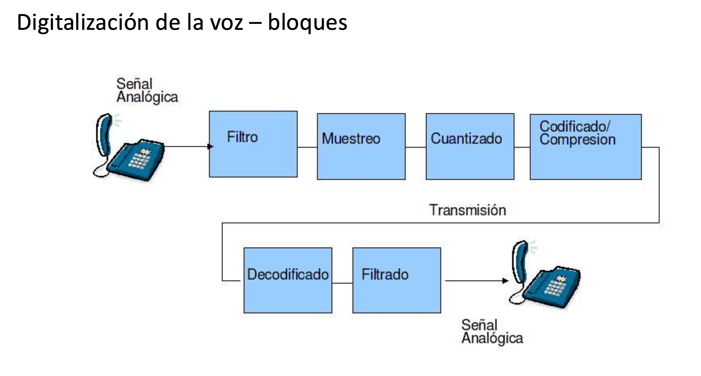
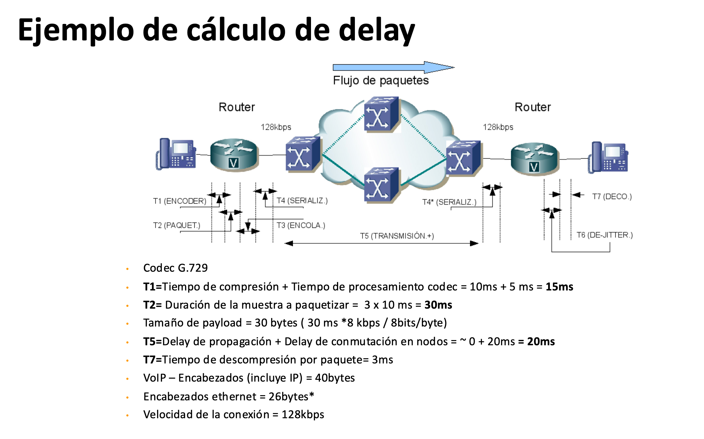
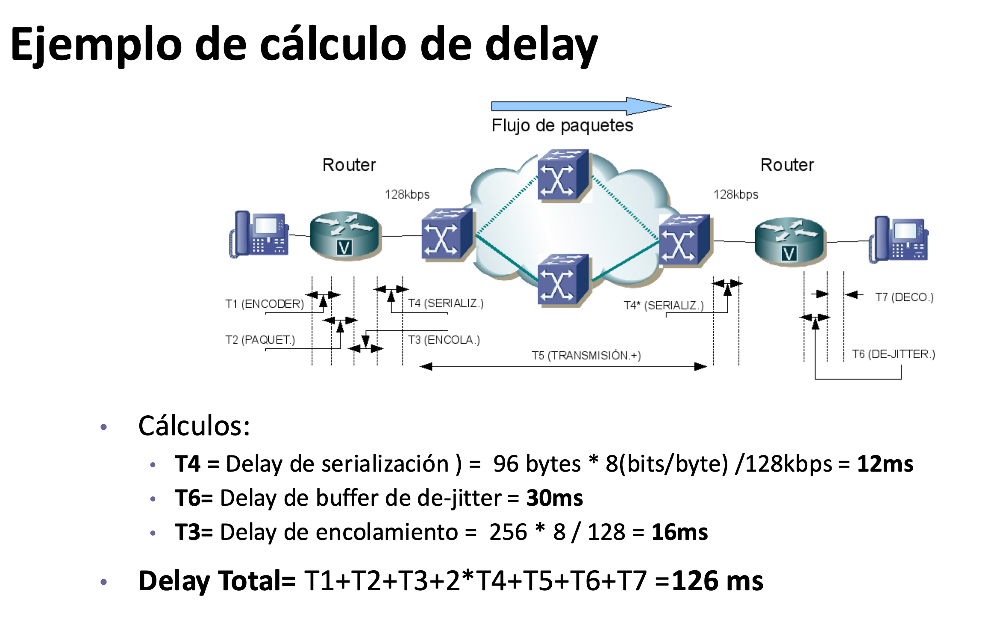
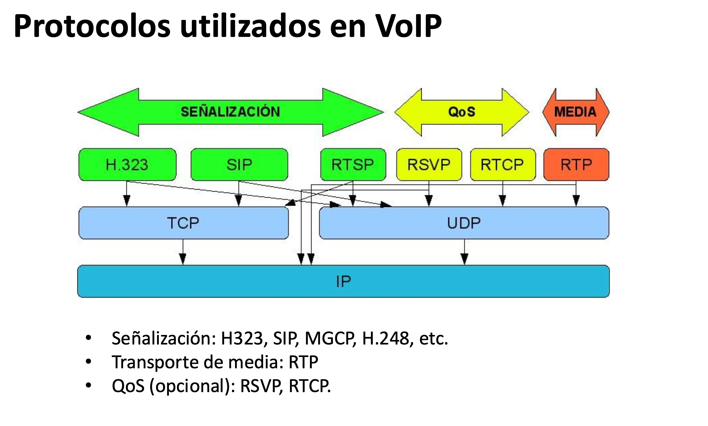
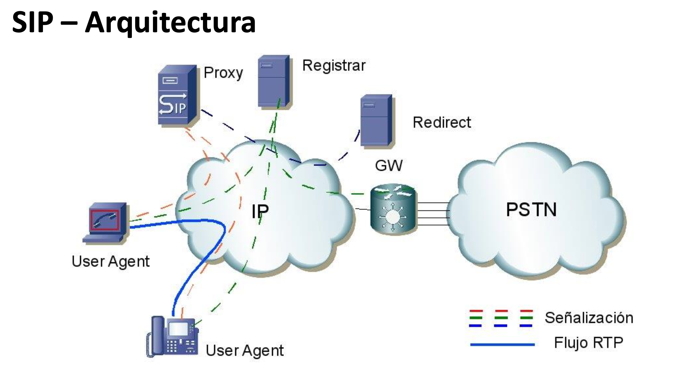
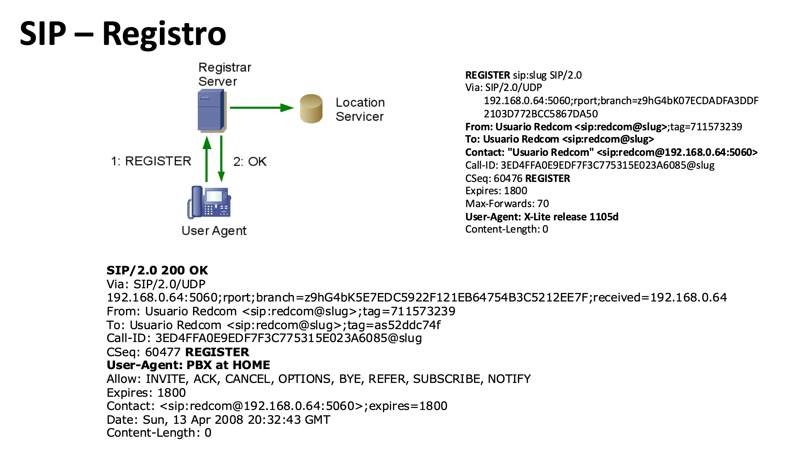
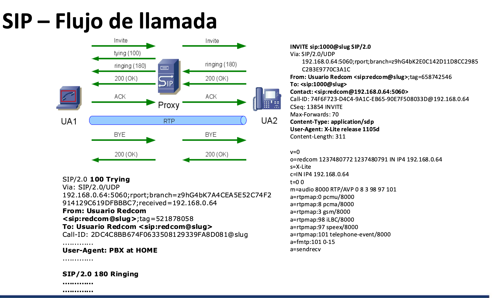
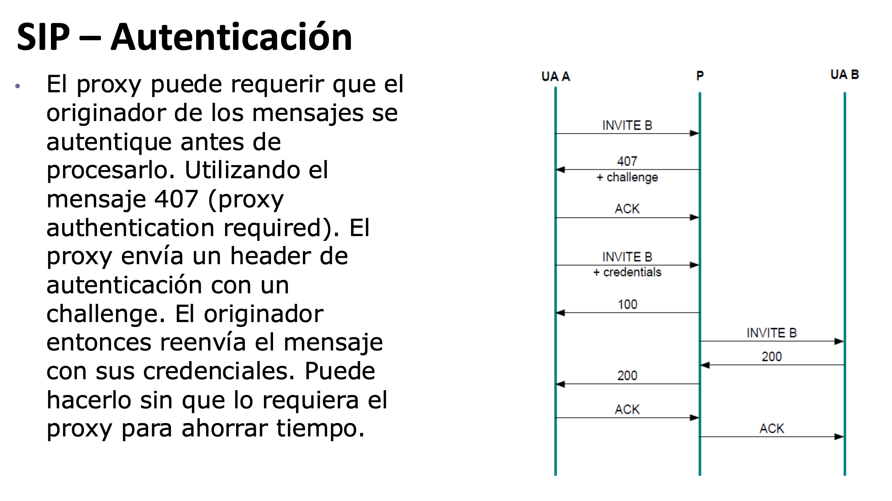
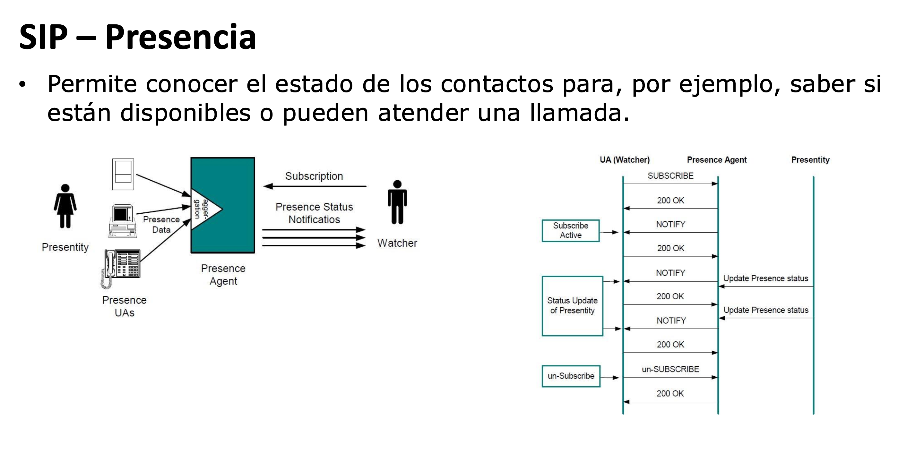
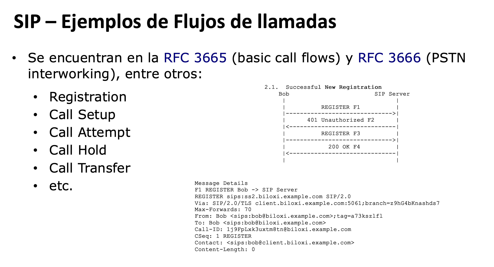

# 05-10-2026 — VoIP (Voice over IP)

## Índice

- [1. VoIP de un vistazo: las dos mitades](#1-voip-de-un-vistazo-las-dos-mitades)
- [2. Digitalización de la voz](#2-digitalización-de-la-voz)
  - [2.1 Filtro: el que evita el desastre](#21-filtro-el-que-evita-el-desastre)
  - [2.2 Muestreo: de dónde salen las 8000 muestras por segundo](#22-muestreo-de-dónde-salen-las-8000-muestras-por-segundo)
  - [2.3 Cuantización: el paso que pierde información](#23-cuantización-el-paso-que-pierde-información)
  - [2.4 Codificación y compresión](#24-codificación-y-compresión)
  - [2.5 De dónde salen los 64 kbps](#25-de-dónde-salen-los-64-kbps)
- [3. Codecs: las tres familias](#3-codecs-las-tres-familias)
  - [3.1 Waveform: copiar la onda](#31-waveform-copiar-la-onda)
  - [3.2 Vocoders: no mandar la voz, mandar la receta](#32-vocoders-no-mandar-la-voz-mandar-la-receta)
  - [3.3 Híbridos: lo mejor de los dos mundos](#33-híbridos-lo-mejor-de-los-dos-mundos)
  - [3.4 Tabla comparativa](#34-tabla-comparativa)
- [4. MOS (Mean Opinion Score)](#4-mos-mean-opinion-score)
- [5. El delay en voz paquetizada](#5-el-delay-en-voz-paquetizada)
  - [5.1 Qué dice la ITU-T G.114](#51-qué-dice-la-itu-t-g114)
  - [5.2 Los siete tiempos: T1 a T7](#52-los-siete-tiempos-t1-a-t7)
  - [5.3 El ejemplo de clase, número por número](#53-el-ejemplo-de-clase-número-por-número)
  - [5.4 Ejercicio resuelto: el mismo método con otros datos](#54-ejercicio-resuelto-el-mismo-método-con-otros-datos)
  - [5.5 Cuánto ancho de banda consume realmente una llamada](#55-cuánto-ancho-de-banda-consume-realmente-una-llamada)
  - [5.6 Cómo encarar esto en el parcial](#56-cómo-encarar-esto-en-el-parcial)
- [6. Protocolos usados en VoIP](#6-protocolos-usados-en-voip)
- [7. RTP, RTCP y el jitter](#7-rtp-rtcp-y-el-jitter)
  - [7.1 Qué le agrega RTP a UDP](#71-qué-le-agrega-rtp-a-udp)
  - [7.2 Jitter y buffer de de-jitter](#72-jitter-y-buffer-de-de-jitter)
  - [7.3 RTCP: el canal de control](#73-rtcp-el-canal-de-control)
  - [7.4 Por qué RTP no asegura calidad](#74-por-qué-rtp-no-asegura-calidad)
  - [7.5 Entonces, ¿cómo se le aplica QoS a VoIP?](#75-entonces-cómo-se-le-aplica-qos-a-voip)
- [8. SIP: generalidades](#8-sip-generalidades)
- [9. SIP: arquitectura y los tres servidores](#9-sip-arquitectura-y-los-tres-servidores)
  - [9.1 User Agent (UAC / UAS)](#91-user-agent-uac--uas)
  - [9.2 Registrar Server](#92-registrar-server)
  - [9.3 Proxy Server](#93-proxy-server)
  - [9.4 Redirect Server](#94-redirect-server)
  - [9.5 Las piezas de soporte: Location Service, Gateway y B2BUA](#95-las-piezas-de-soporte-location-service-gateway-y-b2bua)
  - [9.6 Los tres servidores, lado a lado](#96-los-tres-servidores-lado-a-lado)
- [10. SIP: el registro, paso a paso](#10-sip-el-registro-paso-a-paso)
- [11. SIP: el flujo de llamada, paso a paso](#11-sip-el-flujo-de-llamada-paso-a-paso)
- [12. SIP: autenticación](#12-sip-autenticación)
- [13. SIP: métodos (mensajes de petición)](#13-sip-métodos-mensajes-de-petición)
- [14. SIP: mensajes de respuesta](#14-sip-mensajes-de-respuesta)
- [15. SIP: direccionamiento (SIP-URIs)](#15-sip-direccionamiento-sip-uris)
- [16. SDP (Session Description Protocol)](#16-sdp-session-description-protocol)
- [17. SUBSCRIBE / NOTIFY y presencia](#17-subscribe--notify-y-presencia)
- [18. Forking de mensajes](#18-forking-de-mensajes)
- [19. Flujos de llamada de referencia](#19-flujos-de-llamada-de-referencia)
- [20. Resumen para el parcial](#20-resumen-para-el-parcial)

---

## 1. VoIP de un vistazo: las dos mitades

**VoIP (Voice over IP)** es llevar una conversación telefónica sobre una red IP. El tema se parte siempre en **dos mitades que son independientes entre sí**, y entender esa separación es la llave de toda la clase:

| | **Señalización** (plano de control) | **Media** (plano de datos) |
|---|---|---|
| ¿Qué hace? | Ubicar al otro, hacer sonar el teléfono, negociar con qué codec van a hablar, cortar | Llevar la voz digitalizada de una punta a la otra |
| ¿Qué protocolo? | **SIP** (y H.323, MGCP, H.248) | **RTP** sobre UDP |
| ¿Por dónde va? | Pasa por los servidores SIP (proxies) | **Directo entre los dos teléfonos** |
| ¿Cuánto tráfico es? | Unos pocos mensajes de texto | Un paquete cada 20–30 ms, durante toda la llamada |

La consecuencia práctica de esta separación: **el servidor SIP no ve ni toca el audio**. Arma la llamada y se corre del camino. Por eso un servidor modesto puede manejar miles de llamadas simultáneas — solo mueve señalización.

### El problema de fondo del transporte

La voz la vamos a mandar sobre **UDP**, no sobre TCP. ¿Por qué elegir un transporte que no garantiza nada?

Porque para voz en tiempo real, **la retransmisión de TCP no sirve**: si un paquete con 30 ms de audio se pierde, pedirlo de nuevo y esperarlo significa que cuando llegue, ese audio ya tendría que haber sonado hace rato. Llega tarde, y un audio que llega tarde es basura — es exactamente igual de inútil que si se hubiera perdido, pero encima nos costó tiempo y ancho de banda. Además, el control de congestión de TCP frena el flujo justo cuando la voz necesita cadencia constante.

Entonces elegimos velocidad: UDP. Pero UDP nos deja sin nada:

- los paquetes pueden **perderse**,
- pueden **llegar desordenados** (tomaron caminos distintos),
- pueden **llegar con separaciones irregulares** (jitter),
- y no hay forma de saber en qué momento de la conversación va cada uno.

Ahí entra **RTP**: una capa fina que le agrega al payload UDP lo mínimo necesario (número de secuencia, timestamp, identificación del codec) para **detectar pérdidas, reordenar y reconstruir la temporización original**, sin pagar el precio de la confiabilidad. Lo vemos en detalle en la [sección 7](#7-rtp-rtcp-y-el-jitter).

> **La idea en una frase:** UDP da velocidad pero no da orden ni tiempo; RTP agrega orden y tiempo sin sacrificar la velocidad.

---

## 2. Digitalización de la voz

Antes de poder mandar la voz por una red IP hay que convertirla en bits. Ese proceso es una cadena de bloques, y cada bloque hace exactamente una cosa:



```
  ┌──────────── LADO EMISOR ─────────────────────────────────┐
  Señal      ┌────────┐  ┌──────────┐  ┌────────────┐  ┌─────────────┐
  analógica →│ FILTRO │ →│ MUESTREO │ →│ CUANTIZADO │ →│ CODIFICADO/ │→ bits
             └────────┘  └──────────┘  └────────────┘  │ COMPRESIÓN  │
              acota en    toma 8000     redondea a      └─────────────┘
              frecuencia  muestras/s    valores          arma palabras
                                        discretos        y comprime
                                                               │
                                                        TRANSMISIÓN
                                                               │
  ┌──────────── LADO RECEPTOR ───────────────────────────────┐ │
             ┌──────────────┐  ┌──────────┐                   ▼
  bits     → │ DECODIFICADO │ →│ FILTRADO │ → Señal analógica
             └──────────────┘  └──────────┘
              reconstruye      alisa los escalones
              las muestras     de la reconstrucción
```

Fijate en la simetría: el receptor **deshace** lo que hizo el emisor, en orden inverso. Y fijate algo más importante: hay un bloque que **no se puede deshacer**. El cuantizado pierde información para siempre — esa pérdida es el precio de pasar al mundo digital, y de ahí sale el "ruido de cuantización".

### 2.1 Filtro: el que evita el desastre

Lo primero que se hace es **acotar la señal en frecuencia** antes de muestrearla:

| | Banda del filtro | Frecuencia de muestreo |
|---|---|---|
| **Narrowband** (telefonía clásica) | 300 Hz – 3400 Hz | 8 kHz |
| **Wideband** (HD voice, G.722) | 50 Hz – 7000 Hz | 16 kHz |

> ⚠️ En los apuntes de clase la banda narrowband aparece como "300 Hz a 4,3 kHz". El valor estándar de la ITU-T es **300–3400 Hz** (parece un 3,4 transpuesto). Lo que sí ocupa 4 kHz es **el canal completo**, que incluye bandas de guarda a los costados — y de ahí viene, justamente, el muestreo a 8 kHz.

**¿Por qué acotar en frecuencia?** Por dos razones distintas, y conviene no mezclarlas:

1. **Porque alcanza.** El oído humano llega hasta ~20 kHz, pero la inteligibilidad de la voz (entender *qué* se dice y *quién* lo dice) se concentra entre los 300 y los 3400 Hz. Mandar más sería gastar ancho de banda en información que no aporta a la tarea. Es el mismo criterio que en video: no se transmiten componentes que el ojo no puede detectar. Para música sí hace falta más banda — por eso wideband llega a 7 kHz y la música va mucho más allá.

2. **Porque si no filtrás, rompés la señal (aliasing).** Esta es la razón técnica, y es la que no está escrita en la diapositiva. Cuando muestreás a $f_s$, cualquier componente de frecuencia **mayor a $f_s/2$ se "pliega"** y aparece en la señal digitalizada como una frecuencia baja falsa, superpuesta a la voz real. A ese fenómeno se le llama **aliasing**, y tiene una propiedad brutal: **una vez que ocurrió, es irreversible**. No hay procesamiento posterior que lo saque, porque la frecuencia espuria quedó mezclada con las frecuencias legítimas y ya no se distinguen. Por eso el filtro va **antes** del muestreo y no después; se lo llama **filtro anti-aliasing**.

**¿Y el "filtrado" del final?** Cumple la función inversa: el decodificador entrega una señal escalonada (una muestra, otra muestra, otra muestra) y el filtro de reconstrucción **alisa esos escalones** para devolver una onda continua, eliminando las componentes de alta frecuencia que introdujo el propio escalonado.

### 2.2 Muestreo: de dónde salen las 8000 muestras por segundo

El **muestreo** toma "fotos" del valor instantáneo de la señal a intervalos regulares:

| | Muestras por segundo | Bits por muestra |
|---|---|---|
| **Narrowband** | 8000 (una cada 125 µs) | 8 |
| **Wideband** | 16 000 (una cada 62,5 µs) | 14 |

**¿Por qué justo 8000?** Por el **teorema de muestreo (Nyquist–Shannon)**: para poder reconstruir después una señal sin ambigüedad, hay que muestrearla a una frecuencia de **al menos el doble de su componente de frecuencia más alta**.

$$f_s \geq 2 \cdot f_{max}$$

Con $f_{max} = 3400$ Hz, el mínimo teórico sería 6800 Hz. Se usa **8000** por dos motivos prácticos:

- Deja un **margen de guarda**: los filtros reales no son perfectos (no cortan en seco a los 3400 Hz, bajan con una pendiente), así que todavía hay un poco de energía arriba de 3400 Hz que conviene cubrir.
- El canal de voz telefónico está **definido** como 4 kHz, y $2 \times 4000 = 8000$. Es la cuenta de toda la telefonía digital desde los años 60.

Para wideband la cuenta es la misma: $f_{max} = 7000$ Hz, se muestrea a 16 kHz.

**Dato útil para el cálculo de delay:** una muestra cada 125 µs quiere decir que un codec que trabaja muestra por muestra (como G.711) tiene un delay de codificación de apenas 0,125 ms. Los codecs que comprimen necesitan juntar un bloque de muestras antes de poder trabajar, y por eso acumulan mucho más delay. Volvemos a esto en la [sección 5.2](#52-los-siete-tiempos-t1-a-t7).

### 2.3 Cuantización: el paso que pierde información

La muestra que sale del bloque anterior es todavía un valor **analógico** (puede ser 0,6341287… voltios). Para representarla con una cantidad finita de bits hay que **aproximarla al valor discreto más cercano** de una lista predefinida. Eso es **cuantizar**.

#### Ejemplo concreto con 3 bits

Supongamos que la señal se mueve entre −1 V y +1 V, y que tenemos **3 bits por muestra**. Con 3 bits puedo representar $2^3 = 8$ niveles distintos. El rango total es de 2 V, así que cada escalón mide:

$$\Delta = \frac{2\ \text{V}}{8\ \text{niveles}} = 0{,}25\ \text{V}$$

Los 8 niveles quedan así, cada uno con su palabra binaria:

| Código | Nivel asignado | Rango de entrada que cae acá |
|---|---|---|
| `000` | −0,875 V | −1,000 a −0,750 |
| `001` | −0,625 V | −0,750 a −0,500 |
| `010` | −0,375 V | −0,500 a −0,250 |
| `011` | −0,125 V | −0,250 a 0,000 |
| `100` | +0,125 V | 0,000 a +0,250 |
| `101` | +0,375 V | +0,250 a +0,500 |
| `110` | +0,625 V | +0,500 a +0,750 |
| `111` | +0,875 V | +0,750 a +1,000 |

Ahora llegan tres muestras y las cuantizamos:

| Muestra real | Nivel más cercano | Se transmite | Error de cuantización |
|---|---|---|---|
| 0,63 V | 0,625 V | `110` | 0,005 V |
| 0,70 V | 0,625 V | `110` | 0,075 V |
| −0,30 V | −0,375 V | `010` | 0,075 V |

Fijate en el punto clave: **0,63 V y 0,70 V se transmiten exactamente igual**. El receptor va a reconstruir 0,625 V en los dos casos y no tiene manera de saber cuál era el original. Esa diferencia perdida es el **error de cuantización**, y suena como un ruido de fondo: el **ruido de cuantización**.

El error máximo es siempre medio escalón, $\Delta/2$. Con 3 bits eso es 0,125 V — bastante. Con los **8 bits** reales de la telefonía son 256 niveles, $\Delta = 2/256 = 7{,}8$ mV y el error máximo baja a 3,9 mV. La regla práctica: **cada bit que agregás mejora la relación señal/ruido en unos 6 dB**.

$$\text{SNR}_{\text{cuantización}} \approx 6{,}02 \cdot n + 1{,}76\ \ [\text{dB}]$$

#### Por qué los escalones no son todos iguales (companding)

Hay un problema con lo de arriba: el error de cuantización es **constante en valor absoluto**, pero la voz **no** lo es. Cuando alguien habla fuerte, 3,9 mV de error sobre una señal de 800 mV es irrelevante. Cuando alguien habla bajito, 3,9 mV de error sobre una señal de 20 mV arruina el audio. Con escalones uniformes, **la voz suave suena mucho peor que la voz fuerte**.

La solución es **cuantización no uniforme** (*companding*): escalones **finos cerca del cero** y **gruesos en las amplitudes altas**. Así el error deja de ser constante en valor absoluto y pasa a ser **proporcional a la señal** — o sea, la relación señal/ruido queda pareja en todo el rango dinámico.

Hay dos leyes estándar, y la diferencia es puramente geográfica:

- **Ley A (A-law)**: Europa, Uruguay, casi todo el mundo. Es el codec **G.711a**, payload type 8.
- **Ley µ (µ-law)**: Estados Unidos y Japón. Es **G.711u**, payload type 0.

Son incompatibles entre sí, y por eso en el SDP de una llamada internacional vas a ver que se ofrecen las dos (`a=rtpmap:0 pcmu/8000` y `a=rtpmap:8 pcma/8000`) para que el otro extremo elija la que entiende.

El resultado de todo esto: **con 8 bits y companding se consigue una calidad equivalente a unos 12–13 bits uniformes**. Esa es la magia que hace que la telefonía entre en 64 kbps.

### 2.4 Codificación y compresión

Dos cosas distintas que la diapositiva pone en el mismo bloque:

- **Codificación**: asignarle a cada nivel cuantizado su **palabra binaria** (los `000`, `110`, etc. de la tabla de arriba). En narrowband son palabras de 8 bits. Esto es simplemente escribir el resultado del cuantizado.
- **Compresión**: aplicarle a esa secuencia un **algoritmo** que la represente con menos bits, aprovechando que la voz es muy redundante y predecible. Acá es donde entran los codecs de la [sección 3](#3-codecs-las-tres-familias), y donde empieza a aparecer delay: comprimir requiere **juntar un bloque de muestras** y procesarlo.

### 2.5 De dónde salen los 64 kbps

Con todo lo anterior, la cuenta sale sola:

$$8000\ \frac{\text{muestras}}{\text{s}} \times 8\ \frac{\text{bits}}{\text{muestra}} = 64\,000\ \frac{\text{bits}}{\text{s}} = \textbf{64 kbps}$$

Y sí: **ese es el canal de voz estándar de la telefonía digital**. Se lo llama **DS0** (en la jerarquía norteamericana) o **E0** / *timeslot* (en la europea, la que usa Uruguay), y es el ladrillo con el que se construye todo lo demás: un **E1** son 30 canales de voz de 64 kbps + 2 de señalización y sincronismo = 2,048 Mbps.

El codec que implementa exactamente esto, sin comprimir nada, es **G.711**. Todo lo que viene después (G.729, G.723.1, etc.) es intentar meter la misma voz en menos bits.

Para wideband la cuenta es: $16\,000 \times 14 = 224$ kbps en crudo, que G.722 comprime a 64 kbps — misma tasa que G.711 pero con el doble de banda de audio.

---

## 3. Codecs: las tres familias

Un **codec** (codificador/decodificador) es el algoritmo que convierte la voz digitalizada en un flujo de bits lo más chico posible, y después la reconstruye. Se clasifican en tres familias según **qué tanto saben sobre la señal que están codificando**.

### 3.1 Waveform: copiar la onda

Los **codecs de forma de onda** intentan **reproducir la forma de la onda tal cual es**, muestra por muestra, sin asumir absolutamente nada sobre quién o qué la generó. Para ellos la voz es simplemente una señal.

- **Cómo funcionan**: codifican el valor de cada muestra (PCM) o la *diferencia* entre una muestra y la predicción de la anterior (ADPCM — como la señal es predecible, la diferencia es chica y entra en menos bits).
- **Ejemplos**: **G.711** (PCM, 64 kbps), **G.726** (ADPCM, 16 a 40 kbps).
- **Ventajas**: excelente calidad, **muy poco delay** (G.711 trabaja muestra a muestra: 0,125 ms), **poca CPU**, y como no asumen nada sobre la señal, **funcionan con cualquier cosa**: música, tonos de fax, señales de módem, DTMF.
- **Desventaja**: comprimen poco o nada. Para bajar el bitrate en serio, no alcanza.

### 3.2 Vocoders: no mandar la voz, mandar la receta

Los **vocoders** (de *voice coder*, también llamados *source codecs*) dan vuelta el problema por completo. En vez de transmitir la onda, transmiten **los parámetros de un modelo de cómo se produce la voz humana**.

El modelo es el del **aparato fonador**, y tiene dos partes:

```
   ┌─────────────────┐        ┌──────────────────┐
   │     FUENTE      │   →    │     FILTRO       │  →  voz
   │  (excitación)   │        │ (tracto vocal)   │
   └─────────────────┘        └──────────────────┘
   cuerdas vocales:            boca, lengua, nariz:
   · tren de pulsos            le da la forma
     (sonidos sonoros: a,e,o)  espectral — qué
   · ruido blanco              vocal o consonante
     (sordos: s, f, sh)        suena
```

El codificador **analiza** la señal y en vez de la onda transmite: ¿este tramo es sonoro o sordo? ¿con qué frecuencia vibran las cuerdas (*pitch*)? ¿con qué energía? ¿cómo son los coeficientes del filtro del tracto vocal? El decodificador **sintetiza** voz nueva con esos parámetros.

- **Ejemplo**: **LPC-10** a 2,4 kbps (uso militar y satelital).
- **Ventaja**: bitrate ridículamente bajo. 2,4 kbps es **27 veces menos** que G.711.
- **Desventajas**: la voz resultante es **inteligible pero suena sintética, robótica** — se entiende *qué* se dijo pero se pierde la naturalidad y buena parte de la identidad del hablante (porque lo que llega no es tu voz, es una voz reconstruida con tus parámetros). Y como el modelo es específicamente el de la voz humana, **destruye cualquier otra cosa**: música, tonos, fax.

### 3.3 Híbridos: lo mejor de los dos mundos

Los **híbridos** usan el modelo del vocoder, pero le agregan una corrección de tipo waveform. La técnica se llama **análisis por síntesis (AbS)** y es muy elegante:

1. El codificador calcula los parámetros del modelo (como un vocoder).
2. **Sintetiza localmente** la voz que produciría ese modelo.
3. **Compara** esa voz sintética contra la original y mide el error.
4. Busca, dentro de un **diccionario (codebook)** de señales de excitación, **cuál minimiza ese error**.
5. Transmite los parámetros **y el índice de esa entrada del diccionario** — no la señal de excitación, solo su número.

Esa idea es **CELP** (*Code Excited Linear Prediction*) y es la base de casi todos los codecs modernos de voz.

- **Ejemplos**: **G.729** (CS-ACELP, 8 kbps — el de los ejercicios de delay), **G.723.1** (5,3 / 6,3 kbps), **GSM-FR**, **AMR** (celulares), **iLBC**, **Opus**.
- **Ventaja**: calidad cercana a la telefónica con una fracción del bitrate. G.729 mete en 8 kbps algo que suena casi como los 64 kbps de G.711.
- **Desventajas**: **mucha más CPU**, y sobre todo **más delay**, porque necesitan acumular una trama completa de muestras antes de poder analizarla, y varios necesitan además mirar un poquito de la trama *siguiente* (*look-ahead*). Ese delay es inevitable y es exactamente el **T1** del cálculo de delay.

### 3.4 Tabla comparativa

| Codec | Familia | Bitrate | Trama | Look-ahead | Delay algorítmico | MOS aprox. |
|---|---|---|---|---|---|---|
| **G.711** (PCM) | Waveform | 64 kbps | 0,125 ms | — | ~0,125 ms | 4,1 |
| **G.726** (ADPCM) | Waveform | 32 kbps | 0,125 ms | — | ~0,125 ms | 3,85 |
| **G.729** (CS-ACELP) | Híbrido | 8 kbps | 10 ms | 5 ms | **15 ms** | 3,92 |
| **G.723.1** | Híbrido | 6,3 kbps | 30 ms | 7,5 ms | 37,5 ms | 3,9 |
| **G.723.1** | Híbrido | 5,3 kbps | 30 ms | 7,5 ms | 37,5 ms | 3,65 |
| **G.722** (wideband) | Waveform | 64 kbps | 0,125 ms | — | ~1,5 ms | 4,5 (banda ancha) |
| **LPC-10** | Vocoder | 2,4 kbps | 22,5 ms | — | alto | ~2,5 |

> Los MOS son **valores típicos de referencia**, no constantes exactas: dependen de la prueba, del idioma y de las condiciones de red. Usalos para comparar codecs entre sí, no como números absolutos.

El compromiso de fondo, que es lo que hay que entender:

$$\text{menos bitrate} \longrightarrow \text{más compresión} \longrightarrow \text{más CPU y más delay, y algo menos de calidad}$$

Por eso la elección de codec es una **decisión de ingeniería según el enlace**: en una LAN de 1 Gbps usás G.711 (calidad máxima, delay mínimo, y el ancho de banda sobra); en un enlace WAN de 128 kbps usás G.729 (el ancho de banda es el recurso escaso y vale la pena pagar 15 ms de delay para ahorrarlo).

---

## 4. MOS (Mean Opinion Score)

El **MOS** es la forma estándar de ponerle un número a **qué tan bien suena** una llamada. Está definido en la **ITU-T P.800**.

**Cómo se obtiene:** se junta un grupo de oyentes, se les hace escuchar muestras de audio pasadas por distintos codecs y condiciones de red, y cada uno la puntúa en una escala del 1 al 5. El MOS es **el promedio de todas esas opiniones** — literalmente, *mean opinion score*.

| MOS | Calidad | Esfuerzo para entender |
|---|---|---|
| **5** | Excelente | Ninguno, relajado |
| **4** | Buena | Atención normal, sin esfuerzo apreciable |
| **3** | Regular | Esfuerzo moderado |
| **2** | Pobre | Esfuerzo considerable |
| **1** | Mala | No se entiende aun esforzándose |

Referencias que conviene tener en la cabeza:

- **MOS ≈ 4,0 es "toll quality"**: la calidad de la telefonía tradicional. Es el objetivo a alcanzar.
- **Por debajo de 3,6** los usuarios empiezan a quejarse.
- **Ningún codec llega a 5**, ni siquiera sin red de por medio: la digitalización misma ya cuesta algo.

**Lo importante conceptualmente:** el MOS es **subjetivo por diseño**. No es una medida de la red, es una medida de **la percepción de una persona** — o sea, es la métrica de **QoE** aplicada a voz, atando directo con la distinción QoS/QoE de la [clase de QoS](2026-09-07%20QoS.md#3-qos-vs-qoe-calidad-de-experiencia).

**¿Y si no puedo poner gente a escuchar?** Porque es caro y lento, existen modelos que **estiman** el MOS a partir de mediciones objetivas:

- **E-model (ITU-T G.107)**: calcula un **factor R** (de 0 a 100) combinando delay, pérdida de paquetes, eco, ruido y el codec usado, y de ahí deriva un MOS estimado. Es el que usan los sistemas de monitoreo de VoIP en producción, porque solo necesita datos que la red ya mide.
- **PESQ (P.862)** y su sucesor **POLQA (P.863)**: comparan la señal original contra la recibida y calculan un puntaje. Necesitan ambas señales, así que sirven para laboratorio y pruebas, no para monitoreo en vivo.

---

## 5. El delay en voz paquetizada

> 🔴 **Esta sección es la más importante del tema para el parcial.** No alcanza con saber la lista de los tiempos: hay que saber **de dónde sale cada número** y poder rehacer la cuenta con datos distintos.

### 5.1 Qué dice la ITU-T G.114

La recomendación **ITU-T G.114** fija cuánto retardo tolera una conversación. El número que define es el **retardo en un solo sentido, boca a oreja** (*one-way, mouth-to-ear*): desde que la palabra sale de la boca del que habla hasta que entra en el oído del que escucha.

| Retardo one-way | Veredicto |
|---|---|
| **0 – 150 ms** | **Aceptable** para la mayoría de las aplicaciones. El usuario no percibe degradación. |
| **150 – 400 ms** | Aceptable **siempre que el administrador sea consciente** del impacto en la calidad (caso típico: enlaces satelitales). |
| **más de 400 ms** | **Inaceptable** para planificación general de red. |

⚠️ Dos precisiones que se prestan a confusión en el parcial:

1. Es **one-way, no RTT**. Si medís con `ping` y te da 200 ms, eso es ida y vuelta — y encima [no podés asumir que el one-way es RTT/2](2026-09-07%20QoS.md#51-retardo-delay--latencia), porque el ruteo puede ser asimétrico.
2. Es **boca a oreja, no red a red**. Incluye el codec, la paquetización, el buffer de de-jitter y la decodificación — no solamente lo que tarda la red. Por eso **la red no puede gastarse los 150 ms**: para cuando el paquete entra a la red, el presupuesto ya viene consumido en parte.

**¿Por qué 150 ms y no otro número? ¿Qué se rompe exactamente?**

- **Se rompe el turno de habla.** Una conversación humana funciona con silencios cortos entre turnos. Si el retardo es alto, los dos interpretan ese silencio como "el otro terminó" y arrancan a hablar al mismo tiempo (*talker overlap*). Después se pisan, se piden disculpas, vuelven a arrancar juntos. La llamada se vuelve agotadora aunque el audio se escuche perfecto.
- **Se vuelve audible el eco.** Siempre hay un poco de eco (acoplamiento acústico del parlante al micrófono, o híbridos en la PSTN). Con poco retardo el eco vuelve tan rápido que el oído lo integra con la voz propia y ni lo registra. Con retardo alto vuelve **separado en el tiempo** y se percibe como un eco molesto y distinto. O sea: **el retardo no genera eco, pero lo hace audible.**

### 5.2 Los siete tiempos: T1 a T7



El retardo total es la **suma de siete componentes** que se van acumulando a lo largo del camino. Lo que marca la imagen, de izquierda a derecha:

```
     EMISOR                     RED                      RECEPTOR
  ┌───────────┐                                       ┌───────────┐
  │ T1 ENCODER│                                       │T6 DE-JITTER│
  │ T2 PAQUET.│  ──► T4 SERIALIZ. ──► T5 TRANSMISIÓN ──► T4* SERIALIZ.│
  │ T3 ENCOLA.│                                       │ T7 DECO.   │
  └───────────┘                                       └───────────┘
```

| Tiempo | Qué es | Dónde ocurre | De qué depende | Fórmula |
|---|---|---|---|---|
| **T1** | **Codificación**: juntar una trama de muestras, comprimirla y procesarla | Teléfono emisor | **Del codec elegido** | trama + look-ahead + proceso |
| **T2** | **Paquetización**: acumular las tramas que van a ir en un paquete | Teléfono emisor | **De una decisión de diseño**: cuántas tramas meto por paquete | nº de tramas × duración de trama |
| **T3** | **Encolamiento**: esperar el turno en la cola de salida | Router emisor | De cuánto tráfico hay delante | bytes encolados × 8 / velocidad |
| **T4** | **Serialización**: poner los bits del paquete en el cable, uno por uno | Interfaz de salida | Del **tamaño del paquete** y de la **velocidad del enlace** | bytes del frame × 8 / velocidad |
| **T5** | **Transmisión por la red**: propagación + conmutación en los nodos intermedios | Núcleo de la red | De la distancia y de la cantidad de saltos | dato del enunciado |
| **T6** | **Buffer de de-jitter**: retención deliberada para absorber el jitter | Teléfono receptor | De una **decisión de diseño** (o del algoritmo adaptativo) | dato del enunciado |
| **T7** | **Decodificación**: descomprimir y reconstruir el audio | Teléfono receptor | Del codec | dato del enunciado |

**Dos observaciones clave que casi siempre se preguntan:**

🔹 **T4 aparece dos veces.** En la imagen está T4 (al salir del enlace de acceso del emisor) y **T4\*** (al bajar al enlace de acceso del receptor). El paquete se serializa **una vez por cada enlace lento que atraviesa**; los dos accesos de 128 kbps son los enlaces lentos del camino, y por eso en la fórmula final aparece **2 × T4**. Dentro del núcleo la serialización es despreciable porque los enlaces son rapidísimos.

🔹 **T1, T2 y T6 son "autoinfligidos".** No son culpa de la red: son decisiones nuestras (qué codec, cuántas tramas por paquete, qué tan grande el buffer). Son justamente las palancas que podemos mover si el presupuesto de delay no cierra.

### 5.3 El ejemplo de clase, número por número



**Los datos del enunciado:**

| Dato | Valor |
|---|---|
| Codec | **G.729** (8 kbps, tramas de 10 ms) |
| Tiempo de compresión + procesamiento del codec | 10 ms + 5 ms |
| Tramas por paquete | 3 |
| Encabezados VoIP (RTP + UDP + IP) | 40 bytes |
| Encabezados Ethernet | 26 bytes |
| Velocidad del enlace de acceso (los dos) | 128 kbps |
| Bytes encolados delante del paquete | 256 bytes |
| Propagación + conmutación en el núcleo | ~0 + 20 ms |
| Buffer de de-jitter | 30 ms |
| Descompresión | 3 ms |

#### Paso 1 — T1: codificación = **15 ms**

$$T_1 = 10\ \text{ms (trama)} + 5\ \text{ms (procesamiento)} = \textbf{15 ms}$$

No son números mágicos: son **las características de G.729**. El codec necesita acumular una trama completa de **10 ms** de audio antes de poder comprimirla (no puede empezar antes, porque analiza el bloque entero), y además necesita **5 ms de look-ahead**: espiar el principio de la trama siguiente para que la transición entre tramas no suene con un salto. Esos 15 ms son el **delay algorítmico** de G.729 y no se pueden evitar usando un procesador más rápido — están en el diseño del codec.

#### Paso 2 — T2: paquetización = **30 ms**

$$T_2 = 3\ \text{tramas} \times 10\ \frac{\text{ms}}{\text{trama}} = \textbf{30 ms}$$

Decidimos meter **3 tramas de G.729 en cada paquete RTP**. Eso obliga a esperar a que estén las tres listas: la primera trama tiene que quedarse esperando 20 ms a sus dos compañeras.

**¿Y por qué no mandar una trama por paquete y ahorrarse 20 ms?** Por el **overhead de los encabezados**. Cada paquete arrastra 40 bytes de IP+UDP+RTP pase lo que pase:

| Tramas por paquete | Payload | Encabezados | Eficiencia | T2 |
|---|---|---|---|---|
| 1 | 10 bytes | 40 bytes | 20% | 10 ms |
| **3** | **30 bytes** | **40 bytes** | **43%** | **30 ms** |
| 6 | 60 bytes | 40 bytes | 60% | 60 ms |

Con una trama por paquete, **el 80% de lo que mandás son encabezados**. Es el compromiso central de la paquetización: **más tramas por paquete = menos overhead pero más delay** (y además, cada paquete que se pierda se lleva más audio).

#### Paso 3 — el tamaño del paquete

$$\text{payload} = \frac{30\ \text{ms} \times 8\ \text{kbps}}{8\ \text{bits/byte}} = \frac{0{,}030\ \text{s} \times 8000\ \text{bps}}{8} = \frac{240\ \text{bits}}{8} = \textbf{30 bytes}$$

30 ms de voz a 8 kbps son 240 bits = 30 bytes. Ahora armamos la trama Ethernet completa, que es lo que realmente se serializa en el cable:

```
┌──────────────┬──────────┬──────────┬──────────┬──────────────┐
│  ETHERNET    │    IP    │   UDP    │   RTP    │   PAYLOAD    │
│   26 bytes   │ 20 bytes │ 8 bytes  │ 12 bytes │   30 bytes   │
└──────────────┴──────────┴──────────┴──────────┴──────────────┘
 └──── 26 ────┘└────────── 40 bytes ───────────┘└──── 30 ─────┘
                                                                
                       TOTAL = 96 bytes
```

- Los **40 bytes** de "encabezados VoIP" son: **IP (20) + UDP (8) + RTP (12)**. Memorizá esta descomposición, es la que más se pregunta.
- Los **26 bytes** de Ethernet son el *framing* completo: preámbulo + SFD (8) + MAC destino (6) + MAC origen (6) + EtherType (2) + FCS (4) = 26.

#### Paso 4 — T4: serialización

$$T_4 = \frac{96\ \text{bytes} \times 8\ \frac{\text{bits}}{\text{byte}}}{128\ \text{kbps}} = \frac{768\ \text{bits}}{128\,000\ \text{bps}} = 0{,}006\ \text{s} = \textbf{6 ms por enlace}$$

Y como hay **dos enlaces de acceso** (T4 a la salida y T4\* a la llegada):

$$2 \times T_4 = \textbf{12 ms}$$

> ⚠️ **Ojo con la diapositiva.** Escribe "T4 = 96 bytes × 8 / 128 kbps = **12ms**", pero esa división da **6 ms**. Los 12 ms son **los dos T4 juntos** (los dos accesos), que es exactamente lo que después usa la fórmula del total con el término `2*T4`. Si en el parcial te piden "¿cuánto vale T4?", la respuesta por la fórmula es **6 ms**; los 12 ms son `2 × T4`. Hacé la división vos y escribí de dónde sale cada término — así queda claro que entendiste el método y no copiaste un número.

Qué dice esto físicamente: a 128 kbps, meter 768 bits en el cable lleva 6 ms, **aunque el cable esté totalmente libre**. Es puro "tiempo de escritura", y depende solo del tamaño del paquete y de la velocidad del enlace. Por eso **la serialización es el enemigo de los enlaces lentos**.

#### Paso 5 — T3: encolamiento

$$T_3 = \frac{256\ \text{bytes} \times 8}{128\ \text{kbps}} = \frac{2048\ \text{bits}}{128\,000\ \text{bps}} = 0{,}016\ \text{s} = \textbf{16 ms}$$

El enunciado dice que hay **256 bytes de tráfico esperando delante** de nuestro paquete en la cola de salida del router. Nuestro paquete no puede empezar a serializarse hasta que esos 256 bytes terminen de salir — y vaciarlos lleva 16 ms.

Esta es **la única componente que QoS puede atacar directamente**: con una cola de prioridad para voz, nuestro paquete se pone **adelante** de esos 256 bytes y T3 se desploma a casi cero. Es exactamente el trabajo de LLQ, que vemos en la [sección 7.5](#75-entonces-cómo-se-le-aplica-qos-a-voip).

#### Paso 6 — los tiempos que vienen dados

- **T5 = 20 ms**: propagación (~0, porque las distancias son cortas; la luz en fibra hace ~200 km por ms) + conmutación en los nodos del núcleo (20 ms).
- **T6 = 30 ms**: el buffer de de-jitter. Retención deliberada ([sección 7.2](#72-jitter-y-buffer-de-de-jitter)).
- **T7 = 3 ms**: descompresión por paquete.

#### Paso 7 — el total

$$\text{Delay total} = T_1 + T_2 + T_3 + 2 \cdot T_4 + T_5 + T_6 + T_7$$

$$= 15 + 30 + 16 + 12 + 20 + 30 + 3 = \textbf{126 ms}$$

| Componente | ms | % del total |
|---|---|---|
| T1 — codificación | 15 | 12% |
| T2 — paquetización | 30 | 24% |
| T3 — encolamiento | 16 | 13% |
| 2 × T4 — serialización | 12 | 10% |
| T5 — red | 20 | 16% |
| T6 — de-jitter | 30 | 24% |
| T7 — decodificación | 3 | 2% |
| **TOTAL** | **126** | **100%** |

**Veredicto:** 126 ms < 150 ms → **cumple G.114**, la llamada va a sonar bien. Pero el margen es de apenas 24 ms: cualquier congestión extra, un salto más o un buffer más grande nos saca de rango.

**Lo que hay que leer en esa tabla:** más de la mitad del retardo (T2 + T6 = 60 ms, el 48%) **no lo pone la red**, lo ponemos nosotros con decisiones de diseño. Si hay que recortar, ahí es donde más rápido se gana — bajando a 2 tramas por paquete y a un buffer de 20 ms, el total cae a **104,75 ms** (T2 pasa a 20 ms, T6 a 20 ms, y de paso el payload baja a 20 bytes → paquete de 86 bytes → $2 \cdot T_4 = 10{,}75$ ms).

### 5.4 Ejercicio resuelto: el mismo método con otros datos

**Enunciado.** Una empresa quiere usar **G.711** (64 kbps) con **paquetización de 20 ms**. Los dos sitios tienen enlaces de acceso de **512 kbps**, hay **512 bytes encolados** delante del paquete de voz, el núcleo aporta **25 ms**, el buffer de de-jitter es de **40 ms** y la decodificación toma **1 ms**. ¿Cumple G.114?

**T1 — codificación.** G.711 no comprime: codifica muestra a muestra, así que su delay algorítmico es de **una muestra = 0,125 ms**, despreciable. Sumamos ~1 ms de procesamiento:

$$T_1 \approx \textbf{1 ms}$$

**T2 — paquetización.** Nos lo dan: $T_2 = \textbf{20 ms}$.

**Tamaño del paquete.**

$$\text{payload} = \frac{20\ \text{ms} \times 64\ \text{kbps}}{8} = \frac{0{,}020 \times 64\,000}{8} = \frac{1280\ \text{bits}}{8} = 160\ \text{bytes}$$

$$\text{trama total} = 160 + 40\ (\text{IP/UDP/RTP}) + 26\ (\text{Ethernet}) = \textbf{226 bytes}$$

**T4 — serialización.**

$$T_4 = \frac{226 \times 8}{512\,000} = \frac{1808}{512\,000} = 0{,}00353\ \text{s} = 3{,}53\ \text{ms} \quad\Rightarrow\quad 2 \cdot T_4 = \textbf{7{,}06 ms}$$

**T3 — encolamiento.**

$$T_3 = \frac{512 \times 8}{512\,000} = \frac{4096}{512\,000} = 0{,}008\ \text{s} = \textbf{8 ms}$$

**T5 = 25 ms, T6 = 40 ms, T7 = 1 ms** (datos).

**Total:**

$$1 + 20 + 8 + 7{,}06 + 25 + 40 + 1 = \textbf{102 ms}$$

✅ **102 ms < 150 ms → cumple G.114 con buen margen.**

---

**Variante (y acá está la moraleja).** Misma configuración, pero los enlaces de acceso son de **128 kbps** en vez de 512 kbps. Solo cambian los dos términos que dependen de la velocidad del enlace:

$$T_4 = \frac{226 \times 8}{128\,000} = \frac{1808}{128\,000} = 14{,}125\ \text{ms} \quad\Rightarrow\quad 2 \cdot T_4 = 28{,}25\ \text{ms}$$

$$T_3 = \frac{512 \times 8}{128\,000} = \frac{4096}{128\,000} = 32\ \text{ms}$$

$$\text{Total} = 1 + 20 + 32 + 28{,}25 + 25 + 40 + 1 = \textbf{147{,}25 ms}$$

😬 **147 ms: pasa raspando.** Con 3 ms de margen, cualquier cosa lo rompe. Y ni siquiera estamos contando que G.711 a 64 kbps consume **90 kbps con encabezados** sobre un enlace de 128 kbps — una sola llamada se come el 70% del acceso.

**Conclusión de ingeniería:** con un acceso de 128 kbps, G.711 **no es viable**. Hay que pasar a G.729, que a cambio de 15 ms de T1 reduce el paquete de 226 a 96 bytes y hace desplomarse T3 y T4 — que es exactamente el ejemplo de clase, con sus 126 ms. **Esa es la razón de ser de los codecs de baja tasa: en enlaces lentos, el tamaño del paquete domina el retardo.**

### 5.5 Cuánto ancho de banda consume realmente una llamada

Otra pregunta clásica, y la trampa está en que **el bitrate del codec no es lo que consume la llamada**.

El método: calcular cuántos paquetes por segundo se mandan, y multiplicarlo por el tamaño **completo** del paquete.

**Ejemplo de clase (G.729, 3 tramas por paquete):**

$$\text{paquetes/s} = \frac{1}{0{,}030\ \text{s}} = 33{,}3\ \text{pps}$$

$$\text{ancho de banda} = 33{,}3\ \frac{\text{paq}}{\text{s}} \times 96\ \frac{\text{bytes}}{\text{paq}} \times 8\ \frac{\text{bits}}{\text{byte}} = \textbf{25,6 kbps por sentido}$$

Un codec "de 8 kbps" consume **25,6 kbps** en el cable: **más del triple**. Y en una llamada hay **dos sentidos**, así que el enlace tiene que bancar unos **51 kbps**.

**El mismo codec, con 1 trama por paquete (10 ms):**

$$\text{trama} = 10 + 40 + 26 = 76\ \text{bytes}, \qquad 100\ \text{pps}$$

$$100 \times 76 \times 8 = \textbf{60,8 kbps por sentido}$$

¡El **doble y pico**, con el mismo codec! Lo único que cambió fue la paquetización. Esto muestra para qué sirve realmente T2: **no es solo delay, es también ancho de banda.**

**Dos técnicas que se usan para bajar esto:**

- **cRTP (compressed RTP, RFC 2508)**: comprime los 40 bytes de IP+UDP+RTP a **2–4 bytes**, aprovechando que casi todos los campos se repiten paquete a paquete. Se negocia salto a salto en enlaces WAN lentos. Con cRTP, el ejemplo de clase cae de 25,6 a unos 11,7 kbps.
- **VAD (Voice Activity Detection) / silence suppression**: no mandar nada durante los silencios. Como en una conversación cada uno habla menos de la mitad del tiempo, ahorra alrededor de un **35%**. En el receptor se genera *comfort noise* para que no parezca que se cortó la llamada.

### 5.6 Cómo encarar esto en el parcial

Un método que funciona siempre:

1. **Identificá el codec** y de ahí sacá **T1** (trama + look-ahead) y el **bitrate**.
2. **Leé la paquetización** (cuántas tramas por paquete o cuántos ms) → eso es **T2** directo.
3. **Calculá el payload**: $\text{payload (bytes)} = \dfrac{T_2\ [\text{s}] \times \text{bitrate [bps]}}{8}$
4. **Armá el paquete completo**: payload **+ 40** (IP 20 + UDP 8 + RTP 12) **+ 26** (Ethernet, si el enunciado lo pide).
5. **T4** = paquete completo × 8 / velocidad del enlace. **Contá cuántos enlaces lentos hay** en el camino: normalmente dos (los dos accesos) → `2 × T4`.
6. **T3** = bytes encolados × 8 / velocidad del enlace.
7. **T5, T6, T7** suelen venir dados en el enunciado.
8. **Sumá todo** y **comparalo contra los 150 ms de G.114**. Siempre cerrá con el veredicto: cumple / no cumple, y con cuánto margen.

**Errores típicos que cuestan puntos:**

| ❌ Error | ✅ Lo correcto |
|---|---|
| Olvidarse de los encabezados y serializar solo el payload | Siempre payload + 40 (+ 26 si hay Ethernet) |
| Contar T4 una sola vez | Hay un T4 **por cada enlace lento**, normalmente dos |
| Mezclar kbps con bps | 128 kbps = 128 000 bps |
| Confundir bits con bytes | Multiplicá los bytes × 8 **antes** de dividir |
| Comparar contra 150 ms de RTT | G.114 son **150 ms en un solo sentido** |
| Decir "G.729 consume 8 kbps en la red" | Consume 25,6 kbps con encabezados |

---

## 6. Protocolos usados en VoIP



VoIP no es un protocolo, es un **conjunto de protocolos** que se reparten el trabajo. La imagen los agrupa por función — y esa agrupación en tres bloques es la forma correcta de ordenarlos mentalmente:

| Bloque | Protocolos | Para qué | Transporte |
|---|---|---|---|
| 🟢 **Señalización** | **SIP**, **H.323**, (MGCP, H.248/Megaco), **RTSP** | Establecer, modificar y terminar sesiones | **TCP o UDP** |
| 🟡 **QoS** (opcional) | **RSVP**, **RTCP** | Reservar recursos / reportar cómo va la sesión | RSVP: directo sobre **IP**. RTCP: **UDP** |
| 🔴 **Media** | **RTP** | Transportar el audio y el video | **UDP** |

Protocolo por protocolo:

- **SIP** (*Session Initiation Protocol*, RFC 3261) — señalización del IETF, en **texto plano**, estilo HTTP. Es el que vemos en el resto de la clase. Puerto **5060** (UDP/TCP) y **5061** (TLS).
- **H.323** — la alternativa de la **ITU-T**, nacida del mundo ISDN. Es un **paraguas de varios protocolos** (H.225 para el establecimiento, RAS para registro, H.245 para negociar capacidades), codificado en **binario (ASN.1)**. Más completo y más pesado; históricamente fue primero, pero **SIP ganó en la práctica** por ser más simple de implementar, depurar (se lee con los ojos en un Wireshark) y extender.
- **RTSP** (*Real Time Streaming Protocol*) — señalización, pero para **streaming bajo demanda**: es el "control remoto" (play, pause, seek) de un video o audio que está en un servidor. No es para llamadas.
- **RTP** (*Real-time Transport Protocol*, RFC 3550) — el que **lleva la voz**. Siempre sobre UDP. [Sección 7](#7-rtp-rtcp-y-el-jitter).
- **RTCP** (*RTP Control Protocol*) — el compañero de RTP: no lleva audio, lleva **estadísticas** (pérdida, jitter, RTT). Está en el bloque de QoS porque **mide** la calidad, aunque no la garantice.
- **RSVP** (*Resource Reservation Protocol*) — **reserva recursos** extremo a extremo antes de la llamada: le pide a cada router del camino que aparte ancho de banda para este flujo. Es el modelo **IntServ**. Corre **directamente sobre IP** (protocolo 46), no sobre TCP ni UDP. En la práctica casi no se usa en redes grandes porque exige que **cada router mantenga estado por cada flujo** y eso no escala; se usa **DiffServ** (marcado por clase) en su lugar.

🔹 **Por qué SIP puede ir sobre TCP o UDP, pero RTP siempre sobre UDP**: la señalización son pocos mensajes, y que lleguen seguro importa más que la latencia — TCP sirve perfecto (y es obligatorio si el mensaje es grande). La media es un flujo continuo en tiempo real donde retransmitir no sirve — ahí UDP es la única opción razonable. Históricamente SIP se usó sobre UDP (con retransmisiones propias), pero hoy TCP/TLS es muy común por seguridad y por tamaño de los mensajes.

---

## 7. RTP, RTCP y el jitter

### 7.1 Qué le agrega RTP a UDP

**RTP (RFC 3550)** es una capa fina que viaja **dentro del payload UDP**. No reemplaza a UDP: lo complementa con la información mínima para manejar **media en tiempo real**.

```
┌──────┬──────┬──────────────────────┬─────────────────┐
│  IP  │ UDP  │      RTP (12 B)      │   voz comprimida │
│ 20 B │ 8 B  │ seq | timestamp | PT │                  │
└──────┴──────┴──────────────────────┴─────────────────┘
```

Los campos que importan y **qué problema resuelve cada uno**:

| Campo | Tamaño | Problema que resuelve |
|---|---|---|
| **Sequence number** | 16 bits | Se incrementa **de a 1 por paquete**. Si el receptor ve 101, 102, **104**, sabe que perdió el 103 → **detecta pérdidas**. Si ve 101, **104**, 102, 103 → **reordena**. |
| **Timestamp** | 32 bits | Marca **el instante de muestreo** del primer byte del payload → permite **reconstruir la temporización original** y **calcular el jitter**. |
| **Payload Type (PT)** | 7 bits | Dice **qué codec** viene adentro (0 = G.711µ, 8 = G.711a, 18 = G.729) → el receptor sabe cómo decodificar, y se puede **cambiar de codec en medio de la llamada**. |
| **SSRC** | 32 bits | Identificador único de la **fuente del flujo** dentro de la sesión → distingue quién habla en una conferencia. |
| **Marker bit** | 1 bit | Marca eventos significativos; en voz, el **primer paquete después de un silencio** (inicio de *talkspurt*), para que el receptor sepa que ahí hay un corte intencional y no un paquete perdido. |

🔹 **Por qué el timestamp no es un reloj de pared.** Avanza con **unidades de muestreo del codec**, no con milisegundos. Para voz a 8 kHz, dos paquetes consecutivos de 30 ms difieren en $0{,}030 \times 8000 = 240$ unidades. Esto hace que la temporización sea **independiente de cuándo salió el paquete**: aunque la red los desordene y los retrase, el receptor puede ponerlos **exactamente en su lugar temporal original**. Es la pieza que hace posible el buffer de de-jitter.

🔹 **Lo que RTP NO hace: retransmitir ni corregir.** RTP te **informa** que perdiste el paquete 103, pero no lo pide de nuevo. ¿Por qué? Porque, como vimos en la [sección 1](#1-voip-de-un-vistazo-las-dos-mitades), un paquete de voz que llega tarde no sirve. Lo que hace el decodificador con el hueco es **disimularlo** (*PLC — Packet Loss Concealment*): repite el último tramo de audio, lo atenúa o lo interpola. Perder un paquete aislado de 20–30 ms es prácticamente inaudible; **lo que se nota es perder varios seguidos**, por eso en voz importa más la *distribución* de la pérdida que el porcentaje total.

### 7.2 Jitter y buffer de de-jitter

El emisor es un metrónomo: manda un paquete **cada 30 ms exactos**. La red no:

```
EMISOR     │──30──│──30──│──30──│──30──│──30──│   (perfecto)
           ▼      ▼      ▼      ▼      ▼      ▼
RECEPTOR   │─25─│────38────│─29─│─────41─────│      (irregular)
             ↑                      ↑
          llegó rápido          llegó tarde
          (cola vacía)       (cola llena en un router)
```

Esa **variación del retardo entre paquetes** es el **jitter**, y aparece porque cada paquete encuentra las colas de los routers en un estado distinto (y, si el ruteo cambia, hasta caminos distintos).

**¿Por qué es un problema?** Porque el decodificador tiene que entregar audio a **ritmo constante** — el oído no tolera que el audio se acelere y se frene. Si reprodujera los paquetes a medida que llegan, se escucharía entrecortado.

**La solución: el buffer de de-jitter (o playout buffer).** El receptor **no reproduce apenas llega**: retiene los paquetes un tiempo y los va sacando a ritmo constante, usando el **timestamp RTP** para colocarlos en su posición temporal exacta.

```
  llegadas irregulares        buffer          salida perfecta
   ─╴╴─╴─╴╴╴─╴╴─╴╴─   →   [▓▓▓▓▓▓░░]   →   │─30─│─30─│─30─│
                            retiene 30 ms
```

**El costo:** ese tiempo de retención **se suma al delay total** — es el **T6 = 30 ms** del ejercicio. Y de ahí sale un compromiso que hay que tener clarísimo:

| Buffer | Absorbe jitter | Delay | Paquetes descartados |
|---|---|---|---|
| **Grande** (ej. 60 ms) | ✅ Mucho | ❌ Alto (se come el presupuesto de G.114) | ✅ Pocos |
| **Chico** (ej. 10 ms) | ❌ Poco | ✅ Bajo | ❌ Muchos |

🔹 **Un paquete que llega después de su momento de reproducción es, a todos los efectos, un paquete perdido.** Ya no sirve: el audio de ese instante ya sonó (o ya se disimuló). Por eso **el jitter se convierte en pérdida** cuando supera el tamaño del buffer — y por eso tiene sentido medirlo y controlarlo aunque la red no esté descartando nada.

Los teléfonos modernos usan buffers **adaptativos**: miden el jitter en vivo y ajustan el tamaño, agrandándolo si la red se pone inestable y achicándolo cuando se calma.

### 7.3 RTCP: el canal de control

**RTCP** corre en paralelo a RTP, en el **puerto siguiente** (RTP en el par, RTCP en el impar: si el audio va al 8000, RTCP va al 8001). Cada participante manda reportes periódicos — típicamente limitados al **5% del ancho de banda de la sesión**, para no competir con el audio.

Los reportes son **SR** (*Sender Report*, el que manda quien transmite) y **RR** (*Receiver Report*, el que manda quien recibe), y llevan:

- **Fraction lost**: qué porcentaje de paquetes se perdió desde el reporte anterior.
- **Cumulative packets lost**: el acumulado de toda la sesión.
- **Interarrival jitter**: una estimación del jitter, calculada con la fórmula del RFC a partir de los timestamps.
- **LSR / DLSR**: timestamp del último SR recibido y cuánto tardó en responder, con lo que el emisor puede **calcular el RTT** sin necesidad de relojes sincronizados.

Para qué sirve en la práctica: el emisor **se entera de cómo le está llegando el audio al otro** y puede reaccionar (cambiar a un codec más robusto, bajar la tasa, avisarle al usuario), y los sistemas de monitoreo alimentan con esos datos el **E-model** para estimar el MOS de cada llamada.

### 7.4 Por qué RTP no asegura calidad

Esta es una pregunta de concepto que vale la pena responder bien, porque la respuesta explica **todo el tema de QoS**.

**RTP no provee ningún mecanismo de aseguramiento de calidad.** ¿Por qué no?

Porque **RTP es un protocolo de extremo a extremo que viaja dentro del payload UDP**, y **los routers intermedios no lo miran ni lo entienden**. Para un router del camino, un paquete RTP es simplemente un datagrama UDP más: reenvía mirando el encabezado IP, no abre el payload. El número de secuencia y el timestamp de RTP son información **solo para los dos extremos**.

Y acá está el punto: **los problemas de calidad se producen en la red** — en las colas de los routers, cuando hay congestión. Por lo tanto **solo se pueden resolver en la red**. RTP puede **enterarse** de que hubo pérdida y jitter, y reportarlo vía RTCP, pero **no tiene ninguna forma de obligar a un router a priorizar su paquete**.

> **La analogía:** RTP es un **termómetro**, no una **estufa**. Te dice que hace frío con mucha precisión; no calienta nada. Para calentar hay que ir a tocar la caldera, y la caldera son los routers.

Esto deja claro el reparto de responsabilidades:

| | Quién lo hace | Dónde |
|---|---|---|
| **Medir** la calidad | RTP / RTCP | En los extremos |
| **Garantizar** la calidad | Mecanismos de QoS (marcado, colas, policing, reserva) | **En cada router del camino** |

### 7.5 Entonces, ¿cómo se le aplica QoS a VoIP?

Enganchando con toda la [clase de QoS](2026-09-07%20QoS.md), estos son los mecanismos concretos para voz, en el orden en que se aplican:

**1. Clasificar y marcar, lo más cerca posible del origen.** Marcar cada paquete con su clase en el encabezado IP (campo DSCP) para que todos los routers del camino sepan qué prioridad darle sin tener que inspeccionarlo:

| Tráfico | DSCP | Nombre | CoS (capa 2) |
|---|---|---|---|
| **RTP de voz** | **46** | **EF** (Expedited Forwarding) | 5 |
| **Señalización SIP** | 24 (o 26) | CS3 (o AF31) | 3 |
| Resto | 0 | BE (Best Effort) | 0 |

Que la señalización tenga su propia marca, distinta y más baja que el audio, es importante: si en plena congestión se pierde el audio, se escucha mal; **si se pierde la señalización, la llamada no se establece o no se corta nunca**.

**2. Definir el *trust boundary*.** El switch de acceso tiene que decidir **de quién se cree las marcas**. Se confía en el teléfono IP (que marca EF correctamente) y **no** se confía en la PC conectada detrás, porque si no cualquier aplicación se automarca EF y el esquema entero se cae. Fuera del borde de confianza, el switch **remarca a 0**.

**3. Encolamiento prioritario: LLQ (Low Latency Queuing).** El mecanismo central. Crea una **cola de prioridad estricta** para EF: mientras haya un paquete de voz esperando, se sirve antes que todo lo demás. Eso es lo que hace **desplomarse el T3** del cálculo de delay.

⚠️ La cola de prioridad va **con un policer**: se le asigna un ancho de banda máximo (típicamente ≤33% del enlace). Sin ese límite, un pico de voz podría dejar al resto del tráfico sin servicio para siempre (*starvation*).

**4. Fragmentación e intercalado (LFI), en enlaces de menos de ~768 kbps.** El problema: a 128 kbps, serializar un paquete de datos de 1500 bytes lleva **94 ms**. Si nuestro paquete de voz llega justo cuando ese gigante empezó a salir, **espera 94 ms** — y la prioridad no ayuda, porque **la serialización no se interrumpe**. La solución es **fragmentar los paquetes grandes** e **intercalar** los de voz entre los fragmentos.

**5. Reducir el tamaño del paquete: cRTP.** Comprimir los 40 bytes de IP/UDP/RTP a 2–4 bytes en el enlace WAN baja a la vez el ancho de banda consumido y los tiempos de serialización.

**6. Separar la voz en su propia VLAN** (*voice VLAN*). Simplifica la clasificación (todo lo que viene de esa VLAN es voz) y aísla el tráfico.

**7. Reservar, si hace falta: RSVP.** Reserva explícita por flujo (IntServ). Da la garantía más fuerte, pero **no escala**: cada router guarda estado de cada llamada. Por eso en redes reales se usa DiffServ (pasos 1 a 3).

**8. Y al final: dimensionar bien.** Ningún mecanismo de QoS crea ancho de banda. QoS decide **quién sufre** cuando no alcanza; si no alcanza para nadie, hay que agrandar el enlace.

---

## 8. SIP: generalidades

**SIP (Session Initiation Protocol)** es un protocolo creado para **crear, modificar y terminar sesiones multimedia**, incluyendo conferencias y llamadas telefónicas.

Sus características, y por qué cada una importa:

- **Está basado en estándares de Internet como HTTP y SMTP.** No es una analogía vaga: SIP copia el modelo **petición/respuesta**, los **códigos de respuesta de tres dígitos** (200 OK, 404 Not Found…), el formato de **encabezados `Nombre: valor`** y el **texto plano**. La consecuencia práctica es enorme: un mensaje SIP **se lee con los ojos** en un Wireshark, se depura fácil, y cualquiera que entienda HTTP ya entiende la mitad de SIP. Es la razón principal por la que le ganó a H.323.
- **Usa RTP para el transporte de los flujos multimedia.** SIP **no transporta voz**. Arma la sesión y se va.
- **La señalización puede usar TCP o UDP** (y TLS sobre TCP para la variante segura).
- **Usa SDP** (*Session Description Protocol*, RFC 2327) para que los participantes **acuerden qué capacidades multimedia** van a usar. SDP viaja **adentro del cuerpo** de los mensajes SIP. [Sección 16](#16-sdp-session-description-protocol).
- **Soporta movilidad de los usuarios** mediante el redireccionamiento de la llamada, y permite **redefinir las facilidades multimedia durante una sesión** (con un *re-INVITE*: así se hace poner en espera, agregar video o cambiar de codec en medio de la llamada).

🔹 **La idea de diseño que atraviesa todo SIP:** separa **quién sos** (tu identidad, el AOR: `sip:redcom@slug`) de **dónde estás** (tu dispositivo ahora mismo: `sip:redcom@192.168.0.64:5060`). Toda la maquinaria de registro, proxies y redirección existe para **mantener actualizado ese mapeo** y poder encontrarte aunque cambies de dispositivo o de red. Eso es "movilidad del usuario".

---

## 9. SIP: arquitectura y los tres servidores

> 🔴 **Los tres servidores (Registrar, Proxy y Redirect) son material seguro de parcial.** Hay que saber para qué sirve cada uno, qué mensajes maneja y en qué se diferencian.



Lo primero que hay que leer en esta imagen es **la diferencia entre los dos tipos de línea**:

- 🔶 **Líneas punteadas = señalización.** Van de cada User Agent **a los servidores** (Proxy, Registrar, Redirect) y de los servidores entre sí. Zigzaguean por la red.
- 🔵 **Línea azul continua = flujo RTP.** Va **directo de un User Agent al otro**, sin pasar por ningún servidor.

**Esa es la arquitectura en una imagen:** los servidores arman la llamada, y después **el audio los esquiva**. Si el proxy se cayera en medio de una conversación ya establecida, la conversación **seguiría funcionando** — lo que no podrías es cortar limpiamente ni iniciar una nueva.

El **GW (Gateway)** de la derecha es la puerta a la **PSTN** (la red telefónica tradicional): traduce SIP ↔ señalización telefónica y RTP ↔ voz TDM, para poder llamar a un teléfono fijo común.

### 9.1 User Agent (UAC / UAS)

El **User Agent** es el **endpoint**: un teléfono IP, un softphone (X-Lite, Zoiper), una app. Es quien efectivamente habla.

Se comporta de dos formas:

- **UAC (User Agent Client)**: el que **genera** peticiones. Es el que **inicia** la llamada.
- **UAS (User Agent Server)**: el que **recibe** peticiones y las responde. Es el que **recibe** la llamada.

⚠️ **Lo importante, y lo que más se confunde:** UAC y UAS **no son dos dispositivos distintos, son dos roles**, y se asignan **por transacción**, no por llamada ni por equipo. El mismo teléfono es UAC cuando llama y UAS cuando lo llaman — y más fino todavía: dentro de **una misma llamada**, si el que llamó manda el INVITE es UAC para esa transacción, pero cuando el otro corta y manda el BYE, **el que llamó pasa a ser UAS** para la transacción del BYE. Todo User Agent implementa los dos roles.

### 9.2 Registrar Server

**Qué hace:** acepta las solicitudes de **REGISTER** de los usuarios y pone esa información en el **servicio de localización (Location Service)** del dominio que maneja.

**Cuál es su trabajo concreto:** mantener el mapeo

$$\underbrace{\texttt{sip:redcom@slug}}_{\text{AOR: quién sos}} \longrightarrow \underbrace{\texttt{sip:redcom@192.168.0.64:5060}}_{\text{Contact: dónde estás}}$$

**Por qué existe:** porque el AOR es **fijo y público** (es "tu número", lo que le das a la gente) pero la dirección del dispositivo es **variable**: te dan IP por DHCP, te movés de la oficina al wifi de casa, te pasás del teléfono de escritorio al celular. **Sin registro, nadie sabría a qué IP mandar el INVITE.**

**Detalles que importan:**

- El registro **expira** (`Expires: 1800` = 30 minutos en el ejemplo de clase). El teléfono tiene que **re-registrarse** antes de que venza o lo dan de baja. Esto es a propósito: si un teléfono se desenchufa sin avisar, el binding se limpia solo.
- Un mismo AOR puede tener **varios Contacts registrados a la vez** (teléfono fijo + celular + softphone). De ahí sale el **forking** de la [sección 18](#18-forking-de-mensajes).
- El Location Service **puede estar en el mismo equipo** que el Registrar.
- **El Registrar no rutea llamadas.** Solo escribe en la base. Quien consulta esa base después es el Proxy.

### 9.3 Proxy Server

**Qué hace:** **rutea las solicitudes de llamada** entre los UAC y los UAS.

**El proceso, paso a paso:**

1. Recibe una petición (típicamente un **INVITE**) dirigida a un AOR.
2. **Consulta al servicio de localización** (lo que escribió el Registrar) para obtener la información de dónde está realmente el UA de destino.
3. Una vez localizado, **le envía la petición de inicio de sesión al UA** o **a otro Proxy**, según corresponda.
4. Las respuestas vuelven por el mismo camino, hacia atrás.

Una llamada puede **pasar por muchos proxies** antes de ser establecida (por ejemplo: proxy de la empresa → proxy del proveedor → proxy del destino).

**Dos tipos, y la diferencia es si recuerda o no:**

| | **Stateless** | **Stateful** |
|---|---|---|
| Qué hace | **Forwarding de mensajes**: reenvía y se olvida | **Procesamiento de transacciones**: mantiene la máquina de estados de cada petición |
| Memoria | No guarda nada | Guarda estado de cada transacción activa |
| Rendimiento | Altísimo, escala enormemente | Más caro en memoria y CPU |
| ¿Puede hacer forking? | ❌ No | ✅ Sí |
| ¿Puede retransmitir / reintentar? | ❌ No | ✅ Sí |
| ¿Autenticación con challenge? | ❌ No | ✅ Sí |
| ¿Sirve para facturar (CDR)? | ❌ No sabe cuándo empezó ni terminó | ✅ Sí |
| Uso típico | Balanceadores de carga en el borde de una red grande | Casi todo lo demás |

🔹 **Lo central del Proxy: maneja señalización, no media.** Reenvía INVITEs, no reenvía audio. El RTP va directo entre los UAs. Por eso un proxy no es cuello de botella para el audio, y por eso su carga crece con la **cantidad de llamadas por segundo**, no con la **duración** de las llamadas.

🔹 **Un proxy reenvía, no termina la llamada.** No "participa" en la conversación: sigue siendo un intermediario. (El que sí participa es el B2BUA, [sección 9.5](#95-las-piezas-de-soporte-location-service-gateway-y-b2bua)).

### 9.4 Redirect Server

**Qué hace:** procesa los mensajes de invitación y responde con **respuestas de redirección (3xx)**. Redirecciona al cliente para que contacte **una dirección alternativa**, que se devuelve en el **encabezado `Contact`**.

**La diferencia con el Proxy, que es toda la gracia:**

```
   PROXY: "dame, yo se lo llevo"          REDIRECT: "no está acá, probá en esta otra dirección"

   A ──INVITE──► Proxy ──INVITE──► B      A ──INVITE──► Redirect
                   │                       A ◄─302 + Contact: sip:b@otro.lado──┘
                   │ (queda en el medio    A ──ACK──► Redirect
                   │  de la señalización)  A ──INVITE──────────────────────────► B
                                                (A reintenta por su cuenta)
```

**Por qué existe:** porque **descarga al servidor**. El Redirect no tiene que mantener el estado de la llamada, ni reenviar mensajes, ni quedarse en el camino de la señalización: contesta una vez y se desentiende. **Le pasa el trabajo al cliente.** En un servidor que recibe muchísimas llamadas, eso es una diferencia enorme de escalabilidad.

**Para qué se usa:** balanceo de carga (repartir clientes entre varios servidores), redirecciones ("este usuario se mudó a otro dominio"), y arquitecturas donde se quiere que el servidor central no quede en el camino de cada llamada.

**Lo que pierde:** control. Como el Redirect se sale del medio, **no puede** hacer forking, ni facturar, ni aplicar políticas una vez que la llamada arranca.

### 9.5 Las piezas de soporte: Location Service, Gateway y B2BUA

- **Location Service** — la **base de datos** que mapea AOR → Contact. No es un servidor SIP (no habla SIP con nadie): es un servicio que el Registrar **escribe** y el Proxy **lee**.
- **Gateway (GW)** — la pasarela hacia la **PSTN**. Traduce señalización SIP ↔ señalización telefónica (ISDN/SS7) y media RTP ↔ voz TDM. Es lo que permite que un softphone llame a un celular o a un fijo.
- **B2BUA (Back-to-Back User Agent)** — un bicho intermedio que **no está en la diapositiva pero conviene conocer**, porque es lo que realmente hace **Asterisk**. Se comporta como **UAS de un lado y UAC del otro**: recibe la llamada, la **termina**, y **origina una llamada nueva** hacia el destino. Como está en el medio de **las dos** sesiones, ve y controla todo (puede grabar, transcodificar, meter música en espera, armar conferencias), a diferencia de un proxy que solo reenvía. El precio: **toda la media pasa por él**, así que sí es un cuello de botella y escala mucho peor.

### 9.6 Los tres servidores, lado a lado

| | **Registrar** | **Proxy** | **Redirect** |
|---|---|---|---|
| **Función** | Registrar dónde está cada usuario | Rutear las peticiones al destino | Decirle al cliente dónde buscar |
| **Mensaje que maneja** | **REGISTER** | **INVITE** (y el resto) | **INVITE** |
| **Qué responde** | **200 OK** (o 401 con challenge) | Reenvía, y devuelve las respuestas del destino | **3xx** (301, 302…) con `Contact` |
| **¿Queda en el camino?** | No (actúa una sola vez, al registrarse) | **Sí**, en toda la señalización | **No**, se sale enseguida |
| **¿Consulta el Location Service?** | Lo **escribe** | Lo **lee** | Lo **lee** |
| **¿Ve la media (RTP)?** | ❌ Nunca | ❌ Nunca | ❌ Nunca |
| **Analogía** | El padrón electoral | El cadete que lleva la carta | La recepcionista que te da la dirección |

⚠️ **Lo que más se olvida:** **muchas veces el Registrar, el Redirect y el Proxy se encuentran en el mismo equipo.** Son **roles lógicos**, no tres cajas distintas. Un Asterisk o un Kamailio hacen los tres a la vez. En el parcial, si te preguntan "¿cuántos servidores necesito?", la respuesta correcta no es "tres".

---

## 10. SIP: el registro, paso a paso



```
   User Agent                 Registrar Server          Location Service
       │                            │                          │
       │──── 1. REGISTER ──────────►│                          │
       │     (AOR + Contact +       │─── escribe el binding ──►│
       │      Expires: 1800)        │   AOR → Contact, 1800 s  │
       │                            │                          │
       │◄─── 2. 200 OK ─────────────│                          │
       │     (Contact; expires=1800)│                          │
```

### Paso 1: el REGISTER

```
REGISTER sip:slug SIP/2.0
Via: SIP/2.0/UDP 192.168.0.64:5060;rport;branch=z9hG4bK07ECDADFA3DDF2103D772BCC5867DA50
From: Usuario Redcom <sip:redcom@slug>;tag=711573239
To: Usuario Redcom <sip:redcom@slug>
Contact: "Usuario Redcom" <sip:redcom@192.168.0.64:5060>
Call-ID: 3ED4FFA0E9EDF7F3C775315E023A6085@slug
CSeq: 60476 REGISTER
Expires: 1800
Max-Forwards: 70
User-Agent: X-Lite release 1105d
Content-Length: 0
```

Encabezado por encabezado, **qué hace cada uno**:

| Encabezado | Qué dice | Por qué está |
|---|---|---|
| `REGISTER sip:slug` | La petición va dirigida **al dominio** (`slug`), no a un usuario | El Registrar es del dominio |
| `Via:` | **Por dónde pasó** la petición: IP y puerto de origen | Para que la **respuesta vuelva por el mismo camino**. Cada proxy que reenvía **agrega su propio Via** arriba |
| `;branch=z9hG4bK…` | Identificador único de **esta transacción** | Para machear respuestas con peticiones. El prefijo **`z9hG4bK` es obligatorio** (RFC 3261) y es la forma de saber que el otro extremo habla SIP moderno |
| `;rport` | "Respondeme al puerto **real** de donde salí" (RFC 3581) | Imprescindible **detrás de NAT** |
| `From:` / `To:` | Quién registra y **qué AOR** se registra (acá son el mismo) | En un REGISTER, `To` es **el AOR que se está registrando** |
| **`Contact:`** | **`sip:redcom@192.168.0.64:5060`** | 🔑 **Este es el dato que se registra**: la ubicación real del dispositivo |
| `Call-ID:` | Identificador único del **diálogo** | Agrupa todos los mensajes relacionados |
| `CSeq: 60476 REGISTER` | Número de secuencia + método | **Ordena** las peticiones y detecta retransmisiones |
| `Expires: 1800` | Validez **solicitada**: 30 minutos | El UA deberá re-registrarse antes de que venza |
| `Max-Forwards: 70` | Cuántos saltos puede dar el mensaje | **Evita loops** de proxies (igual que el TTL de IP) |
| `Content-Length: 0` | No hay cuerpo | Un REGISTER no lleva SDP: no se está negociando media |

### Paso 2: el Registrar escribe en el Location Service

El servidor guarda el binding AOR → Contact con su tiempo de vida. **Esto es todo lo que hace el registro.** A partir de ahora, cuando un Proxy reciba un INVITE para `sip:redcom@slug`, va a consultar esta base y va a saber que tiene que mandarlo a `192.168.0.64:5060`.

### Paso 3: el 200 OK

```
SIP/2.0 200 OK
Via: SIP/2.0/UDP 192.168.0.64:5060;rport;branch=z9hG4bK5E7EDC…;received=192.168.0.64
From: Usuario Redcom <sip:redcom@slug>;tag=711573239
To: Usuario Redcom <sip:redcom@slug>;tag=as52ddc74f
Call-ID: 3ED4FFA0E9EDF7F3C775315E023A6085@slug
CSeq: 60477 REGISTER
User-Agent: PBX at HOME
Allow: INVITE, ACK, CANCEL, OPTIONS, BYE, REFER, SUBSCRIBE, NOTIFY
Expires: 1800
Contact: <sip:redcom@192.168.0.64:5060>;expires=1800
Date: Sun, 13 Apr 2008 20:32:43 GMT
Content-Length: 0
```

Lo que hay que mirar acá:

- **`;received=192.168.0.64`** — el servidor **anota de qué IP le llegó realmente** el paquete. Si el UA estuviera detrás de un NAT, la IP que él escribió en el `Via` sería privada y las respuestas no volverían nunca; con `received` (y `rport`), el servidor contesta a la dirección real. **Este par de parámetros es la base de todo el manejo de NAT en SIP.**
- **`;tag=as52ddc74f` en el `To`** — el servidor agrega su propio tag. La terna **`Call-ID` + tag de `From` + tag de `To`** es lo que identifica unívocamente un **diálogo** en SIP.
- **`Contact: …;expires=1800`** — el servidor **confirma** el binding y el tiempo que efectivamente otorga. Puede otorgar **menos** de lo pedido; el UA debe respetar lo que le devuelven, no lo que pidió.
- **`User-Agent: PBX at HOME`** — del lado del servidor hay una central (un Asterisk, en este caso).
- **`Allow:`** — la lista de métodos que este servidor soporta.

> ⚠️ **Una observación sobre la diapositiva:** el REGISTER muestra `CSeq: 60476` y el 200 OK muestra `CSeq: 60477`. En SIP, **una respuesta debe repetir exactamente el mismo CSeq de la petición que contesta**. Que acá sean distintos indica que son capturas de **dos transacciones distintas** (un registro y un re-registro posterior), no un par petición/respuesta real. Es un detalle, pero la regla sí es material de parcial: **el CSeq de la respuesta siempre coincide con el de la petición**.

### En la vida real: casi siempre hay autenticación de por medio

El flujo de la diapositiva está simplificado. Un registro real contra un servidor serio se ve así (y es exactamente lo que muestra la imagen de la [sección 19](#19-flujos-de-llamada-de-referencia)):

```
   Bob                              SIP Server
    │──── REGISTER ─────────────────────►│   (sin credenciales)
    │◄─── 401 Unauthorized + challenge ──│   "probá de nuevo, con esto"
    │──── REGISTER + credenciales ──────►│   (hash con el nonce)
    │◄─── 200 OK ────────────────────────│   registrado
```

---

## 11. SIP: el flujo de llamada, paso a paso



Este es **el diagrama más importante de SIP**. Hay que poder dibujarlo de memoria.

```
   UA1                         Proxy                          UA2
    │                            │                             │
    │──── 1. INVITE (SDP) ──────►│                             │
    │◄─── 2. 100 Trying ─────────│──── 3. INVITE (SDP) ───────►│
    │                            │                             │ ♪ suena
    │◄─── 180 Ringing ───────────│◄─── 4. 180 Ringing ─────────│
    │  ♪ ringback local          │                             │
    │                            │                             │ ← atiende
    │◄─── 200 OK (SDP) ──────────│◄─── 5. 200 OK (SDP) ────────│
    │                            │                             │
    │──── 6. ACK ───────────────►│──── ACK ───────────────────►│
    │                            │                             │
    │◄══════════════ 7. FLUJO RTP (voz) ═══════════════════════►│
    │        (DIRECTO — el proxy NO está en el medio)          │
    │                            │                             │
    │──── 8. BYE ───────────────►│──── BYE ───────────────────►│
    │◄─── 200 OK ────────────────│◄─── 200 OK ─────────────────│
```

**Paso 1 — INVITE.** UA1 manda `INVITE sip:1000@slug SIP/2.0` al proxy. Lleva **SDP en el cuerpo** (`Content-Type: application/sdp`, `Content-Length: 311`): es **la oferta** — "estos codecs puedo hablar, y mandame el audio a esta IP y a este puerto".

**Paso 2 — 100 Trying.** El proxy contesta enseguida "lo recibí, estoy buscando". **¿Para qué sirve un mensaje que no dice nada?** Para **cortar las retransmisiones**: sobre UDP, SIP retransmite el INVITE a los 500 ms, 1 s, 2 s… hasta recibir *alguna* respuesta. Como buscar al destinatario y hacer sonar su teléfono puede llevar varios segundos, sin el 100 el emisor estaría inundando al proxy con copias del INVITE. El 100 dice **"te escuché, callate y esperá"**.

**Paso 3 — INVITE reenviado.** El proxy consulta el Location Service, encuentra dónde está el 1000 y le reenvía el INVITE, **agregando su propio `Via`** para que las respuestas sepan volver.

**Paso 4 — 180 Ringing.** El teléfono de UA2 **empezó a sonar**. Esto viaja de vuelta hasta UA1, que **genera localmente el tono de llamada** (*ringback*) que escucha el usuario.

**Paso 5 — 200 OK.** UA2 **atendió**. El 200 OK lleva **el SDP de respuesta**: "de los codecs que me ofreciste elijo este, y mandame el audio a esta IP y a este puerto". Con esto, **los dos extremos ya saben todo lo necesario** para mandarse RTP.

**Paso 6 — ACK.** UA1 confirma que recibió el 200 OK.

🔹 **¿Por qué el INVITE necesita un ACK si las demás peticiones no?** Porque el INVITE es el único con un **handshake de tres vías**. La razón: entre el INVITE y el 200 OK puede pasar **mucho tiempo** (el teléfono suena 30 segundos mientras alguien lo busca). En ese lapso el que llamó puede haberse ido, haberse quedado sin red o haber colgado. El ACK confirma que **sigue ahí y recibió los parámetros de media**, antes de que empiece a fluir audio hacia la nada.

🔹 **El ACK no es una respuesta, es un método.** En los apuntes suele escribirse "ACK: respondo al INVITE", pero técnicamente es **una petición** que confirma la recepción de la **respuesta final** al INVITE. Diferencia fina pero preguntable.

**Paso 7 — RTP directo.** La barra azul del diagrama: **el audio va de UA1 a UA2 sin pasar por el proxy**, a las IPs y puertos que se intercambiaron en el SDP. La señalización ya hizo su trabajo.

**Paso 8 — BYE + 200 OK.** Cualquiera de los dos puede cortar mandando **BYE**; el otro responde **200 OK**. El BYE **sí vuelve a pasar por el proxy** (es señalización).

### El modelo oferta/respuesta (offer/answer)

Lo que acaba de pasar en los pasos 1 y 5 tiene nombre propio: **modelo oferta/respuesta, RFC 3264**.

```
   OFERTA (en el INVITE)                RESPUESTA (en el 200 OK)
   "hablo PCMU, PCMA, GSM,       →      "elijo PCMU.
    iLBC, Speex y DTMF.                  Mandame el audio a
    Mandame el audio a                   192.168.0.70:9000"
    192.168.0.64:8000"
```

El que ofrece pone **todo lo que puede hacer**; el que responde **elige del menú** (no puede agregar nada que no estuviera ofrecido) y dice dónde quiere recibir. **SDP no negocia por sí solo** — es solo el formato de descripción; la negociación la hace **este intercambio de dos pasos, transportado por SIP**.

Y este mismo mecanismo se reutiliza **durante la llamada**, con un **re-INVITE**: así se pone en espera, se agrega video o se cambia de codec sin cortar.

---

## 12. SIP: autenticación



**El problema:** un proxy no puede dejar que cualquiera le mande INVITEs — si no, le roban el servicio (*toll fraud*: alguien usa tu central para llamar gratis al exterior). Necesita **saber quién es el que pide**.

**La solución: HTTP Digest** (heredada de HTTP, RFC 2617 / 7616). Lo elegante del mecanismo es que **la contraseña nunca viaja por la red**:

1. El servidor manda un **challenge** con un **nonce** (un número aleatorio de un solo uso).
2. El cliente calcula un **hash** de: usuario + contraseña + nonce + método + URI.
3. Manda **el hash**, no la contraseña.
4. El servidor, que también conoce la contraseña, **recalcula el hash y compara**.

Como el nonce cambia cada vez, **capturar la respuesta no sirve para reutilizarla después** (protege contra *replay*).

**El flujo de la imagen, paso a paso:**

```
   UA A                       Proxy                        UA B
    │──── INVITE B ────────────►│                            │
    │◄─── 407 + challenge ──────│   "¿quién sos? probá con este nonce"
    │──── ACK ─────────────────►│   confirma el 407
    │──── INVITE B + credentials ►│  mismo INVITE, con el hash
    │◄─── 100 ──────────────────│   "ok, te creo, estoy buscando"
    │                           │──── INVITE B ─────────────►│
    │                           │◄─── 200 ───────────────────│
    │◄─── 200 ──────────────────│                            │
    │──── ACK ─────────────────►│──── ACK ──────────────────►│
```

**Dos detalles que se preguntan:**

🔹 **¿Por qué hay un ACK después del 407?** Porque **407 es una respuesta final** a esa transacción INVITE (no es provisional como el 100 o el 180). Toda respuesta final a un INVITE **debe ser confirmada con ACK**. Ese ACK cierra la primera transacción; el INVITE que viene después, **con credenciales, es una transacción nueva** (y por eso lleva el **CSeq incrementado**).

🔹 **401 vs 407** — diferencia clásica de parcial:

| | **401 Unauthorized** | **407 Proxy Authentication Required** |
|---|---|---|
| ¿Quién lo manda? | Un **UAS** o un **Registrar** | Un **Proxy** |
| Encabezado del challenge | `WWW-Authenticate` | `Proxy-Authenticate` |
| Encabezado de la respuesta | `Authorization` | `Proxy-Authorization` |
| Caso típico | Registro (REGISTER) | Llamada a través de un proxy (INVITE) |

**Y la optimización que menciona la diapositiva:** el originador *"puede hacerlo sin que lo requiera el proxy para ahorrar tiempo"*. Es la **autenticación preventiva** (*preemptive authentication*): si el UA ya sabe, de llamadas anteriores, que ese proxy le va a pedir credenciales, las manda **directamente en el primer INVITE**. Se ahorra dos mensajes y un *round-trip* completo — que en una llamada se traduce en que el teléfono del otro **empieza a sonar antes**.

---

## 13. SIP: métodos (mensajes de petición)

| Método | Para qué | RFC |
|---|---|---|
| **REGISTER** | **Solicito el registro del usuario**: le digo al Registrar dónde estoy | 3261 |
| **INVITE** | **Inicio una llamada** (sesión multimedia). Lleva SDP con la oferta | 3261 |
| **ACK** | **Confirmo la respuesta final al INVITE**. Cierra el handshake de tres vías | 3261 |
| **OPTIONS** | **Consulto las capacidades del servidor**: qué métodos y codecs soporta. También se usa como "ping" para ver si el otro sigue vivo | 3261 |
| **CANCEL** | **Cancelo una solicitud pendiente** (una llamada que **todavía está sonando**) | 3261 |
| **BYE** | **Finalizo una llamada** ya **establecida** | 3261 |
| **SUBSCRIBE** | Me suscribo a eventos de otro (presencia, voicemail…) | 3265 |
| **NOTIFY** | Notifico un evento al que se suscribió | 3265 |
| *REFER* | Transferencia de llamada ("hablá con este otro") | 3515 |
| *UPDATE* | Modificar la sesión **antes** de que esté establecida | 3311 |
| *MESSAGE* | Mensajería instantánea sobre SIP | 3428 |
| *PUBLISH* | Publicar el propio estado de presencia | 3903 |

⚠️ **CANCEL vs BYE — la confusión más común, y pregunta casi segura:**

| | **CANCEL** | **BYE** |
|---|---|---|
| ¿Cuándo se usa? | La llamada **todavía no fue atendida** (está sonando) | La llamada **ya está establecida** (están hablando) |
| ¿Qué cancela/termina? | Una **transacción pendiente** | Un **diálogo activo** |
| Ejemplo | Me arrepentí y cuelgo antes de que atienda | Terminamos de hablar y cuelgo |
| Respuesta del otro lado | `200 OK` (al CANCEL) **y `487 Request Terminated`** (al INVITE original) | `200 OK` |

Un lugar donde esto aparece naturalmente es el **forking paralelo** ([sección 18](#18-forking-de-mensajes)): cuando uno de los teléfonos atiende, el proxy manda **CANCEL** a los otros, que todavía estaban sonando.

---

## 14. SIP: mensajes de respuesta

Los mensajes son **similares a los de HTTP**: tres dígitos donde **la centena indica el tipo**.

| Clase | Significado | Carácter |
|---|---|---|
| **1xx** | **Informativo** / provisional | **NO** termina la transacción: "sigo trabajando" |
| **2xx** | **Éxito** | Respuesta **final** |
| **3xx** | **Redireccionamiento** | Final: "buscá en otro lado" |
| **4xx** | **Problema con el cliente** | Final: "la pediste mal, o acá no es" |
| **5xx** | **Problema en el servidor** | Final: "es culpa mía, no tuya" |
| **6xx** | **Errores globales** | Final: "**no insistas en ningún lado**" |

**El detalle:**

| Código | Nombre | Cuándo aparece |
|---|---|---|
| **100** | Trying | El proxy recibió el INVITE y está buscando |
| **180** | Ringing | El teléfono del destino **está sonando** |
| 181 | Call Is Being Forwarded | La llamada se está desviando |
| 183 | Session Progress | Hay media en curso antes de atender (ej. un mensaje de la operadora) |
| **200** | **OK** | Éxito. En un INVITE significa **atendieron** |
| 202 | Accepted | Aceptado (típico en SUBSCRIBE) |
| 300 | Multiple Choices | Hay varias opciones de contacto |
| 301 | Moved Permanently | Se mudó, actualizá tus registros |
| **302** | **Moved Temporarily** | La respuesta típica de un **Redirect Server** |
| 305 | Use Proxy | Tenés que ir por este proxy |
| **400** | Bad Request | El mensaje está mal formado |
| **401** | Unauthorized | **Un UAS/Registrar** pide autenticación |
| **404** | Not Found | **El usuario no existe** en ese dominio |
| **407** | Proxy Authentication Required | **Un proxy** pide autenticación |
| 408 | Request Timeout | Se venció la espera |
| 486 | Busy Here | **Este dispositivo** está ocupado |
| 487 | Request Terminated | La petición fue **cancelada** (llega tras un CANCEL) |
| **500** | Server Internal Error | Error interno del servidor |
| 501 | Not Implemented | El servidor no soporta ese método |
| 504 | Server Time-out | El servidor no obtuvo respuesta a tiempo |
| **600** | **Busy Everywhere** | El usuario está ocupado **en todos lados** |
| **603** | **Decline** | El usuario **rechazó** la llamada deliberadamente |

🔹 **Por qué 1xx es especial.** Las respuestas **provisionales** no cierran la transacción ni se confirman con ACK: son "informes de avance". Todas las demás son **finales** y, si responden a un INVITE, **se confirman con ACK**.

🔹 **4xx vs 6xx — la diferencia que casi nunca se explica.** Las dos son errores, pero dicen cosas distintas sobre **qué debe hacer el proxy después**:

- **4xx = "este intento falló"**. Es local a ese destino. El proxy **puede y debe seguir probando** otros Contacts del mismo usuario (por eso en el forking secuencial, un `404` lleva a probar el siguiente).
- **6xx = "no insistas"**. Es global al usuario. El proxy **debe dejar de intentar** en todos lados y propagar el error.

El par que lo muestra perfecto: **486 Busy Here** ("este teléfono está ocupado, probá el celular") vs **600 Busy Everywhere** ("estoy ocupado, punto; no me llames a ningún lado").

---

## 15. SIP: direccionamiento (SIP-URIs)

Las direcciones SIP se definen como **SIP-URIs** (*SIP Uniform Resource Indicators*) y se parecen deliberadamente a una dirección de correo:

```
sip:usuario@dominio
```

Existen **dos tipos**, y la diferencia es exactamente la que mencionamos en el registro:

| | **AOR** (Address Of Record) | **Contact** |
|---|---|---|
| **Qué identifica** | **Al usuario** (la identidad) | **Al dispositivo** (la ubicación) |
| **Formato** | `sip:user@domain` | `sip:user@host.domain` |
| **Ejemplo** | `sip:redcom@slug` | `sip:redcom@192.168.0.64:5060` |
| **¿Cambia?** | **No**: es estable, es lo que publicás | **Sí**: cambia con la IP, la red, el dispositivo |
| **Analogía** | Tu dirección de email | El servidor concreto donde está tu buzón ahora |

Y la pieza que une los dos es **el registro**: `REGISTER` es, literalmente, la operación de decirle al dominio "el AOR X está ahora en el Contact Y".

### ¿Y si quiero usar un puerto distinto de 5060?

En `sip:user@host.domain` **el puerto 5060 está implícito**. Si querés otro, **se escribe explícitamente después de dos puntos**, igual que en una URL:

```
sip:redcom@192.168.0.64:5080
```

Los puertos por defecto, cuando no se especifica nada:

| URI | Transporte | Puerto por defecto |
|---|---|---|
| `sip:` | UDP o TCP | **5060** |
| `sips:` | TLS sobre TCP | **5061** |

También se puede forzar el transporte con un parámetro:

```
sip:redcom@192.168.0.64:5080;transport=tcp
```

🔹 **¿Y cómo hace un cliente para encontrar el puerto si el URI no lo dice?** Cuando el URI es un dominio (`sip:redcom@slug`) y no una IP, el UA sigue el procedimiento de la **RFC 3263**: consulta registros **NAPTR** y **SRV** en el DNS (`_sip._udp.slug`, `_sip._tcp.slug`, `_sips._tcp.slug`). Los registros **SRV devuelven host *y* puerto**, así que el operador puede poner su servidor SIP en el puerto que quiera sin que nadie tenga que configurar nada. Solo si no hay SRV se cae al registro A y al puerto 5060.

### URIs seguras

Existe también la posibilidad de **URIs seguras**:

```
sips:usuario@dominio
```

Usa **TLS (RFC 2246) como transporte sobre TCP**. Esto **cifra la señalización**: oculta a quién llamás, los encabezados y las credenciales.

⚠️ **Pero ojo con un punto conceptual importante: `sips:` cifra la SEÑALIZACIÓN, no la VOZ.** El audio va por RTP, que es un protocolo aparte. Para cifrar la voz hace falta **SRTP** (*Secure RTP*), que se negocia **dentro del SDP**. Son dos cosas independientes, y es perfectamente posible (y un error común) tener señalización cifrada y audio en claro.

---

## 16. SDP (Session Description Protocol)

**SDP** está especificado en la **RFC 2327**. Viaja **como parte del mensaje SIP** (en el cuerpo de un INVITE o de un 200 OK) y sirve para **describir la sesión multimedia**.

En esa descripción se incluye:

- El **tipo de multimedia**: audio, video, otros.
- El **tipo de transporte** utilizado: RTP, H.320, etc.
- El **formato del flujo** multimedia: video H.261, MPEG, etc.
- La **información para recibir ese flujo**: direcciones, puertos, formatos, ancho de banda requerido, etc.

⚠️ **Lo más importante de entender sobre SDP: no negocia nada por sí solo.** Es un **formato de descripción**, no un protocolo de negociación — no tiene mensajes, ni estados, ni respuestas. La negociación la hace el **modelo oferta/respuesta** de la [sección 11](#11-sip-el-flujo-de-llamada-paso-a-paso), y el que transporta esas dos descripciones es **SIP**. SDP es el idioma; SIP es el que lleva la carta.

### La estructura

SDP es una lista de líneas `letra=valor`, **en un orden fijo y obligatorio**. Las que llevan `*` son **opcionales**:

```
Session description
  v=  (protocol version)
  o=  (owner/creator and session identifier)
  s=  (session name)
  i=* (session information)
  u=* (URI of description)
  e=* (email address)
  p=* (phone number)
  c=* (connection information — not required if included in all media)
  b=* (bandwidth information)
  z=* (time zone adjustments)
  k=* (encryption key)
  a=* (zero or more session attribute lines)

Time description
  t=  (time the session is active)
  r=* (zero or more repeat times)

Media description
  m=  (media name and transport address)
  i=* (media title)
  c=* (connection information — optional if included at session-level)
  b=* (bandwidth information)
  k=* (encryption key)
  a=* (zero or more media attribute lines)
```

Donde `o=` tiene la forma:

```
o=<username> <session id> <version> <network type> <address type> <address>
```

**Las líneas que realmente hay que saber** (el resto casi no se usa en VoIP):

| Línea | Qué dice | Por qué importa |
|---|---|---|
| **`v=`** | Versión del protocolo (siempre `0`) | — |
| **`o=`** | Quién creó la sesión + **session id** + **version** | 🔑 El campo `version` **se incrementa en cada re-INVITE**: así el otro extremo sabe si la descripción cambió |
| **`s=`** | Nombre de la sesión | — |
| **`c=`** | **Connection**: a qué **dirección IP** mandar la media | 🔑 **El destino del RTP** |
| **`t=`** | Tiempo en que la sesión está activa | `t=0 0` significa **sin límite temporal** (una llamada, que dura lo que dure) |
| **`m=`** | **Media**: tipo, **puerto**, transporte y **lista de codecs** | 🔑 **El puerto del RTP** y la oferta de codecs |
| **`a=`** | Atributos: detalle de cada codec y dirección del flujo | 🔑 Acá vive `rtpmap` y `sendrecv` |

### El ejemplo de la RFC

```
v=0
o=mhandley 2890844526 2890842807 IN IP4 126.16.64.4
s=SDP Seminar
i=A Seminar on the session description protocol
u=http://www.cs.ucl.ac.uk/staff/M.Handley/sdp.03.ps
e=mjh@isi.edu (Mark Handley)
c=IN IP4 224.2.17.12/127
t=2873397496 2873404696
a=recvonly
m=audio 49170 RTP/AVP 0
m=video 51372 RTP/AVP 31
m=application 32416 udp wb
a=orient:portrait
```

Leído: una sesión llamada "SDP Seminar", cuya media se manda a la dirección **multicast** `224.2.17.12` con TTL 127, activa entre dos instantes concretos, **solo de recepción** (`a=recvonly` — es una transmisión, no una conversación), con tres flujos: audio en el puerto 49170, video en el 51372 y una pizarra compartida en el 32416.

### El SDP real de la llamada de clase

Este es el que viaja dentro del INVITE de la [sección 11](#11-sip-el-flujo-de-llamada-paso-a-paso), y es el que conviene saber leer:

```
v=0
o=redcom 1237480772 1237480791 IN IP4 192.168.0.64
s=X-Lite
c=IN IP4 192.168.0.64
t=0 0
m=audio 8000 RTP/AVP 0 8 3 98 97 101
a=rtpmap:0 pcmu/8000
a=rtpmap:8 pcma/8000
a=rtpmap:3 gsm/8000
a=rtpmap:98 iLBC/8000
a=rtpmap:97 speex/8000
a=rtpmap:101 telephone-event/8000
a=fmtp:101 0-15
a=sendrecv
```

Línea por línea:

- **`c=IN IP4 192.168.0.64`** — "mandame el audio a esta IP".
- **`t=0 0`** — sesión sin límite temporal.
- **`m=audio 8000 RTP/AVP 0 8 3 98 97 101`** — la línea clave. Dice: flujo de **audio**, recibilo en el **puerto 8000**, por **RTP/AVP**, y **estos son los codecs que puedo hablar, en orden de preferencia**: 0, 8, 3, 98, 97 y 101.
- **`a=rtpmap:N …`** — traduce cada número a un codec concreto, con su frecuencia de muestreo (8000 Hz en todos: es voz narrowband).
- **`a=fmtp:101 0-15`** — parámetros extra del payload 101: los dígitos del 0 al 15 (0-9, `*`, `#`, A-D).
- **`a=sendrecv`** — el flujo es **bidireccional**.

**Tres cosas que explican el "por qué" de esta línea:**

🔹 **Por qué algunos codecs tienen número fijo y otros no.** Los payload types **0 a 95 son estáticos**: están asignados por la RFC 3551 y todo el mundo sabe que 0 = PCMU, 8 = PCMA, 3 = GSM, 18 = G.729. Los **96 a 127 son dinámicos**: no significan nada por sí solos, y por eso iLBC, Speex y telephone-event **necesitan su línea `rtpmap`** que diga qué son. Si no la ponés, el otro extremo no tiene forma de saber qué le estás mandando.

🔹 **Por qué el DTMF (los tonos del teclado) viaja como un codec aparte.** `telephone-event` (RFC 4733) manda los dígitos **como eventos, no como audio**. ¿Por qué? Porque los codecs comprimidos como G.729 están optimizados para voz y **destrozan los tonos DTMF** — el menú del banco no te reconocería el número de cuenta. Mandándolos fuera de banda, el dígito llega como el **evento "apretó el 5"** y el otro extremo lo regenera perfecto.

🔹 **Cómo se pone una llamada en espera.** Con un **re-INVITE** que cambia `a=sendrecv` por **`a=sendonly`** (yo te sigo mandando — típicamente música en espera — pero no quiero recibir) o **`a=inactive`** (no mandes ni recibas). Las cuatro opciones son `sendrecv`, `sendonly`, `recvonly` e `inactive`. Es exactamente el "Call Hold" de los flujos de referencia de la [sección 19](#19-flujos-de-llamada-de-referencia).

🔹 **Por qué el puerto 8000 y no 8001.** RTP usa por convención **puertos pares**, y **RTCP el impar siguiente**. Si el audio va al 8000, los reportes RTCP van al 8001 sin que haga falta negociarlo.

---

## 17. SUBSCRIBE / NOTIFY y presencia

### Los métodos

**SUBSCRIBE** y **NOTIFY** están especificados en la **RFC 3265 (SIP – Event Notification)** y se emplean para **obtener información asíncrona**. Ejemplos:

- cambio de estado de un contacto **de libre a ocupado**,
- aviso de que hay **mensajes de voicemail disponibles**,
- **información de presencia**: disponibilidad, capacidades del dispositivo, preferencias, voluntad de comunicarse.

🔹 **Por qué hacen falta dos métodos y no alcanza con el modelo petición/respuesta.** Porque SIP, al ser estilo HTTP, es **pull**: vos preguntás, el servidor contesta. Eso sirve para "¿está ocupado ahora?", pero no para "**avisame cuando cambie**". Hacerlo preguntando cada pocos segundos (*polling*) sería un desperdicio brutal: con 200 contactos en la lista, cada teléfono inundaría la red con preguntas que casi siempre tienen la misma respuesta.

La solución es invertir el modelo: **SUBSCRIBE** registra un interés una sola vez ("avisame cuando pase X"), y a partir de ahí es el **servidor** el que toma la iniciativa y manda **NOTIFY** cada vez que efectivamente pasa algo. Es **push** en lugar de **pull**.

### Presencia



La **presencia** permite **conocer el estado de los contactos** para, por ejemplo, saber si están disponibles o pueden atender una llamada. Es lo que hace la lucecita verde/roja al lado de un nombre en cualquier aplicación de mensajería o en un teléfono de recepción.

**Los tres actores** (el vocabulario de la imagen, que es lo que se pregunta):

| Actor | Qué es |
|---|---|
| **Presentity** | La entidad **cuyo estado se publica**: la persona, con **todos sus dispositivos** (teléfono fijo, PC, softphone) |
| **Watcher** | Quien **se suscribe** para enterarse de ese estado |
| **Presence Agent (PA)** | El que está en el medio: **agrega** la información de todos los dispositivos del Presentity y **notifica** a los Watchers |

🔹 **Para qué sirve la "aggregation" del dibujo de la izquierda.** Una persona tiene varios dispositivos y cada uno reporta su propio estado: el teléfono de escritorio está libre, el softphone está en una llamada, el celular no responde. Un Watcher **no quiere tres estados contradictorios**, quiere uno solo: "está ocupado". El PA aplica la política del usuario y **combina los estados de todos los dispositivos en un estado coherente**. Esa combinación es la agregación.

**El flujo de mensajes del diagrama de la derecha:**

```
   UA (Watcher)            Presence Agent              Presentity
        │                        │                          │
        │──── SUBSCRIBE ────────►│                          │   "avisame de este contacto"
        │◄─── 200 OK ────────────│                          │   suscripción aceptada
        │◄─── NOTIFY ────────────│                          │   ◄── estado ACTUAL, enseguida
        │──── 200 OK ───────────►│                          │
        │                        │◄── Update presence ──────│   el presentity cambió
        │◄─── NOTIFY ────────────│                          │
        │──── 200 OK ───────────►│                          │
        │                        │◄── Update presence ──────│   cambió otra vez
        │◄─── NOTIFY ────────────│                          │
        │──── 200 OK ───────────►│                          │
        │                        │                          │
        │──── un-SUBSCRIBE ─────►│                          │   SUBSCRIBE con Expires: 0
        │◄─── 200 OK ────────────│                          │
```

**Lo que hay que notar:**

🔹 **Hay un NOTIFY inmediato, apenas se acepta la suscripción.** No espera a que cambie nada. ¿Por qué? Porque si esperara al primer cambio, el Watcher **se quedaría sin saber nada hasta que pasara algo** — podrían ser horas con la lista de contactos en blanco. El primer NOTIFY entrega **el estado actual** para arrancar sincronizado.

🔹 **Cada NOTIFY se confirma con 200 OK.** Son peticiones SIP normales, con su respuesta.

🔹 **El "un-SUBSCRIBE" no es un método nuevo.** Es un **SUBSCRIBE con `Expires: 0`** — la misma convención que para darse de baja de un registro.

🔹 **Las suscripciones expiran**, igual que los registros, y hay que renovarlas. Misma lógica: si un cliente desaparece sin avisar, la suscripción se limpia sola y el servidor deja de gastar recursos notificando al vacío.

**Otros usos del mismo mecanismo**, más allá de la presencia: **MWI** (*Message Waiting Indication*, la lucecita de "tenés mensajes en el buzón"), **BLF** (*Busy Lamp Field*, las lucecitas del teléfono de la recepcionista que muestran qué internos están ocupados) y seguimiento del estado de diálogos.

---

## 18. Forking de mensajes


**La situación:** el proxy determina que **el usuario puede ser contactado en múltiples destinos**. Por ejemplo, en su teléfono fijo y en su celular.

**Por qué pasa esto:** como vimos en el [registro](#92-registrar-server), **un mismo AOR puede tener varios Contacts registrados a la vez**. Cuando llega un INVITE para ese AOR, el proxy consulta el Location Service y se encuentra con una **lista** de ubicaciones. Tiene que decidir qué hacer con ella — y eso es el **forking**.

⚠️ **El forking solo lo puede hacer un proxy *stateful***, porque hay que **recordar** qué invitaciones se mandaron, cuáles contestaron y qué hay que cancelar. Un proxy stateless reenvía y se olvida: no tiene cómo.

### Las tres estrategias

| Estrategia | Cómo funciona | Ventaja | Desventaja |
|---|---|---|---|
| **Paralelo** | **Copia el mensaje a todos los destinos en forma simultánea** | **El más rápido**: contesta el primero que esté disponible | **Suenan todos los dispositivos** a la vez, y molesta a todos |
| **Secuencial** | **Reenvía a un primer destino y espera; si no recibe respuesta, continúa con el siguiente** | Respeta un **orden de preferencia** ("probá en el escritorio, y recién después en el celular") | **Lento**: hay que esperar el timeout de cada intento |
| **Mix** | **Paralelo a un grupo y secuencial con los otros** | Lo mejor de ambos | Más configuración |

### El flujo secuencial (diagrama de la izquierda)

```
   UA A                    Proxy                   UA B            UA C
    │──── INVITE X ─────────►│                      │               │
    │◄─── 100 ───────────────│                      │               │
    │          [el proxy busca X y obtiene DOS direcciones: B y C]  │
    │                        │──── INVITE B ───────►│               │
    │                        │◄─── 404 Not Found ───│               │   ✗ falló
    │                        │──── ACK ────────────►│               │   confirma el 404
    │                        │──── INVITE C ────────────────────────►│
    │                        │◄─── 200 ─────────────────────────────│   ✓ atendió
    │◄─── 200 ───────────────│                      │               │
    │──── ACK ──────────────►│──── ACK ─────────────────────────────►│
```

Se prueba **uno por vez**. Como el primer intento devolvió `404 Not Found` (un error **4xx**, o sea "este intento falló, pero seguí probando"), el proxy pasa al siguiente de la lista. Si el 404 hubiera sido un **6xx**, el proxy **habría tenido que detenerse** — es la distinción de la [sección 14](#14-sip-mensajes-de-respuesta).

Fijate que el proxy manda **ACK al 404**: toda respuesta final a un INVITE se confirma, también las de error.

### El flujo paralelo (diagrama de la derecha)

```
   UA A                    Proxy                   UA B            UA C
    │──── INVITE X ─────────►│                      │               │
    │◄─── 100 ───────────────│                      │               │
    │                        │──── INVITE B ───────►│  ♪ suena      │
    │                        │──── INVITE C ────────────────────────►│  ♪ suena
    │                        │◄─── 200 ─────────────────────────────│   ✓ C atiende
    │◄─── 200 ───────────────│                      │               │
    │                        │◄─── 180 ─────────────│               │   B todavía sonando
    │                        │──── CANCEL ─────────►│               │   "ya no hace falta"
    │                        │◄─── 200 (for CANCEL)─│               │
    │                        │◄─── 487 Request Terminated ──────────│
    │                        │──── ACK ────────────►│               │
    │──── ACK ──────────────►│──── ACK ─────────────────────────────►│
```

**Lo que hay que leer acá, y es la razón por la que esta diapositiva está en el curso:**

🔹 **Los dos INVITE salen juntos** y los dos teléfonos suenan al mismo tiempo.

🔹 **Gana el primero que atiende.** C contesta `200` y el proxy se lo pasa a A inmediatamente.

🔹 **A los perdedores hay que cancelarlos.** B seguía sonando (mandó `180`), así que el proxy le manda **CANCEL** — exactamente el caso de uso de CANCEL vs BYE de la [sección 13](#13-sip-métodos-mensajes-de-petición): la llamada de B **nunca llegó a establecerse**, así que no corresponde BYE.

🔹 **El CANCEL genera DOS respuestas de B**, y esto se pregunta:
- **`200 (for CANCEL)`** — "recibí tu CANCEL" (responde a la transacción del CANCEL).
- **`487 Request Terminated`** — "la invitación original queda terminada" (responde a la transacción del **INVITE**).
Y como el 487 es una **respuesta final a un INVITE**, el proxy la confirma con **ACK**.

🔹 **A UA A le llega un solo 200.** Aunque hubieran atendido los dos, el proxy **pasa una sola respuesta de éxito** hacia atrás. El que llamó no se entera de que hubo forking: para él fue una llamada común.

---

## 19. Flujos de llamada de referencia



Los **flujos de llamada** completos, mensaje por mensaje y encabezado por encabezado, están documentados en:

- **RFC 3665** — *SIP Basic Call Flow Examples*
- **RFC 3666** — *SIP PSTN Call Flows* (interworking con la red telefónica tradicional)

Entre los escenarios cubiertos: **Registration**, **Call Setup**, **Call Attempt** (intentos fallidos: ocupado, no contesta, rechazado), **Call Hold**, **Call Transfer**, y varios más.

**Por qué vale la pena conocerlos:** son la referencia canónica. Si en el parcial te piden dibujar un flujo o explicar qué mensaje va en qué momento, lo que esperan es exactamente lo que está en estas RFCs. Y para el laboratorio, cuando captures tráfico real con Wireshark, lo que vas a ver es esto.

El ejemplo de la imagen es **"2.1 Successful New Registration"**, y muestra el registro **con autenticación**, que es como ocurre en la realidad:

```
   Bob                                   SIP Server
    │──── F1: REGISTER ───────────────────────►│
    │◄─── F2: 401 Unauthorized ────────────────│   challenge
    │──── F3: REGISTER (con credenciales) ────►│
    │◄─── F4: 200 OK ──────────────────────────│   registrado
```

```
F1 REGISTER Bob -> SIP Server
REGISTER sips:ss2.biloxi.example.com SIP/2.0
Via: SIP/2.0/TLS client.biloxi.example.com:5061;branch=z9hG4bKnashds7
Max-Forwards: 70
From: Bob <sips:bob@biloxi.example.com>;tag=a73kszlfl
To: Bob <sips:bob@biloxi.example.com>
Call-ID: 1j9FpLxk3uxtm8tn@biloxi.example.com
CSeq: 1 REGISTER
Contact: <sips:bob@client.biloxi.example.com>
Content-Length: 0
```

Fijate que acá todo es **`sips:`** y el `Via` dice **`SIP/2.0/TLS`** en el puerto **5061**: es el registro **seguro** de la [sección 15](#15-sip-direccionamiento-sip-uris), con la señalización cifrada.

---

## 20. Resumen para el parcial

### Los números que hay que saber de memoria

| Concepto | Valor |
|---|---|
| Banda del filtro (narrowband) | **300 – 3400 Hz** |
| Frecuencia de muestreo (narrowband) | **8000 muestras/s** (una cada 125 µs) |
| Bits por muestra | **8** |
| Canal de voz estándar | **64 kbps** (G.711 / DS0 / E0) |
| Banda y muestreo wideband | **50 – 7000 Hz**, 16 kHz, 14 bits |
| Encabezados VoIP | **40 bytes** = IP (20) + UDP (8) + RTP (12) |
| Encabezados Ethernet | **26 bytes** |
| G.729 | 8 kbps, trama 10 ms + look-ahead 5 ms → **T1 = 15 ms** |
| **Límite de G.114** | **150 ms** one-way, boca a oreja |
| G.114, zona gris | 150 – 400 ms |
| G.114, inaceptable | > 400 ms |
| MOS "toll quality" | **≈ 4,0** (escala 1 a 5, ITU-T P.800) |
| Puerto SIP | **5060** (UDP/TCP), **5061** (TLS) |
| DSCP de la voz | **EF = 46** |

### Las fórmulas

$$\text{payload (bytes)} = \frac{T_2\ [\text{s}] \times \text{bitrate del codec [bps]}}{8}$$

$$\text{paquete completo} = \text{payload} + 40\ (\text{IP+UDP+RTP}) + 26\ (\text{Ethernet})$$

$$T_4 = \frac{\text{paquete completo [bytes]} \times 8}{\text{velocidad del enlace [bps]}} \qquad
T_3 = \frac{\text{bytes encolados} \times 8}{\text{velocidad del enlace [bps]}}$$

$$\boxed{\text{Delay total} = T_1 + T_2 + T_3 + 2 \cdot T_4 + T_5 + T_6 + T_7}$$

$$\text{ancho de banda por sentido} = \frac{1}{T_2\ [\text{s}]} \times \text{paquete completo [bytes]} \times 8$$

### Las ideas conceptuales

1. **VoIP se parte en dos planos independientes**: señalización (SIP, pasa por los servidores) y media (RTP, va directo entre los teléfonos).
2. **UDP se elige por velocidad**; RTP le devuelve el orden (sequence number) y el tiempo (timestamp) sin pagar el precio de la confiabilidad. **Retransmitir voz no sirve**: lo que llega tarde es basura.
3. **El filtro va antes del muestreo** por el aliasing, que es **irreversible**.
4. **La cuantización es el único paso que pierde información**, y el **companding** (ley A / ley µ) la reparte de forma pareja en todo el rango dinámico.
5. **Tres familias de codecs**: waveform (copia la onda — calidad y poco delay, poca compresión), vocoders (manda los parámetros de un modelo — compresión brutal, suena robótico), híbridos/CELP (análisis por síntesis — el equilibrio, es G.729).
6. **El MOS es QoE, no QoS**: es subjetivo por diseño (P.800), y se estima objetivamente con el E-model (G.107).
7. **G.114: 150 ms one-way boca a oreja.** Lo que se rompe pasado ese umbral es el **turno de habla**, y el retardo además **hace audible el eco**.
8. **Más de la mitad del delay lo ponemos nosotros** (T1 codec + T2 paquetización + T6 de-jitter), no la red. Ahí están las palancas.
9. **El jitter se convierte en pérdida** cuando supera el buffer de de-jitter: un paquete que llega tarde ya no sirve.
10. **RTP mide, no garantiza** — es un termómetro, no una estufa. La calidad se resuelve **en los routers**: marcar EF/DSCP 46, LLQ, LFI en enlaces lentos, cRTP.
11. **SIP separa quién sos (AOR) de dónde estás (Contact)**, y el **registro** es lo que mantiene ese mapeo vivo.
12. **Los tres servidores**: Registrar (escribe dónde estás), Proxy (rutea y queda en el camino), Redirect (te dice dónde buscar y se sale del medio). **Suelen ser el mismo equipo.**
13. **Ningún servidor SIP ve el audio.**
14. **CANCEL** cancela lo que todavía suena; **BYE** termina lo ya establecido.
15. **4xx = "este intento falló, seguí probando"; 6xx = "no insistas en ningún lado".**

### Preguntas de autoevaluación

Intentá responderlas sin mirar; las secciones entre paréntesis son dónde está la respuesta.

1. ¿Por qué se filtra la señal **antes** de muestrearla y no después? ([2.1](#21-filtro-el-que-evita-el-desastre))
2. ¿De dónde salen las 8000 muestras por segundo? ([2.2](#22-muestreo-de-dónde-salen-las-8000-muestras-por-segundo))
3. ¿Por qué los escalones de cuantización **no** son todos iguales? ([2.3](#23-cuantización-el-paso-que-pierde-información))
4. Diferencia entre un vocoder y un codec waveform. ¿Por qué un vocoder destroza la música? ([3.1](#31-waveform-copiar-la-onda), [3.2](#32-vocoders-no-mandar-la-voz-mandar-la-receta))
5. ¿Qué mide el MOS y por qué no se puede calcular con una fórmula a partir de la red? ([4](#4-mos-mean-opinion-score))
6. Rehacé el cálculo de delay de clase cambiando la paquetización a 2 tramas por paquete. ¿Cumple G.114? ([5.3](#53-el-ejemplo-de-clase-número-por-número))
7. ¿Por qué T4 aparece **dos veces** en la fórmula del delay total? ([5.2](#52-los-siete-tiempos-t1-a-t7))
8. Un codec de 8 kbps, ¿cuánto ancho de banda consume realmente? ¿Por qué? ([5.5](#55-cuánto-ancho-de-banda-consume-realmente-una-llamada))
9. ¿Por qué RTP no puede asegurar calidad, por más campos que le agreguen? ([7.4](#74-por-qué-rtp-no-asegura-calidad))
10. ¿Qué pasa con un paquete que llega **después** de su momento de reproducción? ([7.2](#72-jitter-y-buffer-de-de-jitter))
11. Explicá los tres servidores SIP y en qué se diferencia el Proxy del Redirect. ([9](#9-sip-arquitectura-y-los-tres-servidores))
12. ¿Para qué sirve el **100 Trying**, si no dice nada? ([11](#11-sip-el-flujo-de-llamada-paso-a-paso))
13. ¿Por qué el INVITE necesita ACK y el BYE no? ([11](#11-sip-el-flujo-de-llamada-paso-a-paso))
14. ¿Cuándo uso CANCEL y cuándo BYE? ([13](#13-sip-métodos-mensajes-de-petición))
15. ¿Cuál es la diferencia entre 401 y 407? ¿Y entre 486 y 600? ([12](#12-sip-autenticación), [14](#14-sip-mensajes-de-respuesta))
16. Si quiero usar el puerto 5080 en vez del 5060, ¿cómo escribo la URI? ([15](#15-sip-direccionamiento-sip-uris))
17. ¿`sips:` cifra la voz? ([15](#15-sip-direccionamiento-sip-uris))
18. ¿Por qué el DTMF se manda como un payload aparte y no como audio? ([16](#16-sdp-session-description-protocol))
19. ¿Por qué el forking paralelo necesita un proxy stateful? ([18](#18-forking-de-mensajes))
20. En el forking paralelo, ¿qué dos respuestas manda el teléfono que recibió el CANCEL, y por qué dos? ([18](#18-forking-de-mensajes))

---

## Para la próxima

El **[Laboratorio 2 — VoIP](2026-10-19%20Laboratorio%202%20-%20VoIP.md)** (19-10) es donde se arma todo esto en la práctica: una central SIP, teléfonos registrándose y capturas de tráfico donde vas a poder ver, con los ojos, cada uno de los mensajes de esta clase.
